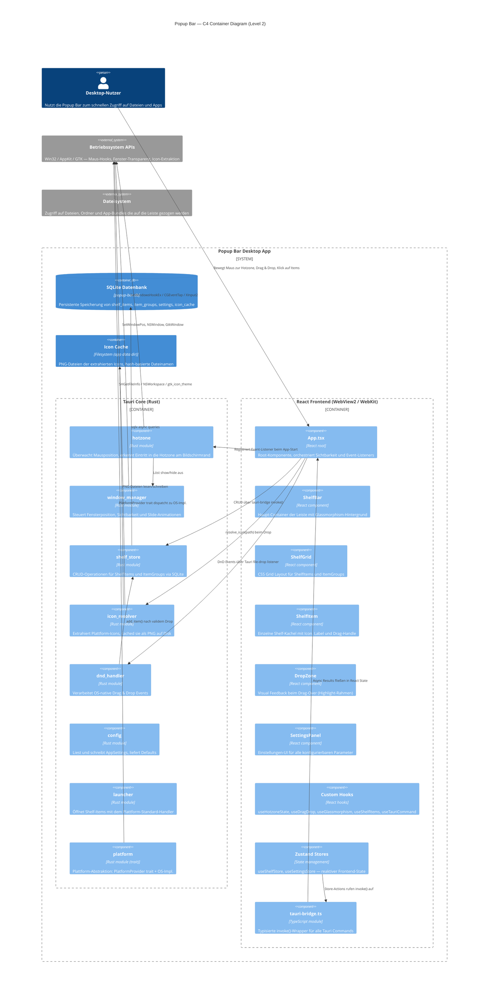
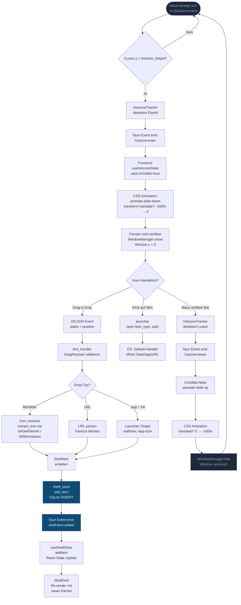
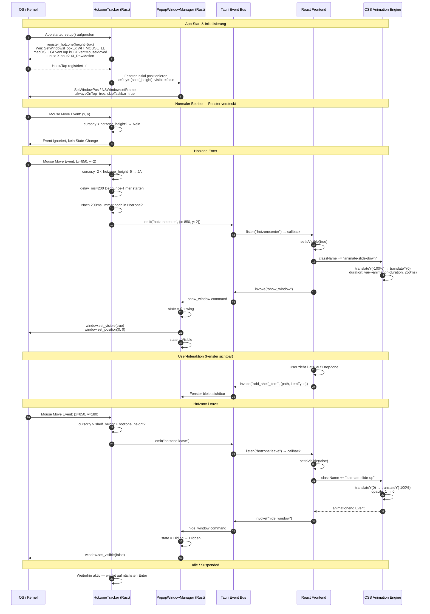
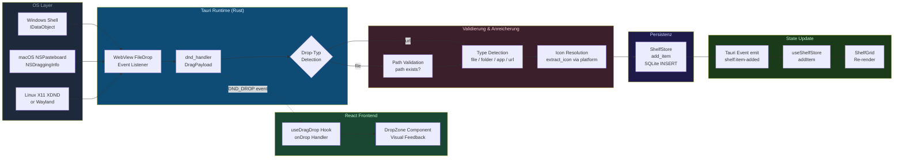
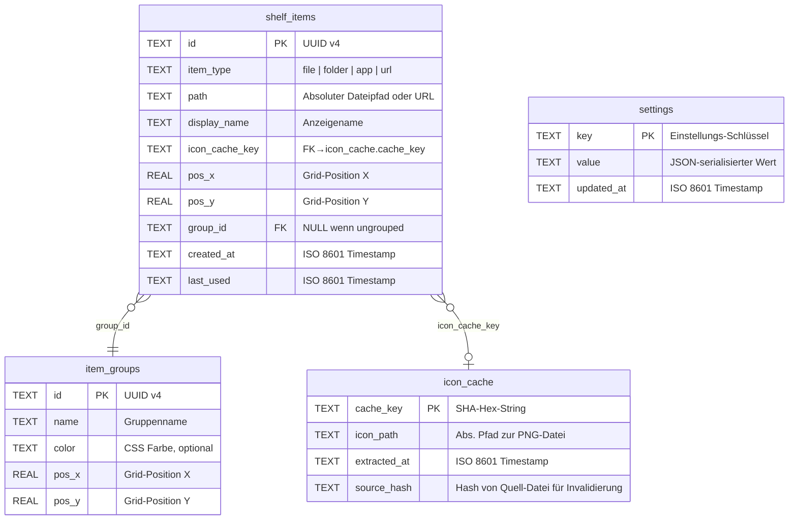
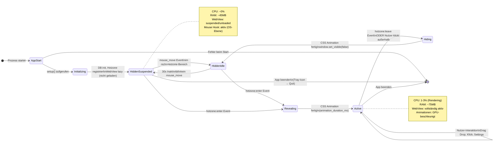

# Architektur-Dokumentation — Popup Bar

> **Dokument-Version:** 0.1.0  
> **Zuletzt aktualisiert:** 2026-03-12  
> **Autoren:** Popup Bar Engineering Team  
> **Status:** Living Document — wird fortlaufend aktualisiert

---

## Inhaltsverzeichnis

- [1.1 System-Architektur-Übersicht](#11-system-architektur-übersicht)
- [1.2 Fenster-Management & Hotzone-Detection](#12-fenster-management--hotzone-detection)
- [1.3 Drag & Drop Architektur](#13-drag--drop-architektur)
- [1.4 Glasmorphism-Rendering](#14-glasmorphism-rendering)
- [1.5 Icon-Extraktion & Rendering](#15-icon-extraktion--rendering)
- [1.6 Persistenz & Konfiguration](#16-persistenz--konfiguration)
- [1.7 Performance & Ressourcen-Budget](#17-performance--ressourcen-budget)

---

## 1.1 System-Architektur-Übersicht

### Überblick

Popup Bar ist eine cross-platform Desktop-Anwendung, die mit **Tauri 2** als nativer Shell und **React + TypeScript** als UI-Schicht gebaut ist. Die Anwendung zeigt eine schwebende Leiste am oberen Bildschirmrand, die sich bei Mausbewegung in die Hotzone herausbewegt. Nutzer können Dateien, Ordner, Anwendungen und URLs per Drag & Drop auf die Leiste ziehen, um schnellen Zugriff darauf zu erhalten.

Die Architektur folgt dem **Event-Driven Architecture**-Muster mit einer klaren Schichtenaufteilung:

| Schicht | Technologie | Verantwortlichkeit |
|---|---|---|
| OS Layer | Windows / macOS / Linux APIs | Maus-Events, Fenster-Transparenz, Datei-Icons |
| Native Core | Rust (Tauri 2) | Hotzone-Detection, Window-Management, Persistenz |
| IPC Bridge | Tauri Commands + Events | Typsichere Kommunikation zwischen Rust und Frontend |
| UI Layer | React 18 + TypeScript | Rendering, Animationen, User Interaction |
| State Management | Zustand | Frontend-State, optimistisches UI |

### C4-Diagramm: Level 2 — Container



### Datenfluss: Von Maus-Detection bis Persistenz



### Architektur-Muster: Event-Driven + Plugin-capable

#### Event-Driven Architecture

Die Anwendung kommuniziert zwischen Rust-Core und React-Frontend **ausschließlich** über zwei klar definierte Kanäle:

1. **Tauri Commands (Request-Response):** Der Frontend-Code ruft `invoke("command_name", args)` auf. Der Rust-Handler verarbeitet die Anfrage synchron oder asynchron und gibt ein typisiertes Ergebnis zurück. Commands werden für **zustandsverändernde Operationen** verwendet: CRUD-Operationen auf dem Shelf, Einstellungen laden/speichern, Fenster anzeigen/verstecken.

2. **Tauri Events (Fire-and-Forget / Pub-Sub):** Der Rust-Core emittiert Events, wenn sich der Zustand ändert (z.B. `hotzone:enter`, `shelf:item-added`). Das Frontend subscribed via `listen()` auf diese Events und aktualisiert reaktiv den State. Events werden für **asynchrone Zustandsänderungen** verwendet, die nicht auf einen expliziten Frontend-Aufruf zurückgehen — insbesondere Maus-Events und externe DnD-Events.

**Vorteile dieses Musters:**
- **Lose Kopplung:** Frontend und Backend kennen sich nicht direkt. Die Event-Namen in `src/types/events.ts` sind die einzige gemeinsame Sprache.
- **Testbarkeit:** Jeder Rust-Handler ist eine isolierte Funktion, die mit Mock-State testbar ist. Frontend-Hooks können mit Mock-Event-Emittern getestet werden.
- **Reaktivität ohne Polling:** Kein `setInterval` für Maus-Position. OS-Events treiben den gesamten Datenfluss an.

#### Plugin-capable Design

Die Rust-Seite ist bewusst in **unabhängige Module** mit klar definierten Schnittstellen strukturiert:

```
src-tauri/src/
├── lib.rs              ← Kompositions-Root: registriert Commands und Plugins
├── commands/           ← Tauri Command Handler (thin layer, delegiert an modules/)
│   ├── shelf_commands.rs
│   ├── settings_commands.rs
│   └── system_commands.rs
└── modules/            ← Fachliche Kernlogik
    ├── hotzone.rs      ← Maus-Tracking, HotzoneTracker
    ├── window_manager.rs  ← Fenster-Lifecycle, WindowState
    ├── shelf_store.rs  ← Daten-Persistenz, ShelfItem / ItemGroup
    ├── icon_resolver.rs   ← Icon-Extraktion und Caching
    ├── dnd_handler.rs  ← Drag & Drop Event Processing
    ├── config.rs       ← Settings, AppSettings, ConfigManager
    ├── launcher.rs     ← Item-Öffnung per OS-Handler
    └── platform/       ← OS-Abstraktions-Schicht
        ├── mod.rs      ← PlatformProvider trait
        ├── windows.rs  ← Win32-Implementierung
        ├── macos.rs    ← AppKit-Implementierung
        └── linux.rs    ← GTK/X11/Wayland-Implementierung
```

Das `platform/`-Modul definiert den `PlatformProvider`-Trait mit plattformübergreifender Schnittstelle. Zur Compile-Zeit wird via `#[cfg(target_os = ...)]` die korrekte Implementierung eingebunden. Neue Plattform-Features können durch Erweiterung des Traits und Hinzufügen einer neuen Implementierungs-Datei integriert werden, ohne bestehenden Code zu ändern.

---

## 1.2 Fenster-Management & Hotzone-Detection

### Konzept

Das Popup Bar-Fenster ist immer gestartet, aber standardmäßig **unsichtbar** (`visible: false`) und positioniert bei `y: -300px` (oberhalb des Bildschirms). Beim Erkennen der Hotzone fährt es per Animation nach unten, sodass es am oberen Bildschirmrand erscheint. Dies vermeidet das teure Erstellen und Zerstören des Fensters bei jeder Interaktion.

### Sequence-Diagramm: Vollständiger Fenster-Lifecycle



### Plattform-Vergleich

| Merkmal | Windows | macOS | Linux |
|---|---|---|---|
| **Hotzone Detection API** | `SetWindowsHookEx(WH_MOUSE_LL)` — System-weiter Low-Level-Maus-Hook im Kernelspace | `CGEventTap(kCGEventMouseMoved)` — Core Graphics Event Tap, benötigt Accessibility-Permission | `XInput2 XI_RawMotion` (X11) oder `libinput` (Wayland) |
| **Polling vs. Event-Push** | Event-Push (Hook-Callback) | Event-Push (EventTap-Callback) | Event-Push (X11) / Polling als Fallback (Wayland) |
| **Window Transparency API** | `SetLayeredWindowAttributes` + `DwmExtendFrameIntoClientArea` | `NSWindow.isOpaque = false` + `NSWindow.backgroundColor = .clear` | X11: ARGB Visual; Wayland: `xdg_surface` mit Alpha-Channel |
| **Vibrancy / Blur API** | `DwmSetWindowAttribute(DWMWA_SYSTEMBACKDROP_TYPE)` — Mica (Win11) oder Acrylic (Win10) | `NSVisualEffectView` mit `.behindWindow`-Blending | Abhängig vom Compositor (KWin, Mutter, Picom) — kein Standard-API |
| **Fenster immer im Vordergrund** | `HWND_TOPMOST` via `SetWindowPos` | `NSWindowLevel.floating` oder `.screenSaver` | `_NET_WM_STATE_ABOVE` (EWMH) |
| **Taskleisten-Ausblendung** | `WS_EX_TOOLWINDOW` Extended Style | `NSApp.activationPolicy = .accessory` | `_NET_WM_WINDOW_TYPE_DOCK` (EWMH) |
| **Bekannte Einschränkungen** | Win10: Acrylic kann bei schnellem Scrollen flackern. WH_MOUSE_LL erfordert aktive Message-Loop. | EventTap benötigt explizite Nutzer-Genehmigung in Systemeinstellungen > Datenschutz > Bedienungshilfen. | Wayland: Globale Maus-Position nur mit `zwlr_pointer_constraints_v1` oder Compositor-Erweiterung. KWin-Blur ist proprietär. |

### Konfiguration: `tauri.conf.json` Fenster-Setup

Das Fenster wird bei App-Start mit diesen Eigenschaften erstellt. Die tatsächlichen Werte stammen aus der Projektdatei `src-tauri/tauri.conf.json`:

```json
{
  "app": {
    "withGlobalTauri": true,
    "security": {
      "csp": "default-src 'self'; style-src 'self' 'unsafe-inline'; img-src 'self' asset: https://asset.localhost"
    },
    "windows": [
      {
        "title": "Popup Bar",
        "width": 1920,
        "height": 300,
        "decorations": false,
        "transparent": true,
        "visible": false,
        "resizable": false,
        "alwaysOnTop": true,
        "skipTaskbar": true,
        "x": 0,
        "y": 0
      }
    ]
  },
  "plugins": {
    "sql": {
      "preload": {
        "db": "sqlite:popup-bar.db"
      }
    },
    "shell": {
      "open": true
    }
  }
}
```

**Erklärung der kritischen Eigenschaften:**

- `decorations: false` — Kein OS-Fensterrahmen (Titelleiste, Schließen-Button). Das Fenster rendert ausschließlich seinen WebView-Inhalt.
- `transparent: true` — Aktiviert ARGB-Transparenz. Auf Windows wird damit `WS_EX_LAYERED` gesetzt, auf macOS `isOpaque = false`.
- `visible: false` — Fenster startet unsichtbar. Verhindert Aufflackern beim App-Start.
- `alwaysOnTop: true` — HWND_TOPMOST / NSWindowLevel.floating. Stellt sicher, dass die Bar vor allen anderen Fenstern erscheint.
- `skipTaskbar: true` — Fenster erscheint nicht in Taskleiste/Dock. Verhält sich wie ein System-Overlay.
- `y: 0` — Positioniert am oberen Bildschirmrand. Der CSS-Slide-Effekt verschiebt den Inhalt nach oben (`translateY(-100%)`), sodass er zunächst nicht sichtbar ist, obwohl das Fenster auf y=0 liegt.

### Rust: Hotzone Registration (vollständiges Skeleton)

```rust
// src-tauri/src/modules/hotzone.rs

use serde::{Deserialize, Serialize};

/// Defines the rectangular hotzone region at the top of the screen.
#[derive(Debug, Clone, Serialize, Deserialize)]
pub struct HotzoneConfig {
    /// Height of the hotzone in pixels from the top screen edge.
    pub height: u32,
    /// Whether hotzone detection is currently active.
    pub enabled: bool,
    /// Debounce delay in milliseconds before triggering the event.
    pub delay_ms: u64,
}

impl Default for HotzoneConfig {
    fn default() -> Self {
        Self {
            height: 5,
            enabled: true,
            delay_ms: 200,
        }
    }
}

/// Tracks mouse position and manages hotzone activation state.
pub struct HotzoneTracker {
    config: HotzoneConfig,
    is_active: bool,
}

impl HotzoneTracker {
    pub fn new(config: HotzoneConfig) -> Self {
        Self { config, is_active: false }
    }

    /// Start listening for mouse events in the hotzone.
    ///
    /// Platform implementations:
    /// - Windows:  SetWindowsHookEx(WH_MOUSE_LL, low_level_mouse_proc, ...)
    /// - macOS:    CGEventTapCreate(kCGSessionEventTap, kCGEventMouseMoved, ...)
    /// - Linux:    XInput2 event subscription via libx11 / libxi
    pub fn start(&mut self) -> Result<(), String> {
        // 1. Resolve screen geometry for primary (or all) monitor(s)
        // 2. Calculate hotzone rectangle: (0, 0, screen_width, hotzone_height)
        // 3. Register OS-level global mouse hook/tap
        // 4. Spawn background thread with event loop
        // 5. In event callback: check if position.y < hotzone_height
        //    - If entering: start debounce timer, emit "hotzone:enter" after delay_ms
        //    - If leaving:  cancel debounce timer, emit "hotzone:leave" immediately
        todo!("Implement platform-specific mouse hook registration")
    }

    /// Stop listening for mouse events.
    pub fn stop(&mut self) -> Result<(), String> {
        // 1. Unregister OS hook/tap
        // 2. Stop background thread
        // 3. Reset is_active = false
        todo!()
    }

    /// Check if cursor is currently within the hotzone.
    pub fn is_cursor_in_hotzone(&self) -> bool {
        // Delegates to platform::get_mouse_position()
        // Compares position.y against config.height
        todo!()
    }

    /// Update hotzone configuration at runtime (e.g., user changes height in settings).
    pub fn update_config(&mut self, config: HotzoneConfig) {
        self.config = config;
        // Re-register hook with new parameters if currently active
    }
}
```

### Animationsstrategie: Dual-Approach

Die Bar-Animation ist bewusst **zweischichtig** implementiert, um sowohl flüssige Optik als auch korrekte Fenster-State-Verwaltung zu gewährleisten:

#### Schicht 1: CSS Transitions (Frontend)

```css
/* src/styles/animations.css */

@keyframes slide-down {
  from {
    transform: translateY(-100%);
    opacity: 0;
  }
  to {
    transform: translateY(0);
    opacity: 1;
  }
}

@keyframes slide-up {
  from {
    transform: translateY(0);
    opacity: 1;
  }
  to {
    transform: translateY(-100%);
    opacity: 0;
  }
}

.animate-slide-down {
  animation: slide-down var(--animation-duration, 0.3s) ease-out forwards;
}

.animate-slide-up {
  animation: slide-up var(--animation-duration, 0.3s) ease-in forwards;
}
```

CSS-Animationen laufen auf dem **Compositor-Thread** des WebViews (WebView2/WebKit). Sie blockieren nie den JavaScript-Hauptthread und profitieren automatisch von GPU-Beschleunigung via `transform`. Die CSS-Variable `--animation-duration` wird dynamisch aus den Settings gesetzt, sodass der Nutzer die Animationsgeschwindigkeit über `animationSpeed` in den Settings steuern kann.

#### Schicht 2: Rust Window Manager (Backend)

Parallel zur CSS-Animation aktualisiert der `PopupWindowManager` den **tatsächlichen Fenster-State** in Rust:

```rust
// Ablauf beim Einblenden:
// 1. CSS animation startet (Frontend, instant)
// 2. invoke("show_window") wird aufgerufen (Frontend → Rust)
// 3. window.set_visible(true)  — Fenster ist nun für das OS sichtbar
// 4. State = Visible

// Ablauf beim Ausblenden:
// 1. CSS animation startet (Frontend, instant)
// 2. Nach animation_duration_ms: invoke("hide_window") (Frontend → Rust)
// 3. window.set_visible(false) — Fenster ist nun für das OS unsichtbar
// 4. State = Hidden — OS kann Ressourcen freigeben
```

**Warum dieser Dual-Approach?**

Das Fenster muss für das OS `visible: true` sein, damit es Eingaben empfangen kann (Maus-Events, Drag & Drop). Wäre es `visible: false` für die Dauer der Einblend-Animation, würde kein DnD-Drop funktionieren. Deshalb wird das Fenster beim Einblenden **sofort** auf visible gesetzt, während die CSS-Animation läuft. Beim Ausblenden wartet Rust auf das Ende der CSS-Animation, bevor `visible: false` gesetzt wird — sonst würde die Bar abrupt verschwinden ohne Fade-Out.

---

## 1.3 Drag & Drop Architektur

### Überblick

Das Drag & Drop-System besteht aus drei Schichten:

1. **OS-Level:** Das Betriebssystem liefert native DnD-Events (Windows Shell IDataObject, macOS NSPasteboard, X11 XDND-Protokoll).
2. **Tauri-Level:** Tauri 2 bridgt OS-native File-Drop-Events über `tauri_plugin_drag` bzw. den integrierten `FileDrop`-Event in den WebView.
3. **Frontend-Level:** React-Hooks und Event-Handler verarbeiten sowohl externe Drops (aus dem Dateimanager) als auch interne Reorder-Operationen.

### DnD Event Pipeline



### OS-native DnD Events und WebView-Integration

Tauri 2 integriert OS-native DnD-Events in den WebView über zwei Mechanismen:

#### Externer Drop (Dateien aus Dateimanager / Browser)

Tauri's WebView registriert einen `FileDrop`-Listener beim Fenster-Setup. Dieser empfängt `DragEnter`, `DragOver`, `DragDrop` und `DragLeave`-Events vom OS und leitet sie als Tauri-Events an das Frontend weiter:

```rust
// Tauri emittiert folgende Events beim externen Drop:
// "tauri://file-drop-hover"    → { paths: Vec<String> }
// "tauri://file-drop"          → { paths: Vec<String>, position: {x, y} }
// "tauri://file-drop-cancelled"

// In dnd_handler.rs:
// DndHandler::register_listeners() subscribed auf diese Events
// und delegiert an handle_drop(DragPayload)
```

#### Interner Drag (Reorder innerhalb der Bar)

Für interne Reorder-Operationen wird die **HTML5 Drag & Drop API** im Frontend verwendet. Der `useDragDrop`-Hook verwaltet `dragstart`/`dragover`/`drop`-Events auf React-Ebene:

```typescript
// src/hooks/useDragDrop.ts
export function useDragDrop(_targetId: string) {
  const [isOver, setIsOver] = useState(false);

  const dragHandlers = {
    draggable: true,
    onDragStart: ((e: React.DragEvent) => {
      e.dataTransfer.setData("application/popup-bar-item", _targetId);
      e.dataTransfer.effectAllowed = "move";
    }) as DragEventHandler,
    onDragEnd: (() => { /* clean up */ }) as DragEventHandler,
  };

  const dropHandlers = {
    onDragOver: ((e: React.DragEvent) => {
      e.preventDefault();
      e.dataTransfer.dropEffect = "move";
      setIsOver(true);
    }) as DragEventHandler,
    onDrop: ((e: React.DragEvent) => {
      e.preventDefault();
      setIsOver(false);
      const sourceId = e.dataTransfer.getData("application/popup-bar-item");
      // invoke("update_shelf_item", { item: { ...item, position: newPos } })
    }) as DragEventHandler,
  };

  return { isOver, dragHandlers, dropHandlers };
}
```

### Drop-Typ-Verarbeitung

| Drop-Typ | Quelle | Erkennung | Verarbeitung |
|---|---|---|---|
| **Files** | Explorer / Finder / Nautilus | MIME-Type aus IDataObject + Path-Extension (z.B. `.pdf`, `.docx`) | `std::fs::metadata(path).is_file()` → Pfad speichern, Icon via `SHGetFileInfo` / `NSWorkspace.icon(forFile:)` extrahieren |
| **Folders** | Explorer / Finder / Nautilus | `std::fs::metadata(path).is_dir()` | Pfad speichern, generisches Ordner-Icon (Plattform-Standard) oder custom Folder-Icon |
| **URLs** | Browser (Adressleiste / Lesezeichen) | Drop-Daten enthalten `text/uri-list` MIME-Type, Path beginnt mit `http://` oder `https://` | URL parsen, `display_name` aus `<title>` oder Hostname, Favicon via `https://www.google.com/s2/favicons?domain=` fetchen |
| **Apps** | Windows Startmenü (`.lnk`) / macOS Dock (`.app`) / Linux (`.desktop`) | Extension `.lnk` → `IShellLink::GetPath()` auflösen; `.app` → Bundle-Info.plist; `.desktop` → `Exec=`-Key parsen | Tatsächlichen Ausführungspfad extrahieren, App-Icon über Plattform-API holen (`IExtractIcon` / `NSWorkspace.icon(forFile:)` / `gtk_icon_theme_lookup_icon`) |

### TypeScript `ShelfItem` Interface und entsprechende Rust-Struct

Das Frontend-Interface aus `src/types/shelf.ts`:

```typescript
// src/types/shelf.ts

export type ItemType = "file" | "folder" | "app" | "url";

export interface ShelfItem {
  id: string;           // UUID v4
  itemType: ItemType;   // Determines launch behavior and icon strategy
  path: string;         // Absolute filesystem path or URL string
  displayName: string;  // User-visible label (filename or URL hostname)
  iconCacheKey: string; // Hash-based key → maps to cached PNG in icon cache dir
  position: {
    x: number;          // Grid position X (in shelf grid units)
    y: number;          // Grid position Y
  };
  groupId?: string;     // Optional: UUID of parent ItemGroup
  createdAt: string;    // ISO 8601 timestamp
  lastUsed: string;     // ISO 8601 timestamp — for LRU sorting
}

export interface ItemGroup {
  id: string;
  name: string;
  color?: string;       // CSS color string, e.g. "rgba(99, 102, 241, 0.3)"
  position: { x: number; y: number };
}
```

Die korrespondierende Rust-Struct aus `src-tauri/src/modules/shelf_store.rs`, die via `serde` zum JSON serialisiert/deserialisiert wird:

```rust
// src-tauri/src/modules/shelf_store.rs

use serde::{Deserialize, Serialize};

/// The type of item stored on the shelf.
/// Serialized as lowercase string for JSON compatibility with TypeScript ItemType.
#[derive(Debug, Clone, Serialize, Deserialize)]
#[serde(rename_all = "lowercase")]
pub enum ItemType {
    File,
    Folder,
    App,
    Url,
}

/// A single item on the shelf.
/// Field names use snake_case in Rust; serde renames to camelCase for the frontend.
#[derive(Debug, Clone, Serialize, Deserialize)]
#[serde(rename_all = "camelCase")]
pub struct ShelfItem {
    pub id: String,
    pub item_type: ItemType,     // → "itemType" in JSON
    pub path: String,
    pub display_name: String,    // → "displayName" in JSON
    pub icon_cache_key: String,  // → "iconCacheKey" in JSON
    pub position_x: f64,
    pub position_y: f64,
    pub group_id: Option<String>, // → "groupId" in JSON, null if ungrouped
    pub created_at: String,       // → "createdAt" in JSON
    pub last_used: String,        // → "lastUsed" in JSON
}

/// A group of shelf items.
#[derive(Debug, Clone, Serialize, Deserialize)]
#[serde(rename_all = "camelCase")]
pub struct ItemGroup {
    pub id: String,
    pub name: String,
    pub color: Option<String>,
    pub position_x: f64,
    pub position_y: f64,
}
```

> **Hinweis zur Serialisierung:** Das Frontend erwartet `camelCase`-Properties (TypeScript-Konvention), während Rust `snake_case` verwendet. `#[serde(rename_all = "camelCase")]` übernimmt diese Konvertierung automatisch. Die `position`-Eigenschaft im TypeScript-Interface (`{ x, y }`) wird in Rust als separate `position_x` und `position_y` Felder gespeichert und beim Serialisieren zusammengeführt.

---

## 1.4 Glasmorphism-Rendering

### Überblick

Der Glasmorphism-Effekt entsteht durch das Zusammenspiel von drei Schichten:

1. **OS-Compositor:** Stellt den "Blur" des Hintergrunds (Bildschirminhalt hinter dem Fenster) zur Verfügung. Auf macOS via `NSVisualEffectView`, auf Windows via DWM Acrylic/Mica, auf Linux optional via Compositor-Erweiterung.
2. **Transparenz-Layer:** Das Fenster muss `transparent: true` sein, sodass das Rendering durch den Fensterbereich hindurch auf den OS-Compositor zugreift.
3. **CSS `backdrop-filter`:** Die WebView wendet zusätzlichen Blur und Tint auf alles hinter dem Element an, was einen mehrschichtigen Effekt erzeugt.

### Rendering-Pipeline

```mermaid
flowchart TB
    subgraph OS_Compositor["OS Compositor"]
        A[Bildschirminhalt\nhinter dem Fenster\nwird gesammelt]
        B[OS Blur API\nWindows: DWM Acrylic/Mica\nmacOS: NSVisualEffectView\nLinux: KWin / Picom]
        A --> B
    end

    subgraph Window_Layer["Window Transparency Layer"]
        C[ARGB Fenster\ntransparent=true\nOS sieht durch Fenster hindurch]
        B --> C
    end

    subgraph WebView_Layer["WebView Rendering (CSS)"]
        D[backdrop-filter: blur(20px)\n-webkit-backdrop-filter: blur(20px)\nBlurred OS-Content als CSS-Background]
        E[background: rgba 255,255,255,0.1\nTint-Color über geblurrtem Hintergrund]
        F[border: 1px solid rgba 255,255,255,0.18\nHelle Randlinie für Glas-Illusion]
        G[box-shadow: 0 8px 32px rgba 0,0,0,0.37\nTiefenwirkung durch Schatten]
        C --> D --> E --> F --> G
    end

    subgraph Content_Layer["UI Content Layer"]
        H[ShelfBar Container\n.glass CSS-Klasse]
        I[ShelfItem Kacheln\nIcon + Label]
        J[DropZone Overlay\nbeim Drag-Over]
        G --> H
        H --> I
        H --> J
    end

    style OS_Compositor fill:#1e293b,color:#94a3b8
    style Window_Layer fill:#0f2940,color:#bae6fd
    style WebView_Layer fill:#0f3d1f,color:#bbf7d0
    style Content_Layer fill:#2d1b4e,color:#e9d5ff
```

### Plattform-Vergleich

| Feature | Windows 10 | Windows 11 | macOS 12+ | Linux (KWin) | Linux (Fallback) |
|---|---|---|---|---|---|
| **Blur API** | `DwmSetWindowAttribute` mit `DWMWA_USE_IMMERSIVE_DARK_MODE` + Acrylic via `DwmEnableBlurBehindWindow` | `DWMWA_SYSTEMBACKDROP_TYPE` → `DWMSBT_MAINWINDOW` (Mica) oder `DWMSBT_TRANSIENTWINDOW` (Acrylic) | `NSVisualEffectView` mit `.behindWindow` + Material `.fullScreenUI` | `KWindowEffects::enableBlurBehind` (KDE Plasma 5+) | Kein System-Blur; Semi-transparenter Solid-Fallback |
| **Transparenz** | `SetLayeredWindowAttributes(hwnd, 0, 255, LWA_ALPHA)` + `WS_EX_LAYERED` | Gleich wie Win10, ergänzt durch DWM Backdrop Types | `NSWindow.isOpaque = false`, `NSWindow.backgroundColor = .clear` | X11: ARGB Visual mit `XMatchVisualInfo`; Wayland: Alpha-Channel im `wl_surface` | X11 ARGB ohne Blur; Wayland falls Alpha-Surface unterstützt |
| **CSS `backdrop-filter`** | Edge WebView2 ✓ (Chrome 76+) | Edge WebView2 ✓ | WebKit ✓ (Safari Engine) | WebKitGTK ✓ | WebKitGTK ✓ (aber ohne OS-Blur der Hintergrund-Pixel) |
| **Ergebnis Qualität** | ⭐⭐⭐ Acrylic gut; Mica eleganter | ⭐⭐⭐⭐ Mica sehr hochwertig | ⭐⭐⭐⭐⭐ Beste Qualität | ⭐⭐⭐ KWin-Blur sehr gut | ⭐⭐ Nur CSS-Effekt, kein Echtzeit-Blur |
| **Fallback** | Semi-transparentes Dunkelgrau falls DWM fehlschlägt | Gleich wie Win10 | — (macOS hat immer NSVisualEffectView) | Compositor-Check via `KWindowSystem::isPlatformX11()` | `background: rgba(15, 23, 42, 0.85)` — solid dark |

### CSS Glassmorphism-Implementierung

Die tatsächliche Implementierung aus `src/styles/glassmorphism.css`:

```css
/* src/styles/glassmorphism.css */

/* Basis-Glassmorphism-Klasse — wird auf .ShelfBar und ähnliche Container angewendet */
.glass {
  /* Tint: leicht opakes Weiß über dem geblurrten Hintergrund */
  background: rgba(255, 255, 255, 0.1);

  /* Kern des Glassmorphism: alles hinter diesem Element wird geblurrt */
  backdrop-filter: blur(20px);
  -webkit-backdrop-filter: blur(20px); /* Safari / WebKitGTK */

  /* Subtile helle Randlinie imitiert Glaskante */
  border: 1px solid rgba(255, 255, 255, 0.18);

  /* Tiefenschatten für Abheben vom Hintergrund */
  box-shadow: 0 8px 32px rgba(0, 0, 0, 0.37);
}

/* Dark Mode Variante */
.glass--dark {
  background: rgba(0, 0, 0, 0.25);
  border: 1px solid rgba(255, 255, 255, 0.08);
}

/* Light Mode Variante */
.glass--light {
  background: rgba(255, 255, 255, 0.25);
  border: 1px solid rgba(255, 255, 255, 0.3);
}
```

### Konfigurierbare CSS Custom Properties

Blur-Intensität und Tint-Farbe sind vollständig über CSS Custom Properties konfigurierbar. Diese werden beim Start und bei Settings-Updates dynamisch auf das Root-Element gesetzt:

```css
/* Dynamisch injiziert via JavaScript aus den Settings: */
:root {
  --glass-blur: 20px;               /* aus settings.blurIntensity */
  --glass-tint: rgba(255,255,255,0.1); /* aus settings.tintColor */
  --animation-duration: 0.25s;      /* aus settings.animationSpeed */
  --shelf-height: 300px;
}

/* Erweiterte Glassmorphism-Definition mit Custom Properties: */
.glass {
  background: var(--glass-tint);
  backdrop-filter: blur(var(--glass-blur));
  -webkit-backdrop-filter: blur(var(--glass-blur));
  border: 1px solid rgba(255, 255, 255, 0.18);
  box-shadow: 0 8px 32px rgba(0, 0, 0, 0.37);
  transition:
    background 0.3s ease,
    backdrop-filter 0.3s ease;  /* Sanftes Überblenden beim Settings-Update */
}
```

```typescript
// Wird aufgerufen wenn settings:changed Event empfangen wird:
function applySettingsToCSS(settings: Settings) {
  const root = document.documentElement;
  root.style.setProperty("--glass-blur", `${settings.blurIntensity}px`);
  root.style.setProperty("--glass-tint", settings.tintColor);
  root.style.setProperty(
    "--animation-duration",
    `${0.3 / settings.animationSpeed}s`
  );
}
```

---

## 1.5 Icon-Extraktion & Rendering

### Überblick

Icons sind zentral für die Erkennbarkeit von Shelf-Items. Die Icon-Pipeline extrahiert plattformspezifische Icons aus dem Dateisystem, konvertiert sie in ein standardisiertes Format (PNG, 48×48 oder 96×96 für HiDPI), cached sie persistent auf Disk, und stellt sie dem Frontend über Tauris Asset-Protokoll zur Verfügung.

### Plattform-APIs für Icon-Extraktion

| Plattform | API / Funktion | Details |
|---|---|---|
| **Windows** | `SHGetFileInfo(path, 0, &sfi, sizeof(sfi), SHGFI_ICON \| SHGFI_LARGEICON)` | Gibt `HICON` zurück. Für HiDPI: `SHGetImageList(SHIL_EXTRALARGE)` → `IImageList::GetIcon`. Apps: `IExtractIcon::Extract` aus Shell Extension. `.lnk`-Shortcuts werden automatisch aufgelöst. |
| **Windows (UWP/Store-Apps)** | `AppxPackageManifest` → `Logo`-Element → PNG in Package-Verzeichnis | Store-Apps haben kein klassisches EXE-Icon. Manifest lesen, PNG aus `Assets/`-Verzeichnis kopieren. |
| **macOS** | `NSWorkspace.shared.icon(forFile: path)` → `NSImage` | Gibt immer ein gültiges `NSImage` zurück (Fallback: generisches Dateiicon). Konvertieren via `NSImage.tiffRepresentation` → `NSBitmapImageRep` → PNG. |
| **macOS (App Bundles)** | `NSBundle(path: appPath)?.infoDictionary?["CFBundleIconFile"]` → `.icns` in `Resources/` | `.icns` enthält Icons in verschiedenen Größen. `NSImage(contentsOf:)` + `draw(in: NSRect(x:0,y:0,width:48,height:48))` |
| **Linux (XDG)** | `gtk_icon_theme_lookup_icon(theme, icon_name, 48, GTK_ICON_LOOKUP_USE_BUILTIN)` | Icon-Name aus `.desktop`-Datei (`Icon=`-Key) oder via `g_file_info_get_content_type`. Sucht in `/usr/share/icons/`, `~/.local/share/icons/`, `~/.icons/`. |
| **Linux (Fallback)** | `gio::FileInfo::icon()` + `GThemedIcon` | Gibt theorierten Icon-Namen zurück, der in das GTK-Icon-Theme aufgelöst wird. |

### Icon Cache-Strategie

Der Cache verhindert wiederholte teure Plattform-API-Aufrufe für dieselbe Datei:

```
Schritt 1: Cache-Key berechnen
  cache_key = SHA256(path + file_mtime + platform_id)[:16]
  → z.B. "a3f7c2b1d8e9f012"

Schritt 2: Cache-Lookup
  let cache_path = app_data_dir / "icon_cache" / (cache_key + ".png")
  if cache_path.exists() → direkt zurückgeben (kein API-Aufruf)

Schritt 3: Icon extrahieren (Cache-Miss)
  let raw_bytes = platform.extract_icon(path, size=48)?;
  → HICON / NSImage / GdkPixbuf als raw RGBA bytes

Schritt 4: Zu PNG konvertieren
  let png_bytes = encode_png(raw_bytes, width=48, height=48)?;
  → Einheitliches Format, plattformunabhängig im Frontend verwendbar

Schritt 5: Cache schreiben
  write(cache_path, png_bytes)?;
  let entry = CachedIcon { cache_key, path: cache_path, format: Png, size: 48 };
  sqlite::insert("icon_cache", entry)?;

Schritt 6: Cache-Key an ShelfItem binden
  shelf_item.icon_cache_key = cache_key;
  → Frontend lädt Icon via: asset://localhost/icon_cache/a3f7c2b1d8e9f012.png
```

### Rust: `IconResolver` mit Cache-Logik

```rust
// src-tauri/src/modules/icon_resolver.rs

use serde::{Deserialize, Serialize};

#[derive(Debug, Clone, Serialize, Deserialize)]
pub struct CachedIcon {
    pub cache_key: String,
    pub path: String,
    pub format: IconFormat,
    pub size: u32,
}

#[derive(Debug, Clone, Serialize, Deserialize)]
pub enum IconFormat {
    Png,
    Svg,
}

pub struct IconResolver {
    cache_dir: String,
}

impl IconResolver {
    pub fn new(cache_dir: String) -> Self {
        Self { cache_dir }
    }

    /// Extract an icon for the given file path and cache it.
    ///
    /// Steps:
    /// 1. Calculate cache_key from path + mtime
    /// 2. Check disk cache → return immediately if found
    /// 3. Call platform.extract_icon(path, 48)
    /// 4. Encode to PNG
    /// 5. Write PNG to cache_dir/cache_key.png
    /// 6. Insert metadata into icon_cache SQLite table
    pub async fn resolve_icon(&self, path: &str) -> Result<CachedIcon, String> {
        let cache_key = self.compute_cache_key(path)?;

        if let Some(cached) = self.get_cached(&cache_key) {
            return Ok(cached);
        }

        // Platform-specific extraction
        let platform = crate::modules::platform::create_provider();
        let raw_bytes = platform.extract_icon(path, 48)
            .map_err(|e| format!("Icon extraction failed: {}", e))?;

        let cache_path = format!("{}/{}.png", self.cache_dir, cache_key);
        // encode_png(raw_bytes) → write to cache_path
        // sqlite: INSERT INTO icon_cache (cache_key, icon_path, extracted_at, source_hash) VALUES (...)

        Ok(CachedIcon {
            cache_key,
            path: cache_path,
            format: IconFormat::Png,
            size: 48,
        })
    }

    /// Compute a stable cache key for a given path.
    fn compute_cache_key(&self, path: &str) -> Result<String, String> {
        use std::collections::hash_map::DefaultHasher;
        use std::hash::{Hash, Hasher};
        use std::fs;

        let metadata = fs::metadata(path)
            .map_err(|e| format!("Cannot stat {}: {}", path, e))?;

        let mtime = metadata.modified()
            .map(|t| t.duration_since(std::time::UNIX_EPOCH).unwrap_or_default().as_secs())
            .unwrap_or(0);

        let mut hasher = DefaultHasher::new();
        path.hash(&mut hasher);
        mtime.hash(&mut hasher);

        Ok(format!("{:016x}", hasher.finish()))
    }

    /// Get a cached icon by its cache key.
    pub fn get_cached(&self, cache_key: &str) -> Option<CachedIcon> {
        let path = format!("{}/{}.png", self.cache_dir, cache_key);
        if std::path::Path::new(&path).exists() {
            Some(CachedIcon {
                cache_key: cache_key.to_string(),
                path,
                format: IconFormat::Png,
                size: 48,
            })
        } else {
            None
        }
    }

    /// Remove a single cached icon (called by LRU eviction).
    pub fn evict(&self, cache_key: &str) -> Result<(), String> {
        let path = format!("{}/{}.png", self.cache_dir, cache_key);
        std::fs::remove_file(&path)
            .map_err(|e| format!("Eviction failed for {}: {}", cache_key, e))
    }

    /// Clear the entire icon cache (e.g., user request or migration).
    pub fn clear_cache(&self) -> Result<(), String> {
        std::fs::remove_dir_all(&self.cache_dir)
            .and_then(|_| std::fs::create_dir_all(&self.cache_dir))
            .map_err(|e| format!("Cache clear failed: {}", e))
    }
}
```

### Frontend: Icon-Anzeige

Im Frontend wird das Icon über Tauris `asset://`-Protokoll geladen, das direkten Zugriff auf das App-Datenverzeichnis ermöglicht, ohne einen expliziten HTTP-Server zu benötigen:

```typescript
// In ShelfItem.tsx:
function getIconUrl(iconCacheKey: string): string {
  if (!iconCacheKey) return "/icons/placeholder.png";
  // Tauri's asset protocol: resolves to app_data_dir/icon_cache/<key>.png
  return `asset://localhost/icon_cache/${iconCacheKey}.png`;
}

// CSP in tauri.conf.json erlaubt explizit: img-src 'self' asset: https://asset.localhost
```

### Thumbnail-Generierung für Bilddateien

Für Bild-Dateien (`.jpg`, `.jpeg`, `.png`, `.gif`, `.webp`, `.bmp`, `.tiff`) wird anstelle des System-Icons ein **echtes Vorschau-Thumbnail** generiert:

```rust
// Erweiterung in icon_resolver.rs:

fn is_image_file(path: &str) -> bool {
    let ext = std::path::Path::new(path)
        .extension()
        .and_then(|e| e.to_str())
        .map(|s| s.to_lowercase());

    matches!(ext.as_deref(), Some("jpg" | "jpeg" | "png" | "gif" | "webp" | "bmp" | "tiff"))
}

async fn generate_thumbnail(path: &str, size: u32) -> Result<Vec<u8>, String> {
    // 1. Bild laden (image crate oder plattform-native Decoder)
    // 2. Aspect-Ratio-erhaltende Skalierung auf size×size
    //    → Letterboxing mit transparentem Hintergrund
    // 3. Als PNG encodieren
    // Ziel-Größen: 48×48 (normale DPI) und 96×96 (HiDPI / Retina)
    todo!()
}
```

Der Unterschied ist im `CachedIcon` sichtbar: Bei normalen Dateien ist `format: Png` mit extrahiertem System-Icon, bei Bilddateien ebenfalls `format: Png`, aber der Inhalt ist das skalierte Bild selbst. Das Frontend muss keinen Unterschied machen.

---

## 1.6 Persistenz & Konfiguration

### Datenbankschema



### Initiales Schema (Migration v1)

```sql
-- migrations/v1_initial.sql

PRAGMA journal_mode = WAL;   -- Write-Ahead Logging für bessere Concurrent-Performance
PRAGMA foreign_keys = ON;

CREATE TABLE IF NOT EXISTS shelf_items (
    id           TEXT PRIMARY KEY NOT NULL,
    item_type    TEXT NOT NULL CHECK(item_type IN ('file', 'folder', 'app', 'url')),
    path         TEXT NOT NULL,
    display_name TEXT NOT NULL,
    icon_cache_key TEXT REFERENCES icon_cache(cache_key) ON DELETE SET NULL,
    pos_x        REAL NOT NULL DEFAULT 0.0,
    pos_y        REAL NOT NULL DEFAULT 0.0,
    group_id     TEXT REFERENCES item_groups(id) ON DELETE SET NULL,
    created_at   TEXT NOT NULL DEFAULT (strftime('%Y-%m-%dT%H:%M:%SZ', 'now')),
    last_used    TEXT NOT NULL DEFAULT (strftime('%Y-%m-%dT%H:%M:%SZ', 'now'))
);

CREATE TABLE IF NOT EXISTS item_groups (
    id    TEXT PRIMARY KEY NOT NULL,
    name  TEXT NOT NULL,
    color TEXT,
    pos_x REAL NOT NULL DEFAULT 0.0,
    pos_y REAL NOT NULL DEFAULT 0.0
);

CREATE TABLE IF NOT EXISTS settings (
    key        TEXT PRIMARY KEY NOT NULL,
    value      TEXT NOT NULL,
    updated_at TEXT NOT NULL DEFAULT (strftime('%Y-%m-%dT%H:%M:%SZ', 'now'))
);

CREATE TABLE IF NOT EXISTS icon_cache (
    cache_key    TEXT PRIMARY KEY NOT NULL,
    icon_path    TEXT NOT NULL,
    extracted_at TEXT NOT NULL DEFAULT (strftime('%Y-%m-%dT%H:%M:%SZ', 'now')),
    source_hash  TEXT NOT NULL
);

-- Indizes für häufige Queries
CREATE INDEX IF NOT EXISTS idx_shelf_items_group ON shelf_items(group_id);
CREATE INDEX IF NOT EXISTS idx_shelf_items_last_used ON shelf_items(last_used DESC);
CREATE INDEX IF NOT EXISTS idx_shelf_items_type ON shelf_items(item_type);

-- Schema-Versions-Tracking
CREATE TABLE IF NOT EXISTS schema_version (
    version     INTEGER PRIMARY KEY NOT NULL,
    applied_at  TEXT NOT NULL DEFAULT (strftime('%Y-%m-%dT%H:%M:%SZ', 'now'))
);

INSERT INTO schema_version (version) VALUES (1);
```

### Warum SQLite statt JSON-Datei?

| Kriterium | SQLite | JSON-Datei |
|---|---|---|
| **Concurrent Access** | WAL-Modus ermöglicht mehrere gleichzeitige Leser und einen Schreiber. Atomic Commits via Transaktionen. | Race Condition bei gleichzeitigem Read/Write (z.B. Auto-Save + Settings-Update). Datei kann korrumpiert werden. |
| **Abfragen** | `SELECT * FROM shelf_items WHERE item_type = 'app' ORDER BY last_used DESC LIMIT 20` — effizient mit Indizes. | Komplettes JSON einlesen, in Rust deserialisieren, filtern, sortieren — O(n) für jede Query. |
| **Migrationen** | Versionierte SQL-Dateien; `ALTER TABLE`, `CREATE INDEX`. Rückwärtskompatibel. | Manuelle Transformations-Logik in Rust/TypeScript. Fehleranfällig. |
| **Atomic Writes** | `BEGIN TRANSACTION; ...; COMMIT;` — entweder alles oder nichts. | Vollständiges Neuschreiben der Datei bei jeder Änderung. Crash zwischen Write-Beginn und Sync hinterlässt korrupte Datei. |
| **Speicher-Effizienz** | B-Tree-Index, kompaktes binäres Format. Kein JSON-Overhead. | JSON-Overhead: Feldnamen, Whitespace. Groß bei vielen Items. |
| **Tauri-Integration** | `tauri-plugin-sql` mit `sqlx` — first-party Support. | Manuelle `std::fs`-I/O. |

### Konfigurationsschema mit Defaults

Die Einstellungen werden in der `settings`-Tabelle als Key-Value-Paare mit JSON-Werten gespeichert. Das TypeScript-Interface (`src/types/settings.ts`) und die Rust-Struct (`src-tauri/src/modules/config.rs`) sind die autoritativen Quellen der Typdefinitionen:

```typescript
// src/types/settings.ts — vollständiges Settings-Interface mit Defaults

export type Theme = "light" | "dark" | "system";

export interface Settings {
  hotzoneSize: number;        // Default: 5    — Hotzone-Höhe in Pixel
  animationSpeed: number;     // Default: 1.0  — Multiplikator (0.5 = halb so schnell)
  blurIntensity: number;      // Default: 20   — CSS blur() in Pixel
  tintColor: string;          // Default: "rgba(255,255,255,0.1)"
  theme: Theme;               // Default: "system"
  autostart: boolean;         // Default: false — App mit OS starten
  multiMonitor: boolean;      // Default: false — Auf allen Monitoren anzeigen
}

export const DEFAULT_SETTINGS: Settings = {
  hotzoneSize: 5,
  animationSpeed: 1.0,
  blurIntensity: 20,
  tintColor: "rgba(255, 255, 255, 0.1)",
  theme: "system",
  autostart: false,
  multiMonitor: false,
};
```

Vollständige Einstellungstabelle mit allen konfigurierbaren Parametern:

| Schlüssel | Typ | Default | Beschreibung | Bereich |
|---|---|---|---|---|
| `hotzone_height_px` | `integer` | `5` | Höhe der unsichtbaren Hotzone in Pixel | 1–50 |
| `animation_duration_ms` | `integer` | `250` | Dauer der Slide-Animation in Millisekunden | 50–1000 |
| `blur_intensity` | `number` | `20` | CSS `backdrop-filter: blur(Xpx)` Wert | 0–100 |
| `tint_color` | `string` | `"rgba(255,255,255,0.1)"` | CSS-Farbe für den Glass-Tint | Beliebige CSS-Farbe |
| `theme` | `"light"\|"dark"\|"system"` | `"system"` | UI-Theme; "system" folgt OS-Einstellung | — |
| `autostart` | `boolean` | `false` | App beim OS-Start automatisch starten | — |
| `multi_monitor` | `"primary"\|"all"\|"cursor"` | `"primary"` | Auf welchen Monitoren die Bar erscheint | — |
| `shelf_height_px` | `integer` | `300` | Höhe der ausgeklappten Bar in Pixel | 100–800 |

### Migrations-Strategie

Schema-Updates werden über versionierte SQL-Dateien verwaltet. Beim App-Start prüft `ShelfStore::init_db()` die aktuelle Schema-Version und wendet fehlende Migrationen in Reihenfolge an:

```
migrations/
├── v1_initial.sql           ← Initiales Schema (alle 4 Tabellen)
├── v2_add_item_tags.sql     ← Beispiel: neue 'tags'-Spalte in shelf_items
└── v3_icon_cache_size.sql   ← Beispiel: 'size' Spalte in icon_cache
```

```rust
// Migrations-Runner (Pseudo-Code):
pub async fn run_migrations(db: &SqlitePool) -> Result<(), sqlx::Error> {
    // 1. Aktuelle Version aus schema_version lesen
    let current: i64 = sqlx::query_scalar(
        "SELECT COALESCE(MAX(version), 0) FROM schema_version"
    ).fetch_one(db).await?;

    // 2. Alle Migrations-Dateien aus dem embedded migrations-Verzeichnis
    //    in Reihenfolge anwenden (sqlx::migrate! Makro)
    sqlx::migrate!("./migrations")
        .run(db)
        .await?;

    log::info!("Migrations applied, schema now at version {}", current);
    Ok(())
}
```

Das `sqlx::migrate!`-Makro embedded die SQL-Dateien zur Compile-Zeit in die Binary. Kein seperates SQL-Verzeichnis muss mit der App ausgeliefert werden. Migrationen sind idempotent dank `CREATE TABLE IF NOT EXISTS` und `IF NOT EXISTS`-Guards.

---

## 1.7 Performance & Ressourcen-Budget

### Zielvorgaben

Die Popup Bar ist ein **Always-On-Background-Prozess**. Ressourcen-Effizienz im Idle-Zustand ist daher eine primäre Design-Anforderung — nicht eine nachträgliche Optimierung.

| Metrik | Ziel | Messmethode |
|---|---|---|
| **RAM (Idle / versteckt)** | < 50 MB | Task Manager / `ps aux` Baseline nach 60s Idle |
| **RAM (Aktiv / sichtbar)** | < 80 MB | Mit vollständig geladenem Shelf (20 Items + Icons) |
| **CPU (versteckt)** | ~0% | Kein Polling, rein event-getrieben; Messung über 60s |
| **CPU (animierend)** | < 5% | Während Slide-In/Out-Animation (250ms Window) |
| **CPU (Maus-Tracking)** | < 0.5% | Beim kontinuierlichen Bewegen der Maus über die Bar |
| **Startup → Hotzone ready** | < 500 ms | Von App-Launch bis erste Hotzone-Detection aktiv |
| **First Reveal Latenz** | < 100 ms | Von `hotzone:enter` bis sichtbare Pixel auf Bildschirm |
| **Drop Processing** | < 200 ms | Von Drop-Event bis neue Kachel in der UI sichtbar |
| **Installierte Größe** | < 10 MB | Gesamtgröße des installierten Pakets |

### Ressourcen-Zustands-Diagramm



### Konkrete Optimierungsmaßnahmen

#### 1. Lazy-Loading der React UI

Die React-Anwendung wird **nicht** beim App-Start geladen. Stattdessen wird die WebView-Initialisierung bis zur ersten Hotzone-Aktivierung verzögert:

```rust
// In PopupWindowManager::show():
// Beim ersten Aufruf: WebView initialisieren + React-App laden
// Bei folgendem Aufrufen: Nur window.set_visible(true)

pub fn show(&mut self) -> Result<(), String> {
    if !self.webview_initialized {
        // WebView erst jetzt mit HTML/CSS/JS laden
        // → Hält Startup-Zeit unter 500ms
        self.initialize_webview()?;
        self.webview_initialized = true;
    }
    self.state = WindowState::Showing;
    // window.set_visible(true) etc.
    todo!()
}
```

**Trade-off:** Die allererste Aktivierung hat ~50–100ms Overhead für die WebView-Initialisierung. Ab dem zweiten Aufklappen ist das Fenster sofort bereit.

#### 2. WebView-Rendering Suspendieren

Wenn die Bar versteckt ist, wird das WebView-Rendering pausiert. Tauri 2 / WebView2 unterstützt `SetIsVisible(false)` auf dem Core WebView2, was den Rendering-Loop anhält und CPU auf ~0% senkt:

```rust
// Beim Verstecken:
// webview.set_is_visible(false)  → WebView2 stoppt Rendering-Frame-Loop
// Beim Einblenden:
// webview.set_is_visible(true)   → WebView2 nimmt Rendering wieder auf
```

#### 3. Icon Cache mit LRU-Eviction

Der Icon-Cache wächst mit jedem neuen Item. Ohne Eviction-Strategie belegt er nach Monaten Nutzung potenziell hunderte MB. Eine LRU-Policy (Least Recently Used) begrenzt die Cache-Größe:

```rust
const MAX_CACHE_ENTRIES: usize = 500;
const MAX_CACHE_SIZE_BYTES: u64 = 50 * 1024 * 1024; // 50 MB

// Eviction-Trigger: Nach jedem add_item()-Aufruf prüfen
fn evict_if_needed(db: &SqlitePool, cache_dir: &str) -> Result<(), String> {
    // SELECT COUNT(*) FROM icon_cache → überschreitet MAX_CACHE_ENTRIES?
    // SELECT SUM(LENGTH(icon_path)) FROM icon_cache → grober Größen-Check
    // DELETE FROM icon_cache WHERE cache_key IN (
    //   SELECT cache_key FROM icon_cache ORDER BY extracted_at ASC LIMIT 50
    // )
    // → Älteste 50 Einträge löschen + Dateien von Disk entfernen
    todo!()
}
```

#### 4. Debounce für Maus-Position

Die OS-Maus-Hook-Callbacks werden bei schnellen Mausbewegungen mit sehr hoher Frequenz aufgerufen (Windows: bis zu 1000 Hz bei Gaming-Mäusen). Ohne Debounce würde jeder Mouse-Move-Event zu einem vollen Hotzone-Check führen:

```rust
// In HotzoneTracker: Debounce-Pattern
// Ansatz A: Nur bei State-Wechsel reagieren (enter/leave), nicht bei jeder Position
// Ansatz B: Explizites delay_ms=200 — Timer resettet sich bei schnellen Events

struct DebouncedHotzone {
    last_state: bool,        // War letzter Frame in Hotzone?
    pending_timer: Option<Instant>,
    delay: Duration,
}

// Im Mouse-Hook-Callback:
fn on_mouse_move(&mut self, x: f64, y: f64) {
    let in_hotzone = y < self.config.height as f64;

    if in_hotzone != self.last_state {
        // State-Wechsel: Debounce-Timer starten
        if in_hotzone {
            self.pending_timer = Some(Instant::now());
        } else {
            // Leave: sofort feuern (keine Verzögerung beim Schließen)
            self.emit_leave();
            self.pending_timer = None;
            self.last_state = false;
        }
    }

    // Debounce-Timer abgelaufen?
    if let Some(timer) = self.pending_timer {
        if timer.elapsed() >= self.delay {
            self.emit_enter(x, y);
            self.pending_timer = None;
            self.last_state = true;
        }
    }
}
```

#### 5. Batch SQLite Writes

Wenn Nutzer mehrere Dateien gleichzeitig auf die Bar droppen (Multi-Selection aus Explorer/Finder), werden alle Items in **einer einzigen Transaktion** geschrieben:

```rust
// In ShelfStore: Batch-Insert
pub async fn add_items_batch(items: Vec<ShelfItem>) -> Result<Vec<ShelfItem>, String> {
    let db = get_db_pool()?;

    let mut tx = db.begin().await
        .map_err(|e| e.to_string())?;

    let mut results = Vec::with_capacity(items.len());
    for item in items {
        let result = sqlx::query_as::<_, ShelfItem>(
            "INSERT INTO shelf_items (...) VALUES (...) RETURNING *"
        )
        .bind(&item.id)
        // ...weitere Bindings
        .fetch_one(&mut *tx)
        .await
        .map_err(|e| e.to_string())?;
        results.push(result);
    }

    tx.commit().await.map_err(|e| e.to_string())?;
    Ok(results)
}

// Vorteile:
// - 1 fsync statt N fsync (signifikanter I/O-Unterschied auf HDDs)
// - Atomic: Entweder alle Items oder keines
// - SQLite WAL: Optimaler Throughput bei Batch-Writes
```

#### Ressourcen-Profil Zusammenfassung

```
Startup-Sequenz (< 500ms total):
  T+0ms   : Rust-Prozess startet, lib.rs setup() aufgerufen
  T+50ms  : SQLite DB geöffnet, Schema-Migration geprüft
  T+80ms  : HotzoneTracker initialisiert, OS-Hook registriert
  T+100ms : System Tray Icon erstellt
  T+100ms : App ist betriebsbereit (hotzone aktiv)
  → WebView wurde NICHT gestartet (Lazy-Load)

Erster Reveal (T+100ms + Maus-Trigger):
  T+0ms   : hotzone:enter emittiert
  T+20ms  : WebView initialisiert (lazy, einmalig)
  T+60ms  : React-App geladen, hydratiert
  T+80ms  : CSS animation-slide-down startet
  T+330ms : Animation fertig (250ms duration)
  → Total First Reveal: ~330ms

Subsequent Reveals (ab zweitem Aufklappen):
  T+0ms   : hotzone:enter emittiert
  T+10ms  : window.set_visible(true)
  T+10ms  : CSS animation-slide-down startet
  T+260ms : Animation fertig
  → Total: ~260ms (nur Animation-Dauer)
```

---

*Dieses Dokument ist Teil der Architektur-Dokumentationsreihe für Popup Bar.*  
*Für weitere Teile siehe: `FRONTEND.md` (Komponenten-Hierarchie), `TESTING.md` (Test-Strategie), `DEPLOYMENT.md` (Build & Distribution).*
