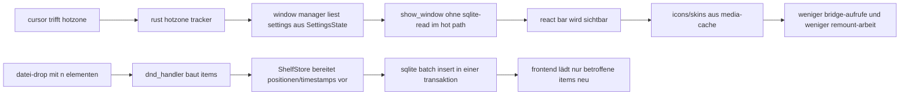

# cleanup + performance pass

## ziel

diese runde härtet die aktuelle tauri-architektur, räumt den worktree auf und verkürzt die häufigsten laufzeitpfade, ohne die app unnötig umzubauen.

## umgesetzt

1. `ARCHIVED_OLD`-altlasten und fremde delete/archiv-verschiebungen aus dem worktree entfernt, damit nur reale release-änderungen übrig bleiben.
2. settings im rust-core als in-memory-state gespiegelt, damit `show_window` nicht bei jedem hotzone-enter erneut sqlite liest.
3. bulk-drop inserts in `ShelfStore` auf einen vorbereiteten batch-pfad mit weniger roundtrips reduziert.
4. frontend-refetches entschlackt:
   `settings_changed` lädt nicht mehr bei jeder kleinen setting-änderung die skin-liste neu.
5. media-payloads dedupliziert:
   icon- und skin-data-urls werden nun gecacht statt bei jedem remount neu über die tauri-bridge geholt.
6. render-churn reduziert:
   shelf reloads holen bei `shelf_items_changed` nur noch items, nicht pauschal items plus gruppen.
7. debug-noise entfernt:
   laute `console.log`-pfade in hotzone/reorder/shelf-hooks runtergefahren.

## laufzeitfluss nach cleanup

## architektur-notiz

### aktuelle empfehlung

1. **halten:** tauri 2 + rust + react bleibt für popup bar die pragmatisch beste mva.
2. **warum:** native windowing, kleiner footprint, rust für hotzone/launcher/persistenz und genug ui-freiheit für die bar.
3. **grenze:** wenn die app stärker in windows-shell, explorer, global shortcuts und multi-monitor-edge-cases hineinwächst, steigt der aufwand in plattform-bridges merklich.

### alternative lösungen für denselben einsatzzweck

1. **winui 3 + c#**
   beste option, wenn `windows-first` wirklich ernst gemeint ist: bessere shell-integration, einfacher autostart/tray/shortcuts, klarere native ux.
2. **powertoys-run-artiger launcher statt hotzone-bar**
   funktional oft stärker: global hotkey, fuzzy search, bookmarks/apps/dateien in einem overlay. weniger `always-on edge logic`, dafür schneller für keyboard-user.
3. **explorer-toolbar/shell-extension**
   nur sinnvoll, wenn der produktkern eher `windows datei-launcher` als `plattformübergreifende overlay-bar` ist. höchste native integration, aber deutlich höhere komplexität und schlechtere portable story.

## entscheidung

1. **kurzfristig:** aktuelle tauri-architektur weiterziehen und noch drei themen priorisieren:
   shared event model für multi-window sync, globale shortcuts, echtes multi-monitor-handling.
2. **mittelfristig:** falls die app faktisch zu `90% windows-only` wird, winui-3-rewrite nüchtern neu bewerten.

## offene rest-risiken

1. macos/linux bundles sind weiter nicht lokal validiert.
2. code-signing und notarization fehlen weiterhin.
3. linux/macos hotzone input ist funktional noch nicht auf windows-niveau.
