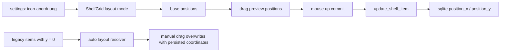

# icon layout pass

## ziel

icons sollen nicht mehr nur implizit ueber die reihenfolge liegen, sondern wirklich platzierbar sein:

1. frei verschiebbar
2. optional am raster ausgerichtet
3. ueber die bestehende `position` dauerhaft gespeichert

## umgesetzt

1. `ShelfGrid` nutzt jetzt echte item-positionen statt nur flex/grid-flow
2. drag bewegt items live und speichert die finale position erst bei mouse-up
3. `alignment = grid` snappt auf ein 64px-raster
4. `alignment = centered | start` erlaubt freie platzierung, nutzt aber fuer alte items ein sinnvolles startlayout
5. alte daten bleiben benutzbar: legacy-positionen mit `y = 0` werden als auto-layout interpretiert

## datenfluss

## produktentscheidungen

1. speichern passiert erst am ende des drags, nicht bei jeder mausbewegung
2. `grid` ist snap-to-grid, die anderen modi sind freie platzierung
3. `centered` und `start` definieren nur das startlayout fuer legacy-items oder neu angelegte items

## bekannte grenzen

1. die bar ist hoehenbegrenzt; freie y-positionen sind absichtlich innerhalb der bar geklemmt
2. sehr alte daten mit rein sequentiellen `position_x`-werten werden erst nach der ersten manuellen verschiebung zu echten freien koordinaten
3. vertikale bars werden brauchbar unterstuetzt, aber der hauptfokus dieser runde liegt klar auf der horizontalen top-bar
