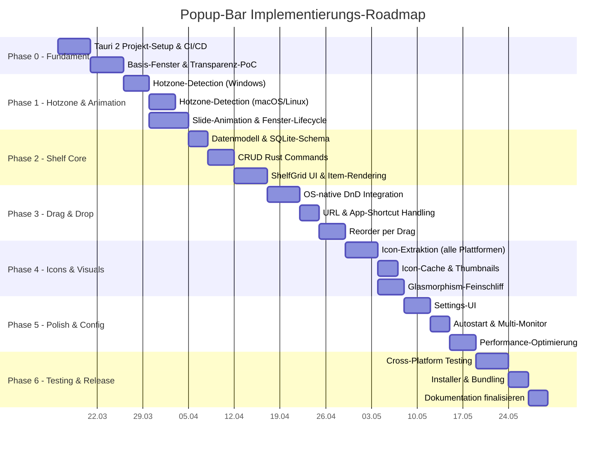
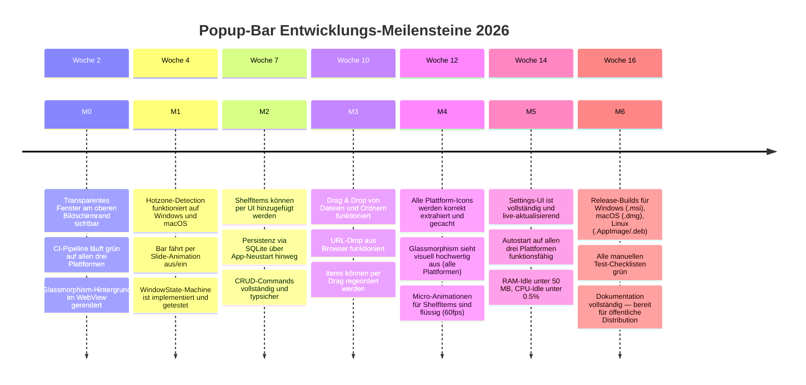

# Implementierungsplan — Popup Bar

> **Dokument-Version:** 1.0.0  
> **Erstellt:** 2026-03-12  
> **Autoren:** Popup Bar Engineering Team  
> **Status:** Aktiv — verbindliche Roadmap für v1.0

---

## Inhaltsverzeichnis

- [3.0 Status-Snapshot (laufend gepflegt)](#30-status-snapshot-laufend-gepflegt)
- [3.1 Phasen-Roadmap](#31-phasen-roadmap)
- [3.2 Detailschritte pro Phase](#32-detailschritte-pro-phase)
  - [Phase 0 — Fundament](#phase-0--fundament-woche-12)
  - [Phase 1 — Hotzone & Animation](#phase-1--hotzone--animation-woche-35)
  - [Phase 2 — Shelf Core](#phase-2--shelf-core-woche-57)
  - [Phase 3 — Drag & Drop](#phase-3--drag--drop-woche-810)
  - [Phase 4 — Icons & Visuals](#phase-4--icons--visuals-woche-1012)
  - [Phase 5 — Polish & Config](#phase-5--polish--config-woche-1314)
  - [Phase 6 — Testing & Release](#phase-6--testing--release-woche-1516)
- [3.3 Risiken & Mitigations](#33-risiken--mitigations)
- [3.4 Meilensteine](#34-meilensteine)

---

## 3.0 Status-Snapshot (laufend gepflegt)

> Konvention fuer Status: `open`, `in progress`, `blocked`, `done`

### Aktive Prioritaeten

| ID | Bereich | Prioritaet | Status | Bezug |
|---|---|---|---|---|
| P1-01 | Hotzone Event-Flow (Backend) | P0 | done | Phase 1 / Aufgabe 1.1 |
| P1-02 | Frontend Event-Wiring (`useHotzoneState`) | P0 | done | Phase 1 / Aufgabe 1.4 |
| P1-03 | Slide Lifecycle Sync (`show_window`/`hide_window`) | P0 | done | Phase 1 / Aufgabe 1.5 |
| P1-04 | WindowState Guardrails | P1 | done | Phase 1 / Aufgabe 1.6 |
| P1-05 | Tests fuer Event-Flow/FSM | P1 | done | Phase 1 / Aufgabe 1.6 (Testabsicherung) |
| P2-01 | SQLite-Schema & Migration Setup | P0 | done | Phase 2 / Aufgabe 2.1 |
| P2-02 | Shelf CRUD Commands (Rust) | P0 | done | Phase 2 / Aufgabe 2.3 |
| P2-03 | `useShelfItems` Backend-Wiring | P0 | done | Phase 2 / Aufgabe 2.4 |
| P2-04 | ShelfGrid Runtime-Persistenzfluss | P1 | in progress | Phase 2 / Aufgabe 2.5 |
| P2-05 | Shelf UX: Error-State + Toasts | P1 | done | Phase 2 Restpunkt (Produktreife) |
| P3-01 | Drop-Path Handling (Datei/Ordner/App/URL) | P0 | in progress | Phase 3 / Aufgabe 3.1-3.3 |
| P3-02 | Reorder Persistenz (`reorder_shelf_items`) | P0 | in progress | Phase 3 / Aufgabe 3.5 |
| P4-01 | Icon Resolver + Cache Baseline | P0 | done | Phase 4 / Aufgabe 4.1-4.3 |
| P4-02 | ShelfItem Icon Rendering + Fallback | P0 | done | Phase 4 / Aufgabe 4.5 |
| P4-03 | Native Icon Extraction (Win/macOS/Linux) | P0 | done | Phase 4 / Aufgabe 4.1-4.2 |
| P4-04 | Icon-Cache-Invalidierung (source_path) | P1 | done | Phase 4 / Aufgabe 4.3 |
| P4-05 | Glassmorphism plattformspezifisch | P1 | done | Phase 4 / Aufgabe 4.4 |
| DOC-01 | Plan-vs-Code Status Sync pro PR | P0 | done | Prozessregel |

---

## 3.1 Phasen-Roadmap



> **Gesamtdauer:** ~16 Wochen (ca. 80 Arbeitstage) für eine einzelne Vollzeit-Entwicklungsperson.  
> Parallelisierung (z.B. `p1b` und `p1c`) ist explizit eingezeichnet.

---

## 3.2 Detailschritte pro Phase

---

### Phase 0 — Fundament (Woche 1–2)

**Ziel:** Ein sauber konfiguriertes, CI-geprüftes Tauri-2-Projekt mit transparentem Testfenster, das als stabiles Fundament für alle weiteren Phasen dient.

---

#### Aufgaben

**Aufgabe 0.1 — Tauri 2 Projekt initialisieren**

Erzeuge das vollständige Projektgerüst mit `npm create tauri-app@latest`, konfiguriere TypeScript strict mode, Vite als Build-Tool und React 18 als UI-Framework. Stelle sicher, dass alle Abhängigkeiten aus `package.json` (Zustand 5, `@tauri-apps/api 2.2`) und `Cargo.toml` (Tauri 2.2, sqlx 0.8, tokio full) korrekt eingebunden sind.

- Akzeptanzkriterien:
  - ✓ `cargo tauri dev` startet ohne Fehler oder Warnings
  - ✓ React-Frontend rendert im WebView (`Hello World`-Komponente sichtbar)
  - ✓ Hot-Reload funktioniert: Änderung in `src/App.tsx` wird ohne Neustart reflektiert
- Abhängigkeiten: Keine
- Aufwand: 1 Tag

---

**Aufgabe 0.2 — Projektstruktur anlegen**

Lege die vollständige Verzeichnisstruktur gemäß Architektur-Dokument an:

```
src-tauri/src/
├── lib.rs
├── commands/
│   ├── shelf_commands.rs
│   ├── settings_commands.rs
│   └── system_commands.rs
└── modules/
    ├── hotzone.rs
    ├── window_manager.rs
    ├── shelf_store.rs
    ├── icon_resolver.rs
    ├── dnd_handler.rs
    ├── config.rs
    ├── launcher.rs
    └── platform/
        ├── mod.rs
        ├── windows.rs
        ├── macos.rs
        └── linux.rs
```

Alle Module enthalten initiale `pub struct` / `pub trait`-Definitionen als Platzhalter (kein `todo!()`-Panicking in Release-Builds).

- Akzeptanzkriterien:
  - ✓ `cargo build` kompiliert ohne Fehler (Warnings für ungenutzte Imports erlaubt)
  - ✓ `lib.rs` registriert alle Command-Module via `tauri::generate_handler![]`
  - ✓ `platform/mod.rs` definiert das `PlatformProvider`-Trait mit mindestens 3 Methoden-Signaturen
- Abhängigkeiten: 0.1
- Aufwand: 1 Tag

---

**Aufgabe 0.3 — CI/CD Pipeline einrichten (GitHub Actions)**

Erstelle `.github/workflows/ci.yml` mit drei Jobs: `test` (Rust unit tests + `cargo clippy`), `build-check` (alle Zielplattformen: `x86_64-pc-windows-msvc`, `x86_64-apple-darwin`, `x86_64-unknown-linux-gnu`), `frontend-check` (TypeScript Typcheck + `vite build`). Verwende `Cargo.lock`-Pinning für reproduzierbare Builds.

```yaml
# .github/workflows/ci.yml (Auszug)
jobs:
  test:
    runs-on: ubuntu-latest
    steps:
      - uses: actions/checkout@v4
      - uses: dtolnay/rust-toolchain@stable
      - run: cargo clippy -- -D warnings
      - run: cargo test

  build-check:
    strategy:
      matrix:
        os: [ubuntu-latest, windows-latest, macos-latest]
    runs-on: ${{ matrix.os }}
    steps:
      - uses: actions/checkout@v4
      - uses: dtolnay/rust-toolchain@stable
      - run: cargo build --release
```

- Akzeptanzkriterien:
  - ✓ CI läuft auf Push zu `main` und allen Pull Requests
  - ✓ Alle drei Matrix-Builds sind grün
  - ✓ `cargo clippy -- -D warnings` produziert keine Fehler
- Abhängigkeiten: 0.2
- Aufwand: 1 Tag

---

**Aufgabe 0.4 — Transparentes Basis-Fenster implementieren**

Konfiguriere `tauri.conf.json` für ein Fenster ohne Titelleiste, mit Transparenz und korrekten Startdimensionen für die Bar. Implementiere plattformspezifische Transparenz in `src-tauri/src/modules/window_manager.rs`:

```rust
// modules/window_manager.rs
use tauri::{AppHandle, Manager, WebviewWindow};

pub struct PopupWindowManager {
    handle: AppHandle,
}

impl PopupWindowManager {
    pub fn configure_window(window: &WebviewWindow) -> tauri::Result<()> {
        #[cfg(target_os = "windows")]
        {
            use window_vibrancy::apply_acrylic;
            apply_acrylic(window, Some((18, 18, 18, 125)))?;
        }
        #[cfg(target_os = "macos")]
        {
            use window_vibrancy::{apply_vibrancy, NSVisualEffectMaterial};
            apply_vibrancy(window, NSVisualEffectMaterial::HudWindow, None, None)?;
        }
        window.set_decorations(false)?;
        window.set_always_on_top(true)?;
        Ok(())
    }
}
```

- Akzeptanzkriterien:
  - ✓ Fenster erscheint ohne Titelleiste und ohne Schatten-Artefakte
  - ✓ Hintergrund ist sichtbar transparent auf Windows (Acrylic) und macOS (Vibrancy)
  - ✓ `always_on_top: true` verhindert, dass andere Fenster die Bar überdecken
- Abhängigkeiten: 0.2
- Aufwand: 2 Tage

---

**Aufgabe 0.5 — Frontend-Basis: App.tsx + ShelfBar-Skeleton**

Implementiere `src/App.tsx` als Root-Komponente und `src/components/ShelfBar/ShelfBar.tsx` als leeren Container mit Glassmorphism-CSS. Richte `src/types/events.ts` für alle Tauri-Event-Namen als `const`-Strings ein.

```typescript
// src/types/events.ts
export const EVENTS = {
  HOTZONE_ENTER: 'hotzone:enter',
  HOTZONE_LEAVE: 'hotzone:leave',
  SHELF_ITEM_ADDED: 'shelf:item-added',
  SHELF_ITEM_REMOVED: 'shelf:item-removed',
  SHELF_ITEM_UPDATED: 'shelf:item-updated',
  SETTINGS_CHANGED: 'settings:changed',
} as const;

export type EventName = typeof EVENTS[keyof typeof EVENTS];
```

- Akzeptanzkriterien:
  - ✓ `ShelfBar` rendert in der WebView mit korrektem Glassmorphism-Hintergrund
  - ✓ TypeScript-Typen für alle Events sind definiert und exportiert
  - ✓ `src/tauri-bridge.ts` enthält typisierte `invoke`-Wrapper (auch wenn Commands noch nicht existieren)
- Abhängigkeiten: 0.4
- Aufwand: 1 Tag

---

**Demo-Ziel (Ende Phase 0):** Ein transparentes, dekoration-freies Fenster am oberen Bildschirmrand ist sichtbar. CI ist grün auf allen drei Plattformen. Das Fenster zeigt den `ShelfBar`-Container mit Glassmorphism-Hintergrund ohne Inhalte.

---

### Phase 1 — Hotzone & Animation (Woche 3–5)

**Ziel:** Die Popup-Bar erkennt zuverlässig, wenn der Cursor den oberen Bildschirmrand berührt, und fährt per CSS-Animation sichtbar aus/ein — auf allen drei Zielplattformen.

---

#### Aufgaben

**Aufgabe 1.1 — HotzoneTracker: Windows-Implementierung**

Implementiere `HotzoneTracker` in `modules/hotzone.rs` für Windows mit `SetWindowsHookEx` (WH_MOUSE_LL). Der Tracker überwacht die globale Mausposition und emittiert `hotzone:enter` / `hotzone:leave` Events über den Tauri-Event-Bus.

```rust
// modules/hotzone.rs (Windows-spezifisch)
use tauri::{AppHandle, Emitter};

pub struct HotzoneConfig {
    pub height_px: u32,         // Standard: 2px
    pub cooldown_ms: u64,       // Standard: 300ms — verhindert Flackern
}

pub struct HotzoneTracker {
    config: HotzoneConfig,
    is_active: std::sync::Arc<std::sync::atomic::AtomicBool>,
}

impl HotzoneTracker {
    pub fn setup(app: AppHandle, config: HotzoneConfig) {
        #[cfg(target_os = "windows")]
        {
            use windows::Win32::UI::WindowsAndMessaging::{
                SetWindowsHookExW, WH_MOUSE_LL, HOOKPROC,
            };
            // Low-level mouse hook installieren
            // Bei cursor.y < config.height_px: emit hotzone:enter
            // Bei cursor.y >= bar_height + margin: emit hotzone:leave
        }
    }
}
```

Der `cooldown_ms`-Parameter (Standard: 300 ms) verhindert, dass ein Flackern der Bar beim versehentlichen Streifen des Randes entsteht.

- Akzeptanzkriterien:
  - ✓ `hotzone:enter`-Event wird emittiert, wenn Cursor `y < 2px` auf dem Primärmonitor
  - ✓ `hotzone:leave`-Event wird emittiert mit 300ms Debounce nach Verlassen
  - ✓ Kein Speicher-Leak: Hook wird beim App-Shutdown korrekt mit `UnhookWindowsHookEx` entfernt
- Abhängigkeiten: 0.4
- Aufwand: 2 Tage

---

**Aufgabe 1.2 — HotzoneTracker: macOS-Implementierung**

Implementiere den `HotzoneTracker` für macOS via `CGEventTap` (`kCGEventMouseMoved`). Nutze `objc2` oder `core-foundation`-Bindings. Der Event-Tap muss im Accessibility-Permission-Flow des macOS-Systems erklärt werden.

```rust
// modules/platform/macos.rs
#[cfg(target_os = "macos")]
pub struct MacOSPlatform;

#[cfg(target_os = "macos")]
impl PlatformProvider for MacOSPlatform {
    fn setup_mouse_hook(&self, callback: HotzoneCallback) -> Result<HookHandle, PlatformError> {
        // CGEventTapCreate mit kCGEventMouseMoved
        // Callback prüft CGEventGetLocation für y-Koordinate
        todo!("Implementierung via core-graphics crate")
    }

    fn request_accessibility_permission(&self) -> bool {
        // AXIsProcessTrustedWithOptions aufrufen
        // Gibt false zurück, wenn Permission nicht erteilt
        todo!()
    }
}
```

- Akzeptanzkriterien:
  - ✓ `hotzone:enter` wird auf macOS korrekt getriggert
  - ✓ Bei fehlenden Accessibility-Rechten: Benachrichtigungs-Dialog erscheint und führt zu Systemeinstellungen
  - ✓ Event-Tap wird beim Beenden der App sicher deregistriert
- Abhängigkeiten: 1.1 (Trait-Definition aus `platform/mod.rs`)
- Aufwand: 3 Tage

---

**Aufgabe 1.3 — HotzoneTracker: Linux-Implementierung (X11 + Wayland-Fallback)**

Implementiere für X11 via `XInput2` Extension (`XISelectEvents` mit `XI_Motion`). Für Wayland, wo globale Mausposition nicht abrufbar ist, implementiere den **1px-Trigger-Streifen-Fallback**: Ein unsichtbares Fenster der Breite des Monitors und Höhe 1px am oberen Rand, das `WM_ENTER`-Events empfängt.

```rust
// modules/platform/linux.rs
#[cfg(target_os = "linux")]
pub struct LinuxPlatform {
    display_server: DisplayServer,
}

#[cfg(target_os = "linux")]
pub enum DisplayServer {
    X11,
    Wayland,
}

#[cfg(target_os = "linux")]
impl LinuxPlatform {
    fn detect() -> Self {
        let ds = if std::env::var("WAYLAND_DISPLAY").is_ok() {
            DisplayServer::Wayland
        } else {
            DisplayServer::X11
        };
        LinuxPlatform { display_server: ds }
    }

    fn setup_wayland_trigger_strip(app: &AppHandle) -> tauri::Result<()> {
        // Erstellt ein zusätzliches 1px-Fenster am oberen Monitor-Rand
        // layer-shell-Protokoll (wlr-layer-shell oder xdg-output)
        todo!("wlr-layer-shell via wayland-client crate")
    }
}
```

- Akzeptanzkriterien:
  - ✓ X11: `hotzone:enter` wird via XInput2 korrekt getriggert
  - ✓ Wayland: 1px-Trigger-Streifen ist unsichtbar aber funktional
  - ✓ `DisplayServer`-Enum wird beim Start korrekt detektiert und geloggt
- Abhängigkeiten: 1.1
- Aufwand: 4 Tage

---

**Aufgabe 1.4 — `useHotzoneState`-Hook: Frontend-Integration**

Implementiere `src/hooks/useHotzoneState.ts`, der auf `hotzone:enter` und `hotzone:leave` via `@tauri-apps/api` `listen()` subscribed und `isVisible: boolean` zurückgibt.

```typescript
// src/hooks/useHotzoneState.ts
import { listen, UnlistenFn } from '@tauri-apps/api/event';
import { useEffect, useState } from 'react';
import { EVENTS } from '../types/events';

export function useHotzoneState() {
  const [isVisible, setIsVisible] = useState(false);

  useEffect(() => {
    let unlistenEnter: UnlistenFn;
    let unlistenLeave: UnlistenFn;

    const setup = async () => {
      unlistenEnter = await listen(EVENTS.HOTZONE_ENTER, () => {
        setIsVisible(true);
      });
      unlistenLeave = await listen(EVENTS.HOTZONE_LEAVE, () => {
        setIsVisible(false);
      });
    };

    setup();
    return () => {
      unlistenEnter?.();
      unlistenLeave?.();
    };
  }, []);

  return { isVisible };
}
```

- Akzeptanzkriterien:
  - ✓ `isVisible` wechselt korrekt bei Hotzone-Events
  - ✓ Event-Listener werden beim Unmount korrekt aufgeräumt (kein Memory-Leak)
  - ✓ Unit-Test mit Mock-Event-Emitter: Hook reagiert auf beide Events korrekt
- Abhängigkeiten: 1.1, 0.5
- Aufwand: 1 Tag

---

**Aufgabe 1.5 — CSS Slide-Animation & Fenster-Lifecycle**

Implementiere die `animate-slide-down`- und `animate-slide-up`-CSS-Animationen in `src/styles/animations.css`. Verknüpfe `isVisible` aus `useHotzoneState` mit der CSS-Klasse auf `ShelfBar`. Implementiere `PopupWindowManager.show()` / `PopupWindowManager.hide()` in Rust, die das Fenster nach der Animation verstecken (um Ressourcen zu sparen).

```css
/* src/styles/animations.css */
@keyframes slide-down {
  from { transform: translateY(-100%); opacity: 0; }
  to   { transform: translateY(0);     opacity: 1; }
}

@keyframes slide-up {
  from { transform: translateY(0);     opacity: 1; }
  to   { transform: translateY(-100%); opacity: 0; }
}

.shelf-bar--visible {
  animation: slide-down 220ms cubic-bezier(0.16, 1, 0.3, 1) forwards;
}

.shelf-bar--hidden {
  animation: slide-up 180ms cubic-bezier(0.7, 0, 0.84, 0) forwards;
}
```

Für die Animation ist der `WebviewWindow`-State relevant: Das Fenster bleibt nach `slide-up` sichtbar für weitere `animationend`-Events, erst dann wird `window.hide()` via Tauri-Command aufgerufen.

- Akzeptanzkriterien:
  - ✓ Animation dauert maximal 250ms (Usability-Anforderung aus Architektur-Dokument)
  - ✓ Kein Flackern oder Sprung beim ersten Erscheinen der Bar
  - ✓ `window.hide()` wird erst nach Ende der `slide-up`-Animation aufgerufen
- Abhängigkeiten: 1.4, 0.4
- Aufwand: 2 Tage

---

**Aufgabe 1.6 — `WindowState`-Machine in Rust**

Implementiere eine `WindowState`-Zustandsmaschine in `modules/window_manager.rs` mit den Zuständen `Hidden`, `Animating`, `Visible`, `Dragging`. Transitions werden durch Events gesteuert.

```rust
// modules/window_manager.rs
#[derive(Debug, Clone, PartialEq)]
pub enum WindowState {
    Hidden,
    AnimatingIn,
    Visible,
    Dragging,      // Verhindert auto-hide während DnD
    AnimatingOut,
}

pub struct PopupWindowManager {
    state: Arc<Mutex<WindowState>>,
    handle: AppHandle,
}

impl PopupWindowManager {
    pub fn transition_to(&self, next: WindowState) -> Result<(), WindowError> {
        let mut state = self.state.lock().unwrap();
        match (&*state, &next) {
            (WindowState::Hidden, WindowState::AnimatingIn) => { /* OK */ }
            (WindowState::Visible, WindowState::AnimatingOut) => { /* OK */ }
            (WindowState::Dragging, WindowState::AnimatingOut) => {
                return Err(WindowError::InvalidTransition); // Nicht verstecken während DnD
            }
            _ => { /* ... weitere Transitionen ... */ }
        }
        *state = next;
        Ok(())
    }
}
```

- Akzeptanzkriterien:
  - ✓ Ungültige State-Transitionen (z.B. `Dragging → Hidden`) werden mit `Err` abgefangen
  - ✓ `Dragging`-State verhindert das automatische Ausblenden der Bar
  - ✓ Unit-Tests für alle validen und invaliden Transitionen
- Abhängigkeiten: 1.1, 1.5
- Aufwand: 1 Tag

---

**Demo-Ziel (Ende Phase 1):** Die Bar fährt sichtbar aus dem oberen Rand heraus, wenn der Cursor die Hotzone trifft, und verschwindet nach 300ms Debounce wieder. Dies funktioniert auf Windows, macOS und Linux (X11). Die Wayland-Fallback-Lösung ist implementiert aber noch nicht vollständig getestet.

---

### Phase 2 — Shelf Core (Woche 5–7)

**Ziel:** ShelfItems können persistent gespeichert, gelesen, aktualisiert und gelöscht werden — das Datenmodell ist produktionsreif mit SQLite-Migrations-System.

---

#### Aufgaben

**Aufgabe 2.1 — SQLite-Schema & Migrations-Setup**

Definiere das Datenbankschema in `src-tauri/migrations/`. Verwende `sqlx`-Migrationen (nummerierte `.sql`-Dateien). Das Schema umfasst `shelf_items`, `item_groups`, `settings` und `icon_cache`.

```sql
-- migrations/0001_initial.sql
CREATE TABLE IF NOT EXISTS item_groups (
    id          TEXT PRIMARY KEY,  -- UUID v4
    name        TEXT NOT NULL,
    position    INTEGER NOT NULL DEFAULT 0,
    created_at  TEXT NOT NULL DEFAULT (datetime('now')),
    updated_at  TEXT NOT NULL DEFAULT (datetime('now'))
);

CREATE TABLE IF NOT EXISTS shelf_items (
    id          TEXT PRIMARY KEY,  -- UUID v4
    group_id    TEXT REFERENCES item_groups(id) ON DELETE SET NULL,
    item_type   TEXT NOT NULL CHECK(item_type IN ('file', 'folder', 'app', 'url')),
    label       TEXT NOT NULL,
    path_or_url TEXT NOT NULL,
    icon_path   TEXT,              -- Pfad im icon_cache
    position    INTEGER NOT NULL DEFAULT 0,
    created_at  TEXT NOT NULL DEFAULT (datetime('now')),
    updated_at  TEXT NOT NULL DEFAULT (datetime('now'))
);

CREATE TABLE IF NOT EXISTS settings (
    key         TEXT PRIMARY KEY,
    value       TEXT NOT NULL,
    updated_at  TEXT NOT NULL DEFAULT (datetime('now'))
);

CREATE TABLE IF NOT EXISTS icon_cache (
    hash        TEXT PRIMARY KEY,  -- SHA-256 des Quell-Pfads
    icon_path   TEXT NOT NULL,
    created_at  TEXT NOT NULL DEFAULT (datetime('now'))
);

CREATE INDEX idx_shelf_items_position ON shelf_items(position);
CREATE INDEX idx_shelf_items_group_id ON shelf_items(group_id);
```

- Akzeptanzkriterien:
  - ✓ Migration wird beim App-Start automatisch via `sqlx::migrate!()` ausgeführt
  - ✓ Schema ist idempotent: Mehrfaches Ausführen der Migration erzeugt keine Fehler
  - ✓ Alle Fremdschlüssel-Constraints sind definiert und aktiv (`PRAGMA foreign_keys = ON`)
- Abhängigkeiten: 0.2
- Aufwand: 1 Tag

---

**Aufgabe 2.2 — Rust-Datenmodelle: `ShelfItem` und `ItemGroup`**

Definiere die Rust-Structs in `modules/shelf_store.rs` mit `serde`-Derive für JSON-Serialisierung und `sqlx`-`FromRow` für Datenbank-Mapping.

```rust
// modules/shelf_store.rs
use serde::{Deserialize, Serialize};
use sqlx::FromRow;
use uuid::Uuid;

#[derive(Debug, Clone, Serialize, Deserialize, FromRow)]
pub struct ShelfItem {
    pub id: String,
    pub group_id: Option<String>,
    pub item_type: ItemType,
    pub label: String,
    pub path_or_url: String,
    pub icon_path: Option<String>,
    pub position: i64,
}

#[derive(Debug, Clone, Serialize, Deserialize, sqlx::Type)]
#[sqlx(type_name = "TEXT")]
#[serde(rename_all = "lowercase")]
pub enum ItemType {
    File,
    Folder,
    App,
    Url,
}

#[derive(Debug, Clone, Serialize, Deserialize, FromRow)]
pub struct ItemGroup {
    pub id: String,
    pub name: String,
    pub position: i64,
}

pub struct ShelfStore {
    db: sqlx::SqlitePool,
}

impl ShelfStore {
    pub async fn add_item(&self, item: CreateShelfItem) -> Result<ShelfItem, sqlx::Error> {
        let id = Uuid::new_v4().to_string();
        // INSERT INTO shelf_items ...
        todo!()
    }

    pub async fn list_items(&self) -> Result<Vec<ShelfItem>, sqlx::Error> {
        sqlx::query_as::<_, ShelfItem>(
            "SELECT * FROM shelf_items ORDER BY position ASC"
        )
        .fetch_all(&self.db)
        .await
    }

    pub async fn delete_item(&self, id: &str) -> Result<(), sqlx::Error> {
        sqlx::query("DELETE FROM shelf_items WHERE id = ?")
            .bind(id)
            .execute(&self.db)
            .await?;
        Ok(())
    }

    pub async fn reorder_items(&self, ordered_ids: Vec<String>) -> Result<(), sqlx::Error> {
        // UPDATE shelf_items SET position = ?, updated_at = datetime('now') WHERE id = ?
        // In einer Transaktion für alle IDs
        todo!()
    }
}
```

- Akzeptanzkriterien:
  - ✓ `ShelfItem` kann verlustfrei in JSON serialisiert und deserialisiert werden
  - ✓ `list_items()` gibt Items korrekt nach `position ASC` sortiert zurück
  - ✓ `reorder_items()` führt alle UPDATEs in einer atomaren SQLite-Transaktion aus
- Abhängigkeiten: 2.1
- Aufwand: 1 Tag

---

**Aufgabe 2.3 — Tauri Commands: CRUD für Shelf**

Implementiere die Tauri-Commands in `commands/shelf_commands.rs`. Alle Commands erhalten den `ShelfStore` als `tauri::State<T>` und geben `Result<T, String>` zurück (serialisierbarer Fehlertyp für Frontend).

```rust
// commands/shelf_commands.rs
use tauri::State;
use crate::modules::shelf_store::{ShelfStore, ShelfItem, CreateShelfItem};

#[tauri::command]
pub async fn list_shelf_items(
    store: State<'_, ShelfStore>
) -> Result<Vec<ShelfItem>, String> {
    store.list_items().await.map_err(|e| e.to_string())
}

#[tauri::command]
pub async fn add_shelf_item(
    store: State<'_, ShelfStore>,
    item: CreateShelfItem,
) -> Result<ShelfItem, String> {
    store.add_item(item).await.map_err(|e| e.to_string())
}

#[tauri::command]
pub async fn remove_shelf_item(
    store: State<'_, ShelfStore>,
    id: String,
) -> Result<(), String> {
    store.delete_item(&id).await.map_err(|e| e.to_string())
}

#[tauri::command]
pub async fn reorder_shelf_items(
    store: State<'_, ShelfStore>,
    ordered_ids: Vec<String>,
) -> Result<(), String> {
    store.reorder_items(ordered_ids).await.map_err(|e| e.to_string())
}
```

Entsprechende typisierte Wrapper werden in `src/tauri-bridge.ts` ergänzt:

```typescript
// src/tauri-bridge.ts (Erweiterung)
import { invoke } from '@tauri-apps/api/core';
import type { ShelfItem, CreateShelfItem } from './types/shelf';

export const tauriBridge = {
  listShelfItems: () =>
    invoke<ShelfItem[]>('list_shelf_items'),
  addShelfItem: (item: CreateShelfItem) =>
    invoke<ShelfItem>('add_shelf_item', { item }),
  removeShelfItem: (id: string) =>
    invoke<void>('remove_shelf_item', { id }),
  reorderShelfItems: (orderedIds: string[]) =>
    invoke<void>('reorder_shelf_items', { orderedIds }),
};
```

- Akzeptanzkriterien:
  - ✓ `invoke('list_shelf_items')` gibt leeres Array zurück bei frischer Datenbank
  - ✓ `invoke('add_shelf_item', ...)` gibt das erzeugte `ShelfItem` mit generierter UUID zurück
  - ✓ Fehler in Rust-Commands landen als `string`-Error im Frontend-`catch`-Block
- Abhängigkeiten: 2.2
- Aufwand: 2 Tage

---

**Aufgabe 2.4 — `useShelfStore` Zustand-Store**

Implementiere `src/stores/useShelfStore.ts` mit Zustand 5. Der Store hält `items: ShelfItem[]` und Action-Funktionen, die über `tauriBridge` mit dem Backend kommunizieren.

```typescript
// src/stores/useShelfStore.ts
import { create } from 'zustand';
import { tauriBridge } from '../tauri-bridge';
import type { ShelfItem } from '../types/shelf';

interface ShelfStoreState {
  items: ShelfItem[];
  isLoading: boolean;
  loadItems: () => Promise<void>;
  addItem: (item: CreateShelfItem) => Promise<void>;
  removeItem: (id: string) => Promise<void>;
  reorderItems: (orderedIds: string[]) => void; // Optimistisch
}

export const useShelfStore = create<ShelfStoreState>((set, get) => ({
  items: [],
  isLoading: false,

  loadItems: async () => {
    set({ isLoading: true });
    const items = await tauriBridge.listShelfItems();
    set({ items, isLoading: false });
  },

  addItem: async (newItem) => {
    // Optimistisches Update: sofort im State, dann persistieren
    const tempId = `temp-${Date.now()}`;
    const optimisticItem = { ...newItem, id: tempId } as ShelfItem;
    set(state => ({ items: [...state.items, optimisticItem] }));
    const savedItem = await tauriBridge.addShelfItem(newItem);
    set(state => ({
      items: state.items.map(i => i.id === tempId ? savedItem : i)
    }));
  },

  removeItem: async (id) => {
    set(state => ({ items: state.items.filter(i => i.id !== id) }));
    await tauriBridge.removeShelfItem(id);
  },

  reorderItems: (orderedIds) => {
    // Optimistische Reorder-Logik
    const itemMap = new Map(get().items.map(i => [i.id, i]));
    const reordered = orderedIds.map(id => itemMap.get(id)!).filter(Boolean);
    set({ items: reordered });
    tauriBridge.reorderShelfItems(orderedIds); // Fire-and-forget
  },
}));
```

- Akzeptanzkriterien:
  - ✓ `loadItems()` wird beim App-Start in `App.tsx` aufgerufen
  - ✓ `addItem()` zeigt das neue Item sofort in der UI (optimistisches Update)
  - ✓ Fehler in Backend-Calls setzen einen `error`-State, der in der UI als Toast angezeigt wird
- Abhängigkeiten: 2.3
- Aufwand: 1 Tag

---

**Aufgabe 2.5 — `ShelfGrid` und `ShelfItem`-Komponenten**

Implementiere `src/components/ShelfGrid/ShelfGrid.tsx` mit CSS Grid Layout und `src/components/ShelfItem/ShelfItem.tsx` als einzelne Kachel mit Icon, Label und Kontext-Menü-Trigger.

```typescript
// src/components/ShelfGrid/ShelfGrid.tsx
import { useShelfStore } from '../../stores/useShelfStore';
import { ShelfItem } from '../ShelfItem/ShelfItem';

export function ShelfGrid() {
  const { items } = useShelfStore();

  return (
    <div
      className="shelf-grid"
      style={{
        display: 'grid',
        gridTemplateColumns: 'repeat(auto-fill, minmax(72px, 1fr))',
        gap: '8px',
        padding: '12px',
      }}
    >
      {items.map(item => (
        <ShelfItem key={item.id} item={item} />
      ))}
    </div>
  );
}
```

- Akzeptanzkriterien:
  - ✓ Items werden in korrekter `position`-Reihenfolge gerendert
  - ✓ Grid passt sich dynamisch an die Anzahl der Items an (kein Overflow)
  - ✓ `ShelfItem` zeigt Platzhalter-Icon, wenn `icon_path` null ist
- Abhängigkeiten: 2.4
- Aufwand: 2 Tage

---

**Demo-Ziel (Ende Phase 2):** Ein Item kann über die Entwicklerkonsole via `invoke('add_shelf_item', ...)` hinzugefügt werden und erscheint sofort in der Shelf-Grid-UI. Nach App-Neustart sind die Items noch vorhanden (SQLite-Persistenz). Löschen via Kontext-Menü funktioniert.

---

### Phase 3 — Drag & Drop (Woche 8–10)

**Ziel:** Dateien, Ordner, App-Bundles und URLs können per Drag & Drop auf die Bar gezogen werden und werden korrekt als `ShelfItem` persistiert.

---

#### Aufgaben

**Aufgabe 3.1 — OS-native DnD: Tauri `file-drop`-Listener**

Implementiere den Basis-Drag-&-Drop-Handler in `modules/dnd_handler.rs`. Nutze Tauris eingebauten `on_file_drop_event`-Listener für Datei-Drops und ergänze die `WindowState`-Machine um den `Dragging`-Zustand.

```rust
// modules/dnd_handler.rs
use tauri::{AppHandle, Emitter, DragDropEvent};

pub struct DndHandler {
    app: AppHandle,
}

impl DndHandler {
    pub fn setup(app: &AppHandle) {
        let window = app.get_webview_window("main").unwrap();
        let app_handle = app.clone();

        window.on_drag_drop_event(move |event| {
            match event {
                DragDropEvent::Enter { paths, position } => {
                    // WindowState → Dragging
                    app_handle.emit("dnd:drag-enter", &paths).unwrap();
                }
                DragDropEvent::Drop { paths, position } => {
                    let payload = DragPayload { paths, position };
                    // Validieren und an shelf_store weiterleiten
                    app_handle.emit("dnd:dropped", &payload).unwrap();
                }
                DragDropEvent::Leave => {
                    // WindowState → Visible
                    app_handle.emit("dnd:drag-leave", ()).unwrap();
                }
                _ => {}
            }
        });
    }
}
```

- Akzeptanzkriterien:
  - ✓ Beim Drag-Over der Bar: Visuelles Feedback (`DropZone`-Highlight) erscheint
  - ✓ Drop von einer Datei erzeugt ein `ShelfItem` mit `item_type: "file"`
  - ✓ `WindowState` wechselt zu `Dragging` beim Enter und zurück beim Leave/Drop
- Abhängigkeiten: 1.6, 2.3
- Aufwand: 2 Tage

---

**Aufgabe 3.2 — `DragPayload`-Validierung**

Implementiere Validierungslogik in `dnd_handler.rs`: Prüfe Pfade auf Existenz, maximale Item-Anzahl (Standard: 50), und doppelte Einträge.

```rust
// modules/dnd_handler.rs
#[derive(Debug, Serialize, Deserialize)]
pub struct DragPayload {
    pub paths: Vec<std::path::PathBuf>,
}

impl DragPayload {
    pub fn validate(&self, existing_items: &[ShelfItem]) -> Result<(), DndError> {
        if self.paths.is_empty() {
            return Err(DndError::EmptyPayload);
        }
        if existing_items.len() + self.paths.len() > 50 {
            return Err(DndError::TooManyItems { max: 50 });
        }
        for path in &self.paths {
            if !path.exists() {
                return Err(DndError::PathNotFound(path.clone()));
            }
        }
        Ok(())
    }

    pub fn classify_path(path: &Path) -> ItemType {
        if path.is_dir() {
            #[cfg(target_os = "macos")]
            if path.extension().map_or(false, |e| e == "app") {
                return ItemType::App;
            }
            return ItemType::Folder;
        }
        #[cfg(target_os = "windows")]
        if path.extension().map_or(false, |e| e == "lnk" || e == "exe") {
            return ItemType::App;
        }
        ItemType::File
    }
}
```

- Akzeptanzkriterien:
  - ✓ Drop von nicht-existierendem Pfad wird mit Error-Toast im Frontend quittiert
  - ✓ `.app`-Bundles auf macOS werden als `ItemType::App` klassifiziert
  - ✓ `.lnk`-Dateien auf Windows werden als `ItemType::App` klassifiziert
- Abhängigkeiten: 3.1
- Aufwand: 1 Tag

---

**Aufgabe 3.3 — URL-Drop-Handling**

Implementiere URL-Drop-Support: Der Frontend-Code lauscht auf `dragover`-Events mit `dataTransfer.types` und extrahiert `text/uri-list` oder `text/plain` (für Browser-Tabs). Favicon wird via HTTP-Request geladen und als Icon verwendet.

```typescript
// src/hooks/useDragDrop.ts
export function useDragDrop() {
  const { addItem } = useShelfStore();

  const handleDrop = useCallback(async (event: DragEvent) => {
    event.preventDefault();
    const url = event.dataTransfer?.getData('text/uri-list')
              || event.dataTransfer?.getData('text/plain');

    if (url && isValidUrl(url)) {
      const label = await fetchPageTitle(url) ?? new URL(url).hostname;
      await addItem({
        item_type: 'url',
        label,
        path_or_url: url,
        icon_path: null, // icon_resolver holt Favicon asynchron
      });
    }
  }, [addItem]);

  return { handleDrop };
}
```

- Akzeptanzkriterien:
  - ✓ URL aus Browser-Adressleiste (per Drag auf die Bar) wird korrekt als `ShelfItem` gespeichert
  - ✓ Label wird aus dem `<title>`-Tag der Website extrahiert (mit 3s Timeout-Fallback auf Hostname)
  - ✓ Favicon-URL wird in `icon_path` gespeichert
- Abhängigkeiten: 3.1, 2.3
- Aufwand: 2 Tage

---

**Aufgabe 3.4 — `DropZone`-Komponente: Visual Feedback**

Implementiere `src/components/DropZone/DropZone.tsx` mit visuellen Drag-Over-Effekten. Die Komponente wrapper den `ShelfGrid` und zeigt ein Highlight-Overlay beim aktiven Drag.

```typescript
// src/components/DropZone/DropZone.tsx
export function DropZone({ children }: { children: React.ReactNode }) {
  const [isDragOver, setIsDragOver] = useState(false);
  const { handleDrop } = useDragDrop();

  return (
    <div
      className={`drop-zone ${isDragOver ? 'drop-zone--active' : ''}`}
      onDragEnter={() => setIsDragOver(true)}
      onDragLeave={() => setIsDragOver(false)}
      onDragOver={e => e.preventDefault()}
      onDrop={async (e) => {
        setIsDragOver(false);
        await handleDrop(e.nativeEvent);
      }}
    >
      {isDragOver && (
        <div className="drop-zone__overlay">
          <span>Hier ablegen</span>
        </div>
      )}
      {children}
    </div>
  );
}
```

- Akzeptanzkriterien:
  - ✓ Highlight-Overlay erscheint bei `dragenter` und verschwindet bei `dragleave`
  - ✓ Overlay-Text wechselt je nach Drag-Typ: „Hier ablegen" vs. „URL hinzufügen"
  - ✓ Drop-Zone hat korrekten `z-index` und überdeckt keine ShelfItems
- Abhängigkeiten: 3.1, 3.3
- Aufwand: 1 Tag

---

**Aufgabe 3.5 — Reorder per Drag (Frontend)**

Implementiere Drag-&-Drop-Reordering innerhalb des `ShelfGrid` via HTML5 Drag API. Kein externer DnD-Library-Einsatz (zu schwer für diese App-Größe). Nutze `dragstart`, `dragover`, `drop`-Events auf den `ShelfItem`-Komponenten.

```typescript
// src/hooks/useItemReorder.ts
export function useItemReorder() {
  const { items, reorderItems } = useShelfStore();
  const draggedId = useRef<string | null>(null);

  const onDragStart = useCallback((id: string) => {
    draggedId.current = id;
  }, []);

  const onDropOnItem = useCallback((targetId: string) => {
    if (!draggedId.current || draggedId.current === targetId) return;
    const currentIds = items.map(i => i.id);
    const fromIdx = currentIds.indexOf(draggedId.current);
    const toIdx   = currentIds.indexOf(targetId);
    const reordered = [...currentIds];
    reordered.splice(fromIdx, 1);
    reordered.splice(toIdx, 0, draggedId.current);
    reorderItems(reordered);
    draggedId.current = null;
  }, [items, reorderItems]);

  return { onDragStart, onDropOnItem };
}
```

- Akzeptanzkriterien:
  - ✓ Items können per Drag innerhalb der Bar umsortiert werden
  - ✓ Neue Reihenfolge wird in SQLite persistiert (via `reorder_shelf_items`)
  - ✓ Bei Drag-Fehler (z.B. Drop außerhalb) wird die ursprüngliche Reihenfolge beibehalten
- Abhängigkeiten: 2.4, 3.4
- Aufwand: 2 Tage

---

**Demo-Ziel (Ende Phase 3):** Eine Datei aus dem Datei-Explorer auf die Bar ziehen → Item erscheint in der Bar. Eine URL aus dem Browser auf die Bar ziehen → URL-Item erscheint. Items können per Drag innerhalb der Bar umsortiert werden. Alle Daten überleben einen App-Neustart.

---

### Phase 4 — Icons & Visuals (Woche 10–12)

**Ziel:** Alle ShelfItems zeigen korrekte, plattform-extrahierte Icons in hochauflösender Qualität. Das Glassmorphism-Rendering ist visuell auf allen drei Plattformen konsistent und performant.

---

#### Aufgaben

**Aufgabe 4.1 — `icon_resolver`: Windows-Implementierung**

Implementiere `extract_icon` in `modules/icon_resolver.rs` für Windows via `SHGetFileInfo` (SHGFI_ICON mit SHGFI_LARGEICON für 256px) und `GetIconInfo`. Konvertiere das HICON zu PNG via `image`-Crate.

```rust
// modules/icon_resolver.rs
use std::path::Path;

pub struct IconResolver {
    cache_dir: std::path::PathBuf,
    db: sqlx::SqlitePool,
}

impl IconResolver {
    pub async fn resolve_icon(&self, path: &Path) -> Result<String, IconError> {
        let hash = self.hash_path(path);

        // Cache-Check in SQLite
        if let Some(cached) = self.lookup_cache(&hash).await? {
            return Ok(cached);
        }

        // Plattform-spezifische Extraktion
        let png_data = self.extract_platform_icon(path)?;

        // Als PNG speichern
        let icon_path = self.cache_dir.join(format!("{}.png", hash));
        std::fs::write(&icon_path, &png_data)?;

        // In SQLite eintragen
        self.insert_cache(&hash, icon_path.to_str().unwrap()).await?;

        Ok(icon_path.to_string_lossy().to_string())
    }

    #[cfg(target_os = "windows")]
    fn extract_platform_icon(&self, path: &Path) -> Result<Vec<u8>, IconError> {
        // SHGetFileInfo(path, 0, &shinfo, size, SHGFI_ICON | SHGFI_LARGEICON)
        // GetIconInfo(hicon, &iconinfo)
        // Bitmap zu PNG konvertieren via image::DynamicImage
        todo!("Windows SHGetFileInfo → PNG")
    }
}
```

- Akzeptanzkriterien:
  - ✓ Icons für `.exe`, `.lnk` und `.pdf`-Dateien werden korrekt extrahiert
  - ✓ Extrahierte Icons haben mindestens 256×256 Pixel
  - ✓ Cache-Hit vermeidet erneute Extraktion: zweiter Aufruf mit gleichem Pfad dauert < 1ms
- Abhängigkeiten: 2.1
- Aufwand: 2 Tage

---

**Aufgabe 4.2 — `icon_resolver`: macOS- und Linux-Implementierung**

macOS: Nutze `NSWorkspace.shared.icon(forFile:)` via `objc2-app-kit`. Exportiere das `NSImage` als PNG via `tiffRepresentation` → `NSBitmapImageRep` → PNG-Daten.

Linux: Implementiere Freedesktop.org Icon Theme Spec Lookup via `gtk_icon_theme_load_icon` (für `.desktop`-Dateien) und direktes Lesen von `Icon=`-Einträgen in `.desktop`-Dateien.

- Akzeptanzkriterien:
  - ✓ `.app`-Bundles auf macOS zeigen ihr korrektes Application-Icon
  - ✓ `.desktop`-App-Einträge auf Linux nutzen das korrekte Theme-Icon
  - ✓ Fallback-Icon (`assets/fallback-icon.png`) wird gezeigt, wenn keine Icon-Quelle gefunden
- Abhängigkeiten: 4.1
- Aufwand: 3 Tage

---

**Aufgabe 4.3 — Icon-Cache-Invalidierung**

Implementiere eine Cache-Invalidierungsstrategie: Icons werden per `inotify` (Linux) / `FSEventStream` (macOS) / `ReadDirectoryChangesW` (Windows) auf Änderungen überwacht. Bei Datei-Update wird der Cache-Eintrag invalidiert.

- Akzeptanzkriterien:
  - ✓ Wenn eine App aktualisiert wird (neues Icon), zeigt die Bar beim nächsten Starten das neue Icon
  - ✓ `icon_cache`-Tabelle wird via `DELETE WHERE hash = ?` bereinigt
  - ✓ Verwaiste PNG-Dateien im Cache-Verzeichnis werden periodisch gelöscht (beim App-Start)
- Abhängigkeiten: 4.2
- Aufwand: 1 Tag

---

**Aufgabe 4.4 — Glasmorphism-Feinschliff: Plattformspezifische Anpassungen**

Verfeinere das visuelle Erscheinungsbild in `src/styles/glassmorphism.css`. Implementiere plattformspezifische CSS-Variablen, die über einen Tauri-Command beim Start gesetzt werden (z.B. unterschiedliche `backdrop-filter`-Werte je nach OS-Fähigkeiten).

```css
/* src/styles/glassmorphism.css */
.shelf-bar {
  /* Fallback für alle Plattformen */
  background: rgba(15, 15, 20, 0.75);
  border: 1px solid rgba(255, 255, 255, 0.12);
  border-top: none;
  border-radius: 0 0 16px 16px;
  box-shadow:
    0 8px 32px rgba(0, 0, 0, 0.4),
    inset 0 1px 0 rgba(255, 255, 255, 0.08);

  /* Blur — nur wenn backdrop-filter unterstützt */
  @supports (backdrop-filter: blur(20px)) {
    background: rgba(15, 15, 20, 0.55);
    backdrop-filter: blur(20px) saturate(180%);
    -webkit-backdrop-filter: blur(20px) saturate(180%);
  }
}

/* macOS: native Vibrancy ist aktiv → minimaler CSS-Blur */
.platform-macos .shelf-bar {
  background: rgba(30, 30, 35, 0.3);
  backdrop-filter: blur(4px);
}

/* Windows: Acrylic ist aktiv → semi-transparent */
.platform-windows .shelf-bar {
  background: rgba(20, 20, 25, 0.45);
}

/* Linux ohne Compositor: opaker Fallback */
.platform-linux-no-compositor .shelf-bar {
  background: rgba(18, 18, 24, 0.95);
  backdrop-filter: none;
}
```

- Akzeptanzkriterien:
  - ✓ Bar sieht auf macOS mit Vibrancy visuell hochwertig aus (subjektiv: Screenshot-Review)
  - ✓ Bar rendert ohne sichtbare Artefakte auf Windows mit Acrylic
  - ✓ Kein Compositor-Crash auf Linux ohne Compositor: Fallback auf opake Farbe
- Abhängigkeiten: 0.4
- Aufwand: 2 Tage

---

**Aufgabe 4.5 — ShelfItem-Micro-Animationen**

Implementiere Hover-, Focus- und Click-Animationen für `ShelfItem`-Kacheln in CSS. Scale-Up auf Hover (1.05), kurze Scale-Down auf Click (0.95), sanfte Opacity-Transitions.

```css
/* src/components/ShelfItem/ShelfItem.css */
.shelf-item {
  transition: transform 150ms ease, box-shadow 150ms ease, opacity 150ms ease;
  cursor: pointer;
  border-radius: 12px;
}

.shelf-item:hover {
  transform: scale(1.05) translateY(-2px);
  box-shadow: 0 4px 16px rgba(0, 0, 0, 0.3);
}

.shelf-item:active {
  transform: scale(0.95);
  transition-duration: 80ms;
}

.shelf-item:focus-visible {
  outline: 2px solid rgba(99, 179, 237, 0.8);
  outline-offset: 2px;
}
```

- Akzeptanzkriterien:
  - ✓ Hover-Animation startet innerhalb von 16ms (kein Jank, 60fps)
  - ✓ Keyboard-Navigation (Tab-Fokus) zeigt sichtbares Focus-Outline
  - ✓ Animation ist `prefers-reduced-motion`-konform (keine Animation wenn Systemeinstellung aktiv)
- Abhängigkeiten: 2.5
- Aufwand: 1 Tag

---

**Demo-Ziel (Ende Phase 4):** Die Bar sieht auf allen drei Plattformen visuell hochwertig aus. Items zeigen ihre echten Plattform-Icons. Hover-Animationen funktionieren flüssig. Ein Screenshot der Bar ist vorzeigbar in einem Portfolio oder Issue-Tracker.

---

### Phase 5 — Polish & Config (Woche 13–14)

**Ziel:** Eine vollständige Settings-UI erlaubt die Konfiguration aller wichtigen Parameter. Autostart ist implementiert und Multi-Monitor-Szenarien werden korrekt behandelt.

**Status (Stand Code):** 5.1–5.4 done. 5.5 (Performance) open. ConfigManager nutzt `settings`-Tabelle (key `app`). SettingsPanel über Zahnrad in der Bar, Backdrop-Click zum Schließen. Autostart via `tauri-plugin-autostart`; Multi-Monitor: Fenster wird bei `show_window` auf Primärmonitor positioniert (Breite = Monitor, Höhe 72px). Cursor-Monitor bei `primary_only=false` noch nicht implementiert (aktuell immer Primärmonitor).

---

#### Aufgaben

**Aufgabe 5.1 — `AppSettings`-Datenmodell und `ConfigManager`** — **done**

Implementiere `AppSettings` in `modules/config.rs` mit Default-Werten. Alle Einstellungen werden via `settings`-Tabelle in SQLite persistiert (Key-Value-Store).

```rust
// modules/config.rs
#[derive(Debug, Clone, Serialize, Deserialize)]
pub struct AppSettings {
    pub hotzone_height_px: u32,         // Standard: 2
    pub hotzone_cooldown_ms: u64,       // Standard: 300
    pub bar_height_px: u32,             // Standard: 72
    pub bar_opacity: f32,               // Standard: 0.85
    pub blur_radius: u32,               // Standard: 20
    pub animation_duration_ms: u64,     // Standard: 220
    pub autostart_enabled: bool,        // Standard: false
    pub launch_at_login: bool,          // Standard: false
    pub primary_monitor_only: bool,     // Standard: true
    pub theme: Theme,                   // Standard: Theme::Auto
    pub max_items: u32,                 // Standard: 50
}

#[derive(Debug, Clone, Serialize, Deserialize, PartialEq)]
pub enum Theme {
    Auto,   // System-Theme folgen
    Dark,
    Light,
}

impl Default for AppSettings {
    fn default() -> Self {
        Self {
            hotzone_height_px: 2,
            hotzone_cooldown_ms: 300,
            bar_height_px: 72,
            bar_opacity: 0.85,
            blur_radius: 20,
            animation_duration_ms: 220,
            autostart_enabled: false,
            launch_at_login: false,
            primary_monitor_only: true,
            theme: Theme::Auto,
            max_items: 50,
        }
    }
}
```

- Akzeptanzkriterien:
  - ✓ `AppSettings::default()` liefert sinnvolle Werte ohne Datenbankzugriff
  - ✓ Settings werden beim App-Start aus SQLite geladen; fehlende Keys werden mit Defaults gefüllt
  - ✓ `settings_changed`-Event wird emittiert, wenn eine Einstellung geändert wird
- Abhängigkeiten: 2.1
- Aufwand: 1 Tag

---

**Aufgabe 5.2 — `SettingsPanel`-Komponente** — **done**

Implementiere `src/components/SettingsPanel/SettingsPanel.tsx` als React-Komponente, die über ein Zahnrad-Icon in der Bar geöffnet wird. Nutze `useSettingsStore` für reaktiven State.

```typescript
// src/components/SettingsPanel/SettingsPanel.tsx
export function SettingsPanel() {
  const { settings, updateSetting } = useSettingsStore();

  return (
    <div className="settings-panel">
      <h2>Einstellungen</h2>

      <SettingsGroup title="Hotzone">
        <RangeInput
          label="Auslöse-Höhe (px)"
          value={settings.hotzone_height_px}
          min={1} max={10}
          onChange={v => updateSetting('hotzone_height_px', v)}
        />
        <RangeInput
          label="Verzögerung (ms)"
          value={settings.hotzone_cooldown_ms}
          min={0} max={1000} step={50}
          onChange={v => updateSetting('hotzone_cooldown_ms', v)}
        />
      </SettingsGroup>

      <SettingsGroup title="Darstellung">
        <RangeInput
          label="Transparenz"
          value={settings.bar_opacity}
          min={0.1} max={1.0} step={0.05}
          onChange={v => updateSetting('bar_opacity', v)}
        />
        <ToggleInput
          label="Nur Primärmonitor"
          value={settings.primary_monitor_only}
          onChange={v => updateSetting('primary_monitor_only', v)}
        />
      </SettingsGroup>

      <SettingsGroup title="System">
        <ToggleInput
          label="Beim Systemstart öffnen"
          value={settings.launch_at_login}
          onChange={v => updateSetting('launch_at_login', v)}
        />
      </SettingsGroup>
    </div>
  );
}
```

- Akzeptanzkriterien:
  - ✓ Settings-Änderungen werden sofort (live preview) in der Bar reflektiert
  - ✓ Panel schließt sich bei Klick außerhalb (Backdrop-Click)
  - ✓ Alle Settings-Felder haben verständliche Labels und Tooltips auf Deutsch
- Abhängigkeiten: 5.1
- Aufwand: 2 Tage

---

**Aufgabe 5.3 — Autostart-Integration** — **done**

Implementiere Autostart via `tauri-plugin-autostart` (Windows Registry `HKCU\SOFTWARE\Microsoft\Windows\CurrentVersion\Run`, macOS Launch Agent plist, Linux `.config/autostart/`). Verknüpfe mit `launch_at_login`-Setting.

```rust
// commands/settings_commands.rs
#[tauri::command]
pub async fn set_launch_at_login(
    enabled: bool,
    autostart: State<'_, tauri_plugin_autostart::ManagerExt>,
) -> Result<(), String> {
    if enabled {
        autostart.enable().map_err(|e| e.to_string())?;
    } else {
        autostart.disable().map_err(|e| e.to_string())?;
    }
    Ok(())
}
```

- Akzeptanzkriterien:
  - ✓ Nach Aktivieren und System-Neustart: App startet automatisch und erscheint im System-Tray
  - ✓ Deaktivieren entfernt den Autostart-Eintrag korrekt
  - ✓ Funktioniert auf allen drei Plattformen
- Abhängigkeiten: 5.1
- Aufwand: 1 Tag

---

**Aufgabe 5.4 — Multi-Monitor-Unterstützung** — **done**

Implementiere Multi-Monitor-Handling in `modules/window_manager.rs`: Erkenne alle angeschlossenen Monitore via `window.available_monitors()`. Konfigurierbare Option `primary_monitor_only` (Standard: `true`). Positioniere die Bar auf dem Monitor, auf dem der Cursor zuletzt war.

```rust
// modules/window_manager.rs
pub async fn position_on_active_monitor(
    app: &AppHandle,
    primary_only: bool,
) -> tauri::Result<()> {
    let window = app.get_webview_window("main").unwrap();

    if primary_only {
        let primary = window.primary_monitor()?.unwrap();
        let pos = primary.position();
        let size = primary.size();
        window.set_position(tauri::PhysicalPosition::new(pos.x, pos.y - 300))?;
        window.set_size(tauri::PhysicalSize::new(size.width, 72))?;
    } else {
        // Cursor-Position ermitteln und nächsten Monitor finden
        // Bar auf diesem Monitor positionieren
    }
    Ok(())
}
```

- Akzeptanzkriterien:
  - ✓ Im `primary_monitor_only`-Modus erscheint die Bar nur auf dem Primärmonitor
  - ✓ Bei Monitor-Disconnect/-Connect wird die Bar-Position neu berechnet
  - ✓ Bar-Breite passt sich der Monitor-Breite an (kein hartkodiertes Pixel-Wert)
- Abhängigkeiten: 1.6, 5.1
- Aufwand: 2 Tage

---

**Aufgabe 5.5 — Performance-Profiling und Optimierungen**

Profil die App mit `cargo flamegraph` (Rust) und Chrome DevTools (Frontend). Identifiziere und behebe die Top-3-Bottlenecks. Typische Targets: Icon-Extraktion-Async (blockiert UI-Thread?), unnötige React-Re-Renders, SQLite-Query-Performance.

- Akzeptanzkriterien:
  - ✓ RAM-Verbrauch im Idle-Zustand unter 50 MB (gemessen mit Windows Task-Manager / macOS Activity Monitor)
  - ✓ CPU-Auslastung im Idle (kein Hover) unter 0.5%
  - ✓ Slide-Animation läuft mit konstant 60fps (gemessen via Chrome Performance-Tab)
  - ✓ Icon-Extraktion läuft vollständig async und blockiert den UI-Thread nicht
- Abhängigkeiten: 4.3
- Aufwand: 3 Tage

---

**Demo-Ziel (Ende Phase 5):** Die App ist vollständig konfigurierbar über die Settings-UI. Autostart ist auf allen Plattformen funktionsfähig. RAM-Verbrauch im Idle ist unter 50 MB. Multi-Monitor-Setups werden korrekt behandelt.

---

### Phase 6 — Testing & Release (Woche 15–16)

**Ziel:** Ein Release-Build für alle drei Plattformen mit vollständiger Dokumentation, cross-platform getestet und bereit für öffentliche Distribution.

---

#### Aufgaben

**Aufgabe 6.1 — Unit-Tests: Rust-Module**

Schreibe Unit-Tests für alle Kern-Module in `src-tauri/src/`. Fokus auf: `ShelfStore` (CRUD-Operationen mit In-Memory-SQLite), `DragPayload::validate()`, `WindowState`-Transitionen, `AppSettings`-Serialisierung.

```rust
// modules/shelf_store.rs — Test-Sektion
#[cfg(test)]
mod tests {
    use super::*;
    use sqlx::SqlitePool;

    async fn test_db() -> SqlitePool {
        let pool = SqlitePool::connect(":memory:").await.unwrap();
        sqlx::migrate!("./migrations").run(&pool).await.unwrap();
        pool
    }

    #[tokio::test]
    async fn test_add_and_list_items() {
        let pool = test_db().await;
        let store = ShelfStore::new(pool);

        let item = store.add_item(CreateShelfItem {
            item_type: ItemType::File,
            label: "Test File".to_string(),
            path_or_url: "/tmp/test.txt".to_string(),
            group_id: None,
            icon_path: None,
        }).await.unwrap();

        let items = store.list_items().await.unwrap();
        assert_eq!(items.len(), 1);
        assert_eq!(items[0].id, item.id);
        assert_eq!(items[0].label, "Test File");
    }

    #[tokio::test]
    async fn test_reorder_items_is_atomic() {
        // Testet, dass bei einem Fehler mitten in der Transaktion
        // alle Änderungen zurückgerollt werden
        todo!()
    }
}
```

Angestrebte Test-Abdeckung: ≥ 80% für `modules/`, ≥ 90% für `commands/`.

- Akzeptanzkriterien:
  - ✓ `cargo test` läuft ohne Fehler auf allen CI-Plattformen
  - ✓ `cargo tarpaulin --out Xml` zeigt ≥ 80% Coverage für `modules/`
  - ✓ Alle Tests laufen unter 5 Sekunden (In-Memory-SQLite vermeidet I/O-Bottleneck)
- Abhängigkeiten: 2.3, 3.2
- Aufwand: 3 Tage

---

**Aufgabe 6.2 — Integration-Tests: Cross-Platform**

Richte manuelle Test-Checklisten für Windows 11, macOS 14+ und Ubuntu 22.04 (GNOME/X11 und Wayland) ein. Ergänze automatisierte Screenshot-Tests via `tauri-driver` + `WebDriver`.

**Manuelle Test-Checkliste (Auszug):**

```
[ ] Hotzone-Trigger funktioniert nach System-Neustart
[ ] App startet automatisch bei aktiviertem Autostart
[ ] Drag & Drop von .pdf aus Downloads auf die Bar
[ ] Drag & Drop von .app-Bundle (macOS) auf die Bar
[ ] URL-Drop aus Chrome/Firefox/Safari
[ ] Items persistieren nach App-Neustart
[ ] Reorder-Drag funktioniert ohne externen Maus-Release-Bug
[ ] Settings-Änderungen werden sofort reflektiert
[ ] Bar positioniert sich korrekt auf 4K-Monitor (HiDPI)
[ ] Bar positioniert sich korrekt auf zweitem Monitor
[ ] Kein RAM-Anstieg nach 1h Idle-Betrieb (Memory-Leak-Test)
```

- Akzeptanzkriterien:
  - ✓ Alle Punkte der manuellen Checkliste sind auf allen drei Plattformen grün
  - ✓ `tauri-driver`-Tests für Hotzone-Trigger und Item-Add laufen in CI
  - ✓ Kein Absturz oder Panic in einem 24h-Dauertest (Stresstest-Skript)
- Abhängigkeiten: 5.5
- Aufwand: 4 Tage

---

**Aufgabe 6.3 — Installer & Bundling**

Konfiguriere `tauri.conf.json` für alle drei Installer-Formate: `.msi` (Windows, via NSIS), `.dmg` (macOS, Universal Binary mit `x86_64` + `aarch64`), `.AppImage` + `.deb` (Linux).

```json
// tauri.conf.json (Auszug)
{
  "bundle": {
    "identifier": "com.popupbar.app",
    "icon": ["icons/32x32.png", "icons/128x128.png", "icons/icon.icns", "icons/icon.ico"],
    "targets": ["msi", "dmg", "appimage", "deb"],
    "windows": {
      "nsis": { "installerIcon": "icons/icon.ico" }
    },
    "macOS": {
      "minimumSystemVersion": "12.0",
      "frameworks": []
    }
  }
}
```

- Akzeptanzkriterien:
  - ✓ `cargo tauri build --target x86_64-pc-windows-msvc` produziert signierbares `.msi`
  - ✓ `cargo tauri build --target aarch64-apple-darwin` produziert Universal-Binary-`.dmg`
  - ✓ Bundle-Größe unter 10 MB auf allen Plattformen
- Abhängigkeiten: 6.1
- Aufwand: 2 Tage

---

**Aufgabe 6.4 — Dokumentation finalisieren**

Vervollständige `README.md`, `CONTRIBUTING.md`, `CHANGELOG.md` und alle Architektur-Dokumente. Stelle sicher, dass alle ADRs auf dem aktuellen Stand sind.

- Akzeptanzkriterien:
  - ✓ `README.md` enthält Installation, Screenshots und Quick-Start-Anleitung
  - ✓ `CONTRIBUTING.md` beschreibt Entwicklungsumgebung-Setup und Contribution-Workflow
  - ✓ Alle ADRs in `docs/adrs/` sind aktuell (Status, Datum, Konsequenzen)
  - ✓ Architektur-Dokument (`ARCHITECTURE.md`) stimmt mit dem implementierten Stand überein
- Abhängigkeiten: 6.3
- Aufwand: 2 Tage

---

**Demo-Ziel (Ende Phase 6):** Ein vollständig funktionierender Release-Build für alle drei Plattformen ist verfügbar. Die App kann von einem technischen Nutzer ohne Anleitung installiert und benutzt werden. Die Dokumentation ist vollständig.

---

## 3.3 Risiken & Mitigations

| # | Risiko | Wahrscheinlichkeit | Impact | Mitigation |
|---|--------|-------------------|--------|------------|
| R1 | Wayland unterstützt keine globale Maus-Position | Hoch | Hoch | Fallback: 1px-unsichtbarer Fensterstreifen am oberen Rand via `wlr-layer-shell`-Protokoll als Trigger-Zone; Feature-Flag in `AppSettings` |
| R2 | WebView `backdrop-filter` Performance auf Linux (WebKitGTK) | Mittel | Mittel | Fallback auf semi-transparente Hintergrundfarbe ohne Blur; Performance-Test in CI via Screenshot-Vergleich; GPU-Beschleunigung via `--enable-gpu`-Flag |
| R3 | Windows Mica/Acrylic API-Änderungen bei zukünftigen Windows-Updates | Niedrig | Hoch | Abstraktionsschicht über `platform`-Modul; `window-vibrancy`-Crate als Buffer; Fallback auf CSS-`rgba`-Hintergrund; CI testet auf Windows Server 2022 und Windows 11 |
| R4 | Icon-Extraktion auf Linux fragmentiert (kein einheitlicher Standard) | Hoch | Mittel | Dreistufiges Fallback-System: (1) Freedesktop.org Spec via `gtk_icon_theme`, (2) Direktes Lesen von `.desktop`-`Icon=`-Einträgen, (3) Generisches Fallback-PNG aus `assets/` |
| R5 | Tauri 2 breaking changes (noch relativ neue Major-Version) | Mittel | Hoch | `Cargo.lock`-Pinning auf getestete Version; `tauri`-Version in `ci.yml` fixiert; Dependency-Update nur nach explizitem Test auf allen Plattformen; Changelog-Monitoring |
| R6 | macOS Accessibility-Rechte für `CGEventTap` werden vom Nutzer nicht erteilt | Mittel | Hoch | Erklär-Dialog beim ersten Start mit Link zu Systemeinstellungen; Graceful Degradation auf sichtbares Permanent-Fenster ohne Auto-Hide wenn kein Permission |
| R7 | SQLite-Datei korrumpiert nach unbeabsichtigtem Prozess-Kill | Niedrig | Mittel | WAL-Modus (`PRAGMA journal_mode = WAL`) für bessere Crash-Recovery; Backup-Kopie bei jedem App-Start (`popup-bar.db.bak`); Import/Export-Funktion in Settings |
| R8 | High-DPI / Fractional Scaling auf Linux (z.B. 1.25x, 1.5x) verzerrte Bar | Mittel | Mittel | `GDK_DPI_SCALE`-Umgebungsvariable respektieren; Tests auf gängigen Fractional-Scaling-Werten (1.25, 1.5, 2.0) in CI via Virtual Display; Tauri `scale_factor`-API nutzen |
| R9 | Tokio async Panic im Hotzone-Thread führt zu Silent Crash | Niedrig | Hoch | `std::panic::catch_unwind` um alle Hintergrund-Tasks; Sentry/Crash-Reporting-Integration als optional-Feature; Watchdog-Thread der den Hotzone-Thread überwacht und neustartet |
| R10 | Bundle-Größe überschreitet 10 MB durch transitive Crate-Abhängigkeiten | Niedrig | Niedrig | `cargo bloat` in CI als Size-Budget-Check; `strip = true` in Cargo-Release-Profil; Optional: `upx`-Kompression für Linux-AppImage |

---

## 3.4 Meilensteine



### Meilenstein-Checkliste

| Meilenstein | Woche | Fertig wenn... | Risiko |
|------------|-------|----------------|--------|
| **M0** — Fundament | 2 | CI grün, Fenster sichtbar mit Glassmorphism | Niedrig |
| **M1** — Hotzone | 4 | Slide-Animation auf Windows + macOS, WindowState stabil | Mittel (R6) |
| **M2** — Shelf Core | 7 | CRUD persistiert, ShelfGrid rendert korrekt | Niedrig |
| **M3** — Drag & Drop | 10 | Datei-Drop + URL-Drop + Reorder vollständig | Mittel (R1) |
| **M4** — Visuals | 12 | Icons korrekt, Glassmorphism auf allen Plattformen | Mittel (R2, R4) |
| **M5** — Polish | 14 | Settings, Autostart, Performance-Budget eingehalten | Mittel (R8) |
| **M6** — Release | 16 | Alle Tests grün, Bundle < 10 MB, Installer funktional | Niedrig (R10) |

### Kritischer Pfad

Der kritische Pfad der Entwicklung verläuft durch folgende Aufgaben:

```
0.1 → 0.2 → 0.4 → 1.1 → 1.5 → 1.6 → 2.1 → 2.2 → 2.3 → 2.4 → 3.1 → 3.5 → 4.1 → 4.2 → 5.1 → 5.5 → 6.1 → 6.3
```

Jede Verzögerung auf diesem Pfad verschiebt direkt den Release-Termin. Die risikoreichsten Schritte auf dem kritischen Pfad sind:

- **1.1 (Hotzone Windows):** Win32 Low-Level Hook ist fehleranfällig — frühzeitig beginnen
- **4.2 (Icon macOS/Linux):** Dritte-Partei-Bindings (`objc2`, GTK) erfordern plattformspezifisches Know-how
- **6.3 (Bundling):** Code-Signing für Windows und macOS erfordert Developer-Zertifikate — rechtzeitig beschaffen

---

*Dokument-Ende — Popup Bar Implementierungsplan v1.0.0*
