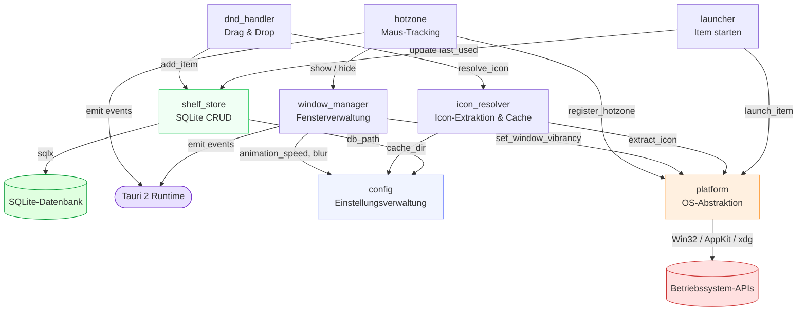
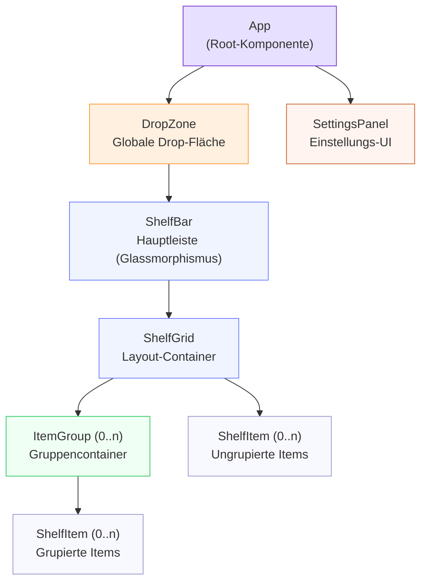
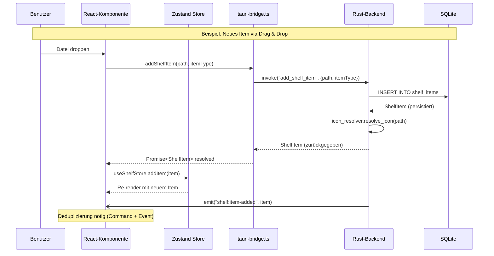

# Teil 2: Modulstruktur

> **Popup Bar** — Cross-platform Desktop-Anwendung  
> Stack: Tauri 2.2 · Rust 1.77+ · React 18 · TypeScript 5.7 · Zustand 5 · SQLite (sqlx)  
> Letzte Aktualisierung: 2026-03-12

---

## Inhaltsverzeichnis

- [2.1 Rust-Backend Module](#21-rust-backend-module)
  - [hotzone](#211-modul-hotzone)
  - [window_manager](#212-modul-window_manager)
  - [shelf_store](#213-modul-shelf_store)
  - [icon_resolver](#214-modul-icon_resolver)
  - [dnd_handler](#215-modul-dnd_handler)
  - [config](#216-modul-config)
  - [launcher](#217-modul-launcher)
  - [platform](#218-modul-platform-abstraktionsschicht)
  - [Modul-Abhängigkeitsgraph](#modul-abhängigkeitsgraph)
- [2.2 React-Frontend Module](#22-react-frontend-module)
  - [Komponentenbaum](#komponentenbaum)
  - [Komponenten](#komponenten-im-detail)
  - [State-Management](#state-management)
  - [Custom Hooks](#custom-hooks)
- [2.3 Schnittstellen-Definition (Rust ↔ Frontend)](#23-schnittstellen-definition-rust--frontend)
  - [Tauri Commands (invoke-API)](#tauri-commands-invoke-api)
  - [Tauri Events (event-API)](#tauri-events-event-api)
- [2.4 Projekt-Dateibaum](#24-projekt-dateibaum)

---

## 2.1 Rust-Backend Module

Der Rust-Backend-Code ist in acht eigenständige Module unter `src-tauri/src/modules/` organisiert. Jedes Modul hat eine klar abgegrenzte Verantwortlichkeit und kommuniziert über definierte öffentliche Schnittstellen mit den anderen Modulen. Das Einstiegspunkt-Modul `src-tauri/src/modules/mod.rs` re-exportiert alle acht Module:

```rust
// src-tauri/src/modules/mod.rs
pub mod config;        // Einstellungsverwaltung
pub mod dnd_handler;   // Drag-&-Drop-Verarbeitung
pub mod hotzone;       // Maus-Tracking & Hotzone-Erkennung
pub mod icon_resolver; // Icon-Extraktion & Caching
pub mod launcher;      // Datei-/App-/URL-Start
pub mod platform;      // Plattformabstraktion (Windows/macOS/Linux)
pub mod shelf_store;   // Datenpersistenz (SQLite)
pub mod window_manager;// Fensterverwaltung
```

---

### 2.1.1 Modul: `hotzone`

**Quelldatei:** `src-tauri/src/modules/hotzone.rs`

#### Verantwortlichkeit

Das `hotzone`-Modul überwacht kontinuierlich die Mausposition und erkennt, ob der Cursor die konfigurierbare „Hotzone" am oberen Bildschirmrand betreten oder verlassen hat. Wenn der Cursor in die Zone eintritt, sendet das Modul ein `hotzone:enter`-Event an das Frontend, das die Einblend-Animation auslöst. Beim Verlassen der Zone sendet es entsprechend `hotzone:leave`.

Die Hotzone ist standardmäßig ein 5 Pixel hoher, bildschirmbreiter Streifen am oberen Rand des primären Monitors. Höhe und Aktivierungsverzögerung sind über `HotzoneConfig` konfigurierbar.

#### Öffentliche API

| Symbol | Typ | Signatur | Beschreibung |
|--------|-----|----------|--------------|
| `HotzoneConfig` | `struct` | Felder: `height: u32`, `enabled: bool`, `delay_ms: u64` | Konfigurationsparameter der Hotzone |
| `HotzoneTracker` | `struct` | Felder: `config`, `is_active` (privat) | Haupt-Controller für Mouse-Tracking |
| `HotzoneTracker::new` | `fn` | `fn new(config: HotzoneConfig) -> Self` | Erstellt eine neue Tracker-Instanz |
| `HotzoneTracker::start` | `fn` | `fn start(&mut self) -> Result<(), String>` | Startet das OS-spezifische Mouse-Listener |
| `HotzoneTracker::stop` | `fn` | `fn stop(&mut self) -> Result<(), String>` | Stoppt den Listener und gibt Ressourcen frei |
| `HotzoneTracker::is_cursor_in_hotzone` | `fn` | `fn is_cursor_in_hotzone(&self) -> bool` | Abfrage des aktuellen Aktivierungsstatus |
| `HotzoneTracker::update_config` | `fn` | `fn update_config(&mut self, config: HotzoneConfig)` | Aktualisiert die Konfiguration zur Laufzeit |

#### Abhängigkeiten

- **`platform`** — wird benötigt, um OS-spezifische Mouse-Hooks zu registrieren (`PlatformProvider::register_hotzone`, `PlatformProvider::get_mouse_position`)
- **`window_manager`** — wird im Callback aufgerufen, um `PopupWindowManager::show()` / `hide()` auszulösen

#### Plattformspezifisches Verhalten

| Plattform | Mechanismus | Bibliothek/API | Besonderheiten |
|-----------|-------------|---------------|----------------|
| **Windows** | Globaler Low-Level-Mouse-Hook | `SetWindowsHookEx(WH_MOUSE_LL)` / Raw Input | Hook läuft im dedizierten Thread; benötigt keine erhöhten Rechte |
| **macOS** | Core Graphics Event Tap | `CGEventTapCreate(kCGSessionEventTap)` | Erfordert Accessibility-Berechtigung in `Info.plist`; Fallback via `NSEvent.addGlobalMonitorForEvents` |
| **Linux (X11)** | Periodisches Polling | `XQueryPointer` über `x11rb` | Polling-Intervall ~8 ms; keine echten Event-Taps in X11 |
| **Linux (Wayland)** | Eingeschränkt | Kein direkter globaler Zugriff | Nur via `wlr-data-control` Protocol oder XWayland-Fallback möglich |

#### Code-Beispiel

```rust
// src-tauri/src/modules/hotzone.rs

use serde::{Deserialize, Serialize};

/// Definiert die rechteckige Hotzone am oberen Bildschirmrand.
/// `height` gibt die Pixel-Höhe des sensitiven Bereichs an.
/// `delay_ms` verhindert versehentliche Aktivierungen durch kurze Überfahrten.
#[derive(Debug, Clone, Serialize, Deserialize)]
pub struct HotzoneConfig {
    pub height: u32,    // Standard: 5px — sensitiver Bereich am Bildschirmrand
    pub enabled: bool,  // Hotzone kann zur Laufzeit deaktiviert werden
    pub delay_ms: u64,  // Aktivierungsverzögerung in Millisekunden (Standard: 200)
}

impl Default for HotzoneConfig {
    fn default() -> Self {
        Self { height: 5, enabled: true, delay_ms: 200 }
    }
}

/// Verwaltet den Mouse-Tracking-Zustand und die Hotzone-Aktivierung.
/// Hält intern den letzten bekannten Zustand (`is_active`) um
/// redundante Events zu vermeiden.
pub struct HotzoneTracker {
    config: HotzoneConfig,
    is_active: bool,   // true = Maus befindet sich gerade in der Hotzone
}

impl HotzoneTracker {
    /// Erstellt eine neue Instanz mit der gegebenen Konfiguration.
    /// Der Tracker ist nach `new()` inaktiv — `start()` muss aufgerufen werden.
    pub fn new(config: HotzoneConfig) -> Self {
        Self { config, is_active: false }
    }

    /// Registriert den OS-nativen Mouse-Listener via `PlatformProvider`.
    /// Gibt einen Fehler zurück, wenn der Hook nicht installiert werden kann
    /// (z.B. fehlende Accessibility-Rechte auf macOS).
    pub fn start(&mut self) -> Result<(), String> { todo!() }

    /// Deregistriert den Mouse-Listener und gibt alle OS-Ressourcen frei.
    pub fn stop(&mut self) -> Result<(), String> { todo!() }

    /// Fragt ab, ob der Cursor aktuell in der Hotzone liegt.
    /// Wird von `is_active` gecacht — kein OS-Call nötig.
    pub fn is_cursor_in_hotzone(&self) -> bool { todo!() }

    /// Aktualisiert Konfiguration ohne Neustart des Listeners.
    /// Neue `height` wird beim nächsten Position-Check wirksam.
    pub fn update_config(&mut self, config: HotzoneConfig) {
        self.config = config;
    }
}
```

---

### 2.1.2 Modul: `window_manager`

**Quelldatei:** `src-tauri/src/modules/window_manager.rs`

#### Verantwortlichkeit

Das `window_manager`-Modul steuert den gesamten Lebenszyklus des Popup-Bar-Fensters. Es verwaltet die vier Zustände `Hidden → Showing → Visible → Hiding → Hidden`, triggert die CSS-Einblend-Animation (Slide-Down), positioniert das Fenster am oberen Rand des richtigen Monitors und wendet plattformnative Transparenz- und Vibrancy-Effekte an.

Das Fenster ist gemäß `tauri.conf.json` als rahmenlos (`decorations: false`), transparent, nicht in der Taskleiste sichtbar und `alwaysOnTop` konfiguriert. Die initiale Größe beträgt 1920 × 300 px (angepasst auf den primären Monitor).

#### Öffentliche API

| Symbol | Typ | Signatur | Beschreibung |
|--------|-----|----------|--------------|
| `WindowState` | `enum` | `Hidden \| Showing \| Visible \| Hiding` | FSM-Zustände des Fensters |
| `WindowConfig` | `struct` | `width`, `height`, `monitor_index`, `animation_duration_ms` | Fensterkonfiguration |
| `PopupWindowManager` | `struct` | Felder: `state`, `config` | Haupt-Controller |
| `PopupWindowManager::new` | `fn` | `fn new(config: WindowConfig) -> Self` | Erstellt Manager (Initialzustand: `Hidden`) |
| `PopupWindowManager::show` | `fn` | `fn show(&mut self) -> Result<(), String>` | Slide-Down-Animation starten, `window:show`-Event emittieren |
| `PopupWindowManager::hide` | `fn` | `fn hide(&mut self) -> Result<(), String>` | Slide-Up-Animation starten, `window:hide`-Event emittieren |
| `PopupWindowManager::move_to_monitor` | `fn` | `fn move_to_monitor(&mut self, monitor_index: usize) -> Result<(), String>` | Fenster auf anderen Monitor verschieben |
| `PopupWindowManager::apply_vibrancy` | `fn` | `fn apply_vibrancy(&self, blur_intensity: f64, tint_color: &str) -> Result<(), String>` | Nativen Blur-Effekt anwenden |
| `PopupWindowManager::state` | `fn` | `fn state(&self) -> &WindowState` | Aktuellen Zustand abfragen |

#### Abhängigkeiten

- **`config`** — liest `AppSettings.animation_speed` und `blur_intensity` / `tint_color` für Vibrancy
- **`platform`** — delegiert `set_window_vibrancy()` an die plattformspezifische Implementierung

#### Plattformspezifisches Verhalten

| Plattform | Vibrancy-API | Transparenz | Besonderheiten |
|-----------|-------------|-------------|----------------|
| **Windows** | `DwmEnableBlurBehindWindow` / Acrylic via `SetWindowCompositionAttribute` | Nativer ARGB-Compositing | Windows 11: Mica/Acrylic; Windows 10: Blur Behind |
| **macOS** | `NSVisualEffectView` mit Material `.hudWindow` oder `.sidebar` | Core Animation Layers | Automatische Anpassung an Hell-/Dunkel-Modus |
| **Linux** | CSS `backdrop-filter` (Software-Rendering) | Compositor-abhängig (KWin/Mutter) | Kein nativer Blur ohne `kwin_effects`; GNOME Mutter unterstützt es via Extension |

#### Zustandsmaschine (FSM)

```
           hotzone:enter          show() complete
  Hidden ──────────────> Showing ──────────────> Visible
    ^                                               |
    |              hide() complete    hotzone:leave |
    └───────────── Hiding <────────────────────────┘
```

#### Code-Beispiel

```rust
// src-tauri/src/modules/window_manager.rs

use serde::{Deserialize, Serialize};

/// Vier diskrete Zustände des Popup-Fensters.
/// Übergänge sind nur in der definierten Reihenfolge erlaubt (FSM).
#[derive(Debug, Clone, PartialEq, Serialize, Deserialize)]
pub enum WindowState {
    Hidden,   // Fenster ist vollständig ausgeblendet (y-Position: -height)
    Showing,  // Slide-Down-Animation läuft
    Visible,  // Fenster ist vollständig sichtbar
    Hiding,   // Slide-Up-Animation läuft
}

/// Konfiguration für das Popup-Bar-Fenster.
/// `monitor_index: 0` bedeutet primärer Monitor.
#[derive(Debug, Clone, Serialize, Deserialize)]
pub struct WindowConfig {
    pub width: u32,                   // Standard: Monitorbreite (z.B. 1920)
    pub height: u32,                  // Standard: 300px
    pub monitor_index: usize,         // 0-basierter Monitor-Index
    pub animation_duration_ms: u64,   // Standard: 200ms
}

/// Verwaltet Fensterposition, Sichtbarkeit und Transparenz-Effekte.
pub struct PopupWindowManager {
    state: WindowState,
    config: WindowConfig,
}

impl PopupWindowManager {
    pub fn new(config: WindowConfig) -> Self {
        Self { state: WindowState::Hidden, config }
    }

    /// Startet die Slide-Down-Animation und setzt `state = Showing`.
    /// Nach Abschluss: `state = Visible` + `window:show`-Event emittieren.
    pub fn show(&mut self) -> Result<(), String> { todo!() }

    /// Startet die Slide-Up-Animation und setzt `state = Hiding`.
    /// Nach Abschluss: `state = Hidden` + `window:hide`-Event emittieren.
    pub fn hide(&mut self) -> Result<(), String> { todo!() }

    /// Verschiebt das Fenster auf den angegebenen Monitor und passt
    /// `width` an die Monitorbreite an.
    pub fn move_to_monitor(&mut self, monitor_index: usize) -> Result<(), String> { todo!() }

    /// Wendet Glassmorphismus-Effekte via PlatformProvider an.
    /// `blur_intensity`: 0.0–50.0 (CSS-äquivalente Pixel)
    /// `tint_color`: RGBA-String, z.B. "rgba(255, 255, 255, 0.1)"
    pub fn apply_vibrancy(&self, blur_intensity: f64, tint_color: &str) -> Result<(), String> { todo!() }

    pub fn state(&self) -> &WindowState { &self.state }
}
```

---

### 2.1.3 Modul: `shelf_store`

**Quelldatei:** `src-tauri/src/modules/shelf_store.rs`

#### Verantwortlichkeit

Das `shelf_store`-Modul ist die Datenschicht der Anwendung. Es implementiert alle CRUD-Operationen für `ShelfItem` und `ItemGroup` und persistiert sie in einer lokalen SQLite-Datenbank via `sqlx` und dem `tauri-plugin-sql`. Jede Schreiboperation gibt das resultierende Objekt zurück, damit das Frontend den Store sofort aktualisieren kann.

Das Datenbankschema wird beim ersten Start via `init_db()` angelegt. Der Datenbankpfad wird aus `AppSettings` (via `config`-Modul) gelesen und liegt standardmäßig unter dem Tauri App-Datenverzeichnis (`popup-bar.db`).

#### Öffentliche API

| Symbol | Typ | Signatur | Beschreibung |
|--------|-----|----------|--------------|
| `ItemType` | `enum` | `File \| Folder \| App \| Url` | Typ eines Shelf-Eintrags |
| `ShelfItem` | `struct` | Alle Felder s.u. | Einzelner Shelf-Eintrag |
| `ItemGroup` | `struct` | `id`, `name`, `color`, `position_x/y` | Gruppe von Shelf-Einträgen |
| `ShelfStore::init_db` | `async fn` | `async fn init_db() -> Result<(), String>` | Schema anlegen / migrieren |
| `ShelfStore::get_all_items` | `async fn` | `async fn get_all_items() -> Result<Vec<ShelfItem>, String>` | Alle Items laden |
| `ShelfStore::add_item` | `async fn` | `async fn add_item(item: ShelfItem) -> Result<ShelfItem, String>` | Neues Item einfügen |
| `ShelfStore::remove_item` | `async fn` | `async fn remove_item(id: &str) -> Result<(), String>` | Item löschen |
| `ShelfStore::update_item` | `async fn` | `async fn update_item(item: ShelfItem) -> Result<ShelfItem, String>` | Item aktualisieren |
| `ShelfStore::get_all_groups` | `async fn` | `async fn get_all_groups() -> Result<Vec<ItemGroup>, String>` | Alle Gruppen laden |
| `ShelfStore::create_group` | `async fn` | `async fn create_group(group: ItemGroup) -> Result<ItemGroup, String>` | Neue Gruppe anlegen |
| `ShelfStore::delete_group` | `async fn` | `async fn delete_group(id: &str) -> Result<(), String>` | Gruppe löschen, Items ungruppiert lassen |

#### Abhängigkeiten

- **`config`** — liest den Datenbankpfad aus `AppSettings` (oder App-Datenverzeichnis via Tauri)

#### Datenbankschema

```sql
-- Tabelle: shelf_items
CREATE TABLE IF NOT EXISTS shelf_items (
    id           TEXT PRIMARY KEY,          -- UUID v4
    item_type    TEXT NOT NULL,             -- 'file' | 'folder' | 'app' | 'url'
    path         TEXT NOT NULL,             -- Absoluter Pfad oder URL
    display_name TEXT NOT NULL,             -- Angezeigter Name (editierbar)
    icon_cache_key TEXT NOT NULL DEFAULT '', -- Hash-Schlüssel für den Icon-Cache
    position_x   REAL NOT NULL DEFAULT 0.0, -- X-Position im Grid
    position_y   REAL NOT NULL DEFAULT 0.0, -- Y-Position im Grid
    group_id     TEXT REFERENCES item_groups(id) ON DELETE SET NULL,
    created_at   TEXT NOT NULL,             -- ISO-8601 Timestamp
    last_used    TEXT NOT NULL              -- ISO-8601 Timestamp
);

-- Tabelle: item_groups
CREATE TABLE IF NOT EXISTS item_groups (
    id         TEXT PRIMARY KEY,            -- UUID v4
    name       TEXT NOT NULL,              -- Gruppenname
    color      TEXT,                       -- RGBA-Farbe (optional)
    position_x REAL NOT NULL DEFAULT 0.0,
    position_y REAL NOT NULL DEFAULT 0.0
);

-- Index für häufige Abfragen nach Gruppe
CREATE INDEX IF NOT EXISTS idx_shelf_items_group_id
    ON shelf_items(group_id);

-- Index für Sortierung nach Position
CREATE INDEX IF NOT EXISTS idx_shelf_items_position
    ON shelf_items(position_x, position_y);
```

#### SQL-Operationen je Methode

| Methode | SQL-Statement |
|---------|--------------|
| `get_all_items()` | `SELECT * FROM shelf_items ORDER BY position_x, position_y` |
| `add_item()` | `INSERT INTO shelf_items VALUES (?, ?, ?, ?, ?, ?, ?, ?, ?, ?) RETURNING *` |
| `remove_item()` | `DELETE FROM shelf_items WHERE id = ?` |
| `update_item()` | `UPDATE shelf_items SET path=?, display_name=?, icon_cache_key=?, position_x=?, position_y=?, group_id=?, last_used=? WHERE id=? RETURNING *` |
| `get_all_groups()` | `SELECT * FROM item_groups ORDER BY position_x, position_y` |
| `create_group()` | `INSERT INTO item_groups VALUES (?, ?, ?, ?, ?) RETURNING *` |
| `delete_group()` | `DELETE FROM item_groups WHERE id=?` (FK setzt `group_id` der Items auf NULL) |

#### Code-Beispiel

```rust
// src-tauri/src/modules/shelf_store.rs

use serde::{Deserialize, Serialize};

/// Unterscheidet die vier unterstützten Item-Typen.
/// `serde(rename_all = "lowercase")` sorgt für konsistente JSON-Serialisierung.
#[derive(Debug, Clone, Serialize, Deserialize)]
#[serde(rename_all = "lowercase")]
pub enum ItemType { File, Folder, App, Url }

/// Ein einzelner Eintrag auf der Shelf-Leiste.
/// Alle Felder werden 1:1 in `shelf_items` persistiert.
#[derive(Debug, Clone, Serialize, Deserialize)]
pub struct ShelfItem {
    pub id: String,                  // UUID v4
    pub item_type: ItemType,
    pub path: String,                // Absoluter Pfad oder URL
    pub display_name: String,        // Vom User editierbarer Anzeigename
    pub icon_cache_key: String,      // SHA-256 Hash des Pfades → Icon-Dateiname
    pub position_x: f64,
    pub position_y: f64,
    pub group_id: Option<String>,    // None = ungrupiert
    pub created_at: String,          // ISO-8601
    pub last_used: String,           // ISO-8601 — wird bei jedem Launch aktualisiert
}

/// Eine Gruppe, die mehrere ShelfItems visuell zusammenfasst.
#[derive(Debug, Clone, Serialize, Deserialize)]
pub struct ItemGroup {
    pub id: String,
    pub name: String,
    pub color: Option<String>,       // RGBA-String für Gruppenrahmen
    pub position_x: f64,
    pub position_y: f64,
}

/// Stateless-Fassade für alle Datenbankoperationen.
/// Alle Methoden sind `async` und verwenden `sqlx` mit dem
/// Tauri SQL-Plugin-Connection-Pool.
pub struct ShelfStore;

impl ShelfStore {
    /// Legt das Datenbankschema an (idempotent via CREATE IF NOT EXISTS).
    /// Wird einmalig in `lib.rs::setup()` aufgerufen.
    pub async fn init_db() -> Result<(), String> { todo!() }

    /// Gibt alle Items sortiert nach Position zurück.
    pub async fn get_all_items() -> Result<Vec<ShelfItem>, String> { todo!() }

    /// Fügt ein neues Item ein und gibt das gespeicherte Objekt zurück.
    pub async fn add_item(item: ShelfItem) -> Result<ShelfItem, String> { todo!() }

    /// Löscht ein Item anhand seiner UUID.
    pub async fn remove_item(id: &str) -> Result<(), String> { todo!() }

    /// Aktualisiert ein bestehendes Item und gibt das aktualisierte Objekt zurück.
    pub async fn update_item(item: ShelfItem) -> Result<ShelfItem, String> { todo!() }

    pub async fn get_all_groups() -> Result<Vec<ItemGroup>, String> { todo!() }

    /// Legt eine neue Gruppe an.
    pub async fn create_group(group: ItemGroup) -> Result<ItemGroup, String> { todo!() }

    /// Löscht die Gruppe. Items der Gruppe erhalten `group_id = NULL` (via FK ON DELETE SET NULL).
    pub async fn delete_group(id: &str) -> Result<(), String> { todo!() }
}
```

---

### 2.1.4 Modul: `icon_resolver`

**Quelldatei:** `src-tauri/src/modules/icon_resolver.rs`

#### Verantwortlichkeit

Das `icon_resolver`-Modul extrahiert Icons aus Dateien, Applikationen und URLs über plattformnative APIs und speichert sie als PNG-Dateien in einem dedizierten Cache-Verzeichnis. Als Cache-Schlüssel dient ein SHA-256-Hash des Pfades — so wird automatisch erkannt, ob das Icon bereits gecacht ist. Das Modul unterstützt Größenangaben (Standard: 64×64 px) und kann einzelne Icons aus dem Cache entfernen oder den gesamten Cache leeren.

#### Öffentliche API

| Symbol | Typ | Signatur | Beschreibung |
|--------|-----|----------|--------------|
| `CachedIcon` | `struct` | `cache_key`, `path`, `format`, `size` | Metadaten eines gecachten Icons |
| `IconFormat` | `enum` | `Png \| Svg` | Ausgabeformat des Icons |
| `IconResolver` | `struct` | Feld: `cache_dir: String` | Haupt-Controller |
| `IconResolver::new` | `fn` | `fn new(cache_dir: String) -> Self` | Erstellt Resolver mit Cache-Pfad |
| `IconResolver::resolve_icon` | `async fn` | `async fn resolve_icon(&self, path: &str) -> Result<CachedIcon, String>` | Icon extrahieren (oder aus Cache laden) |
| `IconResolver::get_cached` | `fn` | `fn get_cached(&self, cache_key: &str) -> Option<CachedIcon>` | Cache-Lookup ohne Neuextraktion |
| `IconResolver::clear_cache` | `fn` | `fn clear_cache(&self) -> Result<(), String>` | Gesamten Icon-Cache löschen |
| `IconResolver::evict` | `fn` | `fn evict(&self, cache_key: &str) -> Result<(), String>` | Einzelnes Icon aus Cache entfernen |

#### Abhängigkeiten

- **`platform`** — delegiert `extract_icon(path, size)` an den jeweiligen OS-Provider
- **`config`** — liest `cache_dir` aus dem Tauri App-Datenverzeichnis

#### Plattformspezifisches Verhalten

| Plattform | Icon-Extraktion | API | Icon-Format |
|-----------|----------------|-----|-------------|
| **Windows** | Shell-Icon via `SHGetFileInfo` / `IShellItemImageFactory` | Win32 Shell API | HICON → PNG via GDI+ |
| **macOS** | `NSWorkspace.icon(forFile:)` | AppKit / Cocoa | NSImage → PNG |
| **Linux** | XDG-Icon-Theme-Lookup via `gtk3` / `freedesktop` | `gio`-Crate / XDG Spec | Pixbuf → PNG |
| **Alle** | URL-Icons: Favicon-Download (32×32) | HTTP GET + Image-Decode | PNG |

#### Cache-Strategie

Der Cache verwendet einen **SHA-256-Hash des absoluten Pfades** als Dateinamen (`{hash}.png`). Bei `resolve_icon()` wird geprüft:

1. Existiert `{cache_dir}/{sha256(path)}.png`? → Cache-Hit, `CachedIcon` zurückgeben
2. Sonst: Icon via `PlatformProvider::extract_icon()` extrahieren → als PNG in Cache schreiben → `CachedIcon` zurückgeben

Cache-Invalidierung erfolgt nur explizit via `evict()` oder `clear_cache()`. Eine zeitbasierte Invalidierung ist nicht implementiert — das Icon wird beim nächsten manuellen Refresh neu extrahiert.

#### Code-Beispiel

```rust
// src-tauri/src/modules/icon_resolver.rs

use serde::{Deserialize, Serialize};

/// Metadaten eines im Cache gespeicherten Icons.
#[derive(Debug, Clone, Serialize, Deserialize)]
pub struct CachedIcon {
    pub cache_key: String,  // SHA-256 Hash des Quellpfades
    pub path: String,       // Absoluter Pfad zur PNG-Datei im Cache
    pub format: IconFormat,
    pub size: u32,          // Seitenlänge in Pixeln (quadratisch)
}

#[derive(Debug, Clone, Serialize, Deserialize)]
pub enum IconFormat { Png, Svg }

/// Extrahiert und cached Icons für Shelf-Items.
/// `cache_dir` ist typischerweise `{app_data}/popup-bar/icon-cache/`.
pub struct IconResolver {
    cache_dir: String,
}

impl IconResolver {
    pub fn new(cache_dir: String) -> Self { Self { cache_dir } }

    /// Hauptmethode: Gibt ein gecachtes oder neu extrahiertes Icon zurück.
    /// Intern: SHA-256(path) prüfen → Cache-Hit oder PlatformProvider aufrufen.
    pub async fn resolve_icon(&self, path: &str) -> Result<CachedIcon, String> { todo!() }

    /// Synchroner Cache-Lookup ohne OS-Aufruf.
    /// Gibt `None` zurück wenn kein gecachtes Icon gefunden.
    pub fn get_cached(&self, cache_key: &str) -> Option<CachedIcon> { todo!() }

    /// Löscht alle Dateien im `cache_dir`.
    pub fn clear_cache(&self) -> Result<(), String> { todo!() }

    /// Entfernt ein einzelnes Icon aus dem Cache (z.B. nach Pfad-Änderung).
    pub fn evict(&self, cache_key: &str) -> Result<(), String> { todo!() }
}
```

---

### 2.1.5 Modul: `dnd_handler`

**Quelldatei:** `src-tauri/src/modules/dnd_handler.rs`

#### Verantwortlichkeit

Das `dnd_handler`-Modul verarbeitet alle Drag-and-Drop-Ereignisse auf dem Popup-Bar-Fenster. Es unterscheidet zwischen **externen Drops** (Dateien/Ordner vom Desktop oder Dateimanager, die als neue Shelf-Items hinzugefügt werden) und **internen Drops** (bestehende Items werden auf der Shelf neu positioniert oder in Gruppen gezogen). Bei einem externen Drop löst das Modul die Icon-Extraktion via `icon_resolver` aus und persistiert das neue Item via `shelf_store`.

#### Öffentliche API

| Symbol | Typ | Signatur | Beschreibung |
|--------|-----|----------|--------------|
| `DragSource` | `enum` | `External \| Internal { item_id }` | Unterscheidet externe von internen Drags |
| `DragPayload` | `struct` | `source`, `paths`, `position_x/y` | Daten während des Drags |
| `DropResult` | `struct` | `accepted`, `target_group_id`, `new_position_x/y` | Ergebnis nach abgeschlossenem Drop |
| `DndHandler::register_listeners` | `fn` | `fn register_listeners() -> Result<(), String>` | Tauri file-drop Event-Listener registrieren |
| `DndHandler::unregister_listeners` | `fn` | `fn unregister_listeners() -> Result<(), String>` | Listener entfernen |
| `DndHandler::handle_drop` | `fn` | `fn handle_drop(payload: DragPayload) -> Result<DropResult, String>` | Drop verarbeiten und persistieren |

#### Abhängigkeiten

- **`shelf_store`** — persistiert neue Items nach externem Drop (`add_item`)
- **`icon_resolver`** — extrahiert und cached Icons für gedropte Dateien/Apps (`resolve_icon`)

#### Drop-Verarbeitungslogik

```
Tauri file:drop Event
        │
        ▼
  DndHandler::handle_drop(payload)
        │
        ├── DragSource::External?
        │       ├── For each path in payload.paths:
        │       │       ├── icon_resolver.resolve_icon(path)
        │       │       ├── ShelfItem { id: uuid(), item_type: detect(path), ... }
        │       │       └── shelf_store.add_item(item)
        │       └── DropResult { accepted: true, ... }
        │
        └── DragSource::Internal { item_id }?
                ├── shelf_store.update_item (neue Position)
                └── DropResult { accepted: true, new_position_x/y }
```

#### Code-Beispiel

```rust
// src-tauri/src/modules/dnd_handler.rs

use serde::{Deserialize, Serialize};

/// Unterscheidet externe Drops (neue Items) von internen Reorders.
#[derive(Debug, Clone, Serialize, Deserialize)]
pub enum DragSource {
    /// Dateien/Ordner/Apps vom Betriebssystem (Dateimanager, Desktop).
    External,
    /// Ein bestehendes Shelf-Item wird neu positioniert.
    Internal { item_id: String },
}

/// Payload-Daten während eines laufenden Drag-Vorgangs.
#[derive(Debug, Clone, Serialize, Deserialize)]
pub struct DragPayload {
    pub source: DragSource,
    pub paths: Vec<String>,     // Absolute Pfade oder URLs der gezogenen Items
    pub position_x: f64,        // Drop-Position relativ zum Fenster
    pub position_y: f64,
}

/// Ergebnis nach Abschluss eines Drop-Vorgangs.
#[derive(Debug, Clone, Serialize, Deserialize)]
pub struct DropResult {
    pub accepted: bool,                   // false = Drop abgelehnt (z.B. unbekannter Typ)
    pub target_group_id: Option<String>,  // Some(id) wenn in eine Gruppe gedroppt
    pub new_position_x: f64,
    pub new_position_y: f64,
}

/// Stateless Handler für Drag-and-Drop-Ereignisse.
pub struct DndHandler;

impl DndHandler {
    /// Registriert den Tauri-internen `tauri://file-drop`-Listener.
    pub fn register_listeners() -> Result<(), String> { todo!() }

    /// Deregistriert alle Drop-Listener (z.B. beim App-Shutdown).
    pub fn unregister_listeners() -> Result<(), String> { todo!() }

    /// Verarbeitet einen abgeschlossenen Drop: Persistierung + Icon-Extraktion.
    pub fn handle_drop(payload: DragPayload) -> Result<DropResult, String> { todo!() }
}
```

---

### 2.1.6 Modul: `config`

**Quelldatei:** `src-tauri/src/modules/config.rs`

#### Verantwortlichkeit

Das `config`-Modul verwaltet alle persistenten Benutzereinstellungen der Anwendung. Es liest und schreibt ein `AppSettings`-Objekt aus/in eine JSON-Konfigurationsdatei im Tauri App-Datenverzeichnis. Beim ersten Start werden `Default`-Werte verwendet und sofort persistiert. Das Modul validiert Eingabewerte (z.B. `hotzone_size` muss ≥ 1 sein) und emittiert nach jeder Änderung das `settings:changed`-Event an alle Frontend-Listener.

#### Öffentliche API

| Symbol | Typ | Signatur | Beschreibung |
|--------|-----|----------|--------------|
| `AppSettings` | `struct` | Felder s.u. | Gesamtes Einstellungs-Schema |
| `Theme` | `enum` | `Light \| Dark \| System` | Theme-Auswahl |
| `ConfigManager::load` | `fn` | `fn load() -> Result<AppSettings, String>` | Einstellungen laden (Defaults bei erster Ausführung) |
| `ConfigManager::save` | `fn` | `fn save(settings: &AppSettings) -> Result<(), String>` | Einstellungen persistieren |
| `ConfigManager::reset` | `fn` | `fn reset() -> Result<AppSettings, String>` | Auf Standardwerte zurücksetzen |

#### Abhängigkeiten

Das `config`-Modul ist eine **Blatt-Abhängigkeit** — es hat keine Abhängigkeiten zu anderen Modulen. Alle anderen Module, die Einstellungen benötigen, importieren `config`.

#### `AppSettings`-Schema mit Defaults

| Feld | Typ | Default | Beschreibung |
|------|-----|---------|--------------|
| `hotzone_size` | `u32` | `5` | Hotzone-Höhe in Pixeln |
| `animation_speed` | `f64` | `1.0` | Animationsgeschwindigkeits-Multiplikator (0.1–3.0) |
| `blur_intensity` | `f64` | `20.0` | Blur-Radius in CSS-px-Äquivalent (0–50) |
| `tint_color` | `String` | `"rgba(255,255,255,0.1)"` | RGBA-Tint-Farbe für Glassmorphismus |
| `theme` | `Theme` | `System` | Hell/Dunkel/Automatisch |
| `autostart` | `bool` | `false` | Beim Systemstart automatisch starten |
| `multi_monitor` | `bool` | `false` | Hotzone auf allen Monitoren aktivieren |

#### Code-Beispiel

```rust
// src-tauri/src/modules/config.rs

use serde::{Deserialize, Serialize};

/// Alle persistenten Benutzereinstellungen.
/// Implementiert `Default` für den Ersstart ohne Konfigurationsdatei.
#[derive(Debug, Clone, Serialize, Deserialize)]
pub struct AppSettings {
    pub hotzone_size: u32,        // Pixel-Höhe der Hotzone (Standard: 5)
    pub animation_speed: f64,     // Multiplikator; 1.0 = normal, 2.0 = doppelt so schnell
    pub blur_intensity: f64,      // Blur-Radius in px (Standard: 20.0)
    pub tint_color: String,       // RGBA-String für den Glassmorphismus-Tint
    pub theme: Theme,             // Light | Dark | System
    pub autostart: bool,          // Autostart via systemd/launchd/Task Scheduler
    pub multi_monitor: bool,      // Hotzone auf allen angeschlossenen Monitoren
}

#[derive(Debug, Clone, Serialize, Deserialize)]
#[serde(rename_all = "lowercase")]
pub enum Theme { Light, Dark, System }

impl Default for AppSettings {
    fn default() -> Self {
        Self {
            hotzone_size: 5,
            animation_speed: 1.0,
            blur_intensity: 20.0,
            tint_color: String::from("rgba(255, 255, 255, 0.1)"),
            theme: Theme::System,
            autostart: false,
            multi_monitor: false,
        }
    }
}

/// Liest und schreibt Einstellungen aus einer JSON-Datei.
/// Pfad: `{app_data}/popup-bar/settings.json`
pub struct ConfigManager;

impl ConfigManager {
    /// Lädt Einstellungen von Disk. Gibt `Default::default()` zurück
    /// wenn keine Datei existiert (Erststart) und persistiert sie sofort.
    pub fn load() -> Result<AppSettings, String> { todo!() }

    /// Serialisiert `settings` als eingerücktes JSON und schreibt atomisch.
    pub fn save(settings: &AppSettings) -> Result<(), String> { todo!() }

    /// Schreibt `Default::default()` auf Disk und gibt die Defaults zurück.
    pub fn reset() -> Result<AppSettings, String> { todo!() }
}
```

---

### 2.1.7 Modul: `launcher`

**Quelldatei:** `src-tauri/src/modules/launcher.rs`

#### Verantwortlichkeit

Das `launcher`-Modul öffnet Shelf-Items über den systemweiten Standardhandler des Betriebssystems. Je nach `ItemType` wird das passende OS-API aufgerufen: Dateien und Ordner werden in der zugeordneten Anwendung geöffnet, Apps werden direkt gestartet, URLs werden im Standardbrowser geöffnet. Das Modul unterstützt auch das Öffnen mit einer explizit angegebenen Anwendung sowie das Anzeigen im Dateimanager. Zusätzlich kann es prüfen, ob ein Pfad oder eine URL noch erreichbar ist.

#### Öffentliche API

| Symbol | Typ | Signatur | Beschreibung |
|--------|-----|----------|--------------|
| `Launcher::open` | `fn` | `fn open(item_type: &ItemType, path: &str) -> Result<(), String>` | Item mit Standardhandler öffnen |
| `Launcher::open_with` | `fn` | `fn open_with(path: &str, app_path: &str) -> Result<(), String>` | Item mit spezifischer App öffnen |
| `Launcher::reveal_in_file_manager` | `fn` | `fn reveal_in_file_manager(path: &str) -> Result<(), String>` | Datei im Dateimanager anzeigen |
| `Launcher::validate_target` | `fn` | `fn validate_target(path: &str) -> bool` | Prüft ob Pfad/URL noch gültig ist |

#### Abhängigkeiten

- **`platform`** — delegiert `launch_item(path)` an den OS-spezifischen Provider
- **`shelf_store`** — nach erfolgreichem Launch: `last_used`-Timestamp des Items aktualisieren

#### Plattformspezifisches Verhalten

| Plattform | Öffnen via | App öffnen | Dateimanager | URL öffnen |
|-----------|-----------|-----------|--------------|-----------|
| **Windows** | `ShellExecuteW("open", path)` | `CreateProcess` | `explorer /select,<path>` | `ShellExecuteW("open", url)` |
| **macOS** | `NSWorkspace.open(url:)` | `NSWorkspace.launchApplication` | `NSWorkspace.activateFileViewerSelecting` | `NSWorkspace.open(url:)` |
| **Linux** | `xdg-open <path>` via `tauri-plugin-shell` | Direkt via `exec` | `nautilus --select` / `dolphin --select` | `xdg-open <url>` |

#### Code-Beispiel

```rust
// src-tauri/src/modules/launcher.rs

use super::shelf_store::ItemType;

/// Öffnet Shelf-Items via OS-Standardhandler.
/// Alle Operationen sind synchron — der eigentliche Start-Prozess
/// läuft unabhängig im Hintergrund.
pub struct Launcher;

impl Launcher {
    /// Hauptmethode: Wählt anhand von `item_type` den passenden OS-Handler.
    /// - File/Folder → Standardanwendung (z.B. Word für .docx)
    /// - App         → Direkte Ausführung
    /// - Url         → Standardbrowser
    pub fn open(item_type: &ItemType, path: &str) -> Result<(), String> { todo!() }

    /// Öffnet `path` mit einer explizit angegebenen Anwendung.
    /// Nützlich für "Open with..." im Kontextmenü.
    pub fn open_with(path: &str, app_path: &str) -> Result<(), String> { todo!() }

    /// Öffnet den Dateimanager und selektiert `path` direkt.
    /// Plattform: Finder (macOS), Explorer (Windows), Nautilus/Dolphin (Linux).
    pub fn reveal_in_file_manager(path: &str) -> Result<(), String> { todo!() }

    /// Prüft ob `path` noch existiert (für Dateien) oder erreichbar ist (für URLs).
    /// Gibt `false` zurück für gelöschte Dateien oder ungültige URLs.
    pub fn validate_target(path: &str) -> bool { todo!() }
}
```

---

### 2.1.8 Modul: `platform` (Abstraktionsschicht)

**Quelldatei:** `src-tauri/src/modules/platform/mod.rs`  
**Implementierungen:** `windows.rs`, `macos.rs`, `linux.rs`

#### Verantwortlichkeit

Das `platform`-Modul definiert eine plattformunabhängige Schnittstelle für alle betriebssystemspezifischen Operationen als Rust-Trait `PlatformProvider`. Zur Kompilierzeit wird via `#[cfg(target_os = "...")]`-Attributen die passende Implementierung ausgewählt. Die Factory-Funktion `create_provider()` gibt einen `Box<dyn PlatformProvider>` zurück, der von allen anderen Modulen verwendet wird. Nicht unterstützte Plattformen führen zu einem Compiler-Fehler (`compile_error!`).

#### `PlatformProvider` Trait

```rust
// src-tauri/src/modules/platform/mod.rs

/// Koordinaten des Mauszeigers in logischen Pixeln (nicht physisch).
pub struct MousePosition {
    pub x: f64,
    pub y: f64,
}

/// Plattformunabhängige Schnittstelle für OS-Level-Operationen.
/// Jede Methode gibt `Result<_, String>` zurück — Fehler werden
/// als String-Nachrichten an den Aufrufer weitergegeben.
pub trait PlatformProvider {
    /// Registriert einen globalen Mouse-Hook/-Listener für den
    /// `height`-Pixel-Streifen am oberen Bildschirmrand.
    fn register_hotzone(&self, height: u32) -> Result<(), String>;

    /// Entfernt den globalen Mouse-Hook und gibt OS-Ressourcen frei.
    fn unregister_hotzone(&self) -> Result<(), String>;

    /// Gibt die aktuelle Mausposition in Bildschirmkoordinaten zurück.
    /// Ursprung (0,0) ist die obere linke Ecke des primären Monitors.
    fn get_mouse_position(&self) -> Result<MousePosition, String>;

    /// Wendet nativen Blur/Vibrancy-Effekt auf das Anwendungsfenster an.
    /// `blur_radius`: 0.0–50.0 (plattformabhängige Skalierung)
    /// `tint_color`:  RGBA-String, z.B. "rgba(255, 255, 255, 0.1)"
    fn set_window_vibrancy(&self, blur_radius: f64, tint_color: &str) -> Result<(), String>;

    /// Extrahiert das Icon für `path` in der angegebenen `size` (in px).
    /// Gibt die Rohdaten als PNG-Byte-Array zurück.
    fn extract_icon(&self, path: &str, size: u32) -> Result<Vec<u8>, String>;

    /// Öffnet `path` mit dem systemweiten Standardhandler.
    fn launch_item(&self, path: &str) -> Result<(), String>;
}
```

#### Implementierungsübersicht je OS

| Methode | Windows (`WindowsProvider`) | macOS (`MacOSProvider`) | Linux (`LinuxProvider`) |
|---------|---------------------------|------------------------|------------------------|
| `register_hotzone` | `SetWindowsHookEx(WH_MOUSE_LL)` | `CGEventTapCreate` + `CFRunLoop` | X11: Polling-Thread mit `XQueryPointer` |
| `unregister_hotzone` | `UnhookWindowsHookEx` | `CGEventTapEnable(tap, false)` | Thread stoppen |
| `get_mouse_position` | `GetCursorPos` | `NSEvent.mouseLocation` | `XQueryPointer` |
| `set_window_vibrancy` | `DwmSetWindowAttribute` (Mica/Acrylic) | `NSVisualEffectView` | CSS `backdrop-filter` (Software) |
| `extract_icon` | `SHGetFileInfo` + GDI+ → PNG | `NSWorkspace.icon` + NSImage → PNG | GTK `gtk_icon_theme_lookup_icon` → PNG |
| `launch_item` | `ShellExecuteW` | `NSWorkspace.open(url:)` | `xdg-open` |

#### Compile-Time Plattformauswahl

```rust
// src-tauri/src/modules/platform/mod.rs

// Nur die passende Implementierung wird kompiliert:
#[cfg(target_os = "windows")]
pub mod windows;   // → WindowsProvider

#[cfg(target_os = "macos")]
pub mod macos;     // → MacOSProvider

#[cfg(target_os = "linux")]
pub mod linux;     // → LinuxProvider

/// Factory-Funktion: Gibt die korrekte Implementierung zur Laufzeit zurück.
/// Der Rückgabetyp ist `Box<dyn PlatformProvider>` — ermöglicht
/// Dependency Injection und vereinfachtes Testing via Mock-Implementierungen.
pub fn create_provider() -> Box<dyn PlatformProvider> {
    #[cfg(target_os = "windows")]
    return Box::new(windows::WindowsProvider::new());

    #[cfg(target_os = "macos")]
    return Box::new(macos::MacOSProvider::new());

    #[cfg(target_os = "linux")]
    return Box::new(linux::LinuxProvider::new());

    // Kompilierfehler für nicht unterstützte Plattformen (z.B. FreeBSD):
    #[cfg(not(any(target_os = "windows", target_os = "macos", target_os = "linux")))]
    compile_error!("Unsupported platform");
}
```

---

### Modul-Abhängigkeitsgraph



---

## 2.2 React-Frontend Module

Das Frontend ist eine React 18 Single-Page-Application, die von Vite 6 gebaut und in der Tauri WebView ausgeführt wird. State-Management erfolgt via Zustand 5. Die Kommunikation mit dem Rust-Backend läuft ausschließlich über Tauri Commands (`invoke`) und Tauri Events (`listen`).

---

### Komponentenbaum



---

### Komponenten im Detail

#### `App`

**Quelldatei:** `src/App.tsx`

**Props Interface:**  
Keine Props — `App` ist die Root-Komponente der Anwendung.

**Verantwortlichkeit:**  
Koordiniert die Sichtbarkeit der gesamten Anwendung basierend auf dem Hotzone-Status. Rendert `DropZone` (umschließt die `ShelfBar`) sowie das `SettingsPanel`. Der `data-visible`-Attribut steuert die CSS-Animation.

```tsx
// src/App.tsx
function App() {
  const { isVisible } = useHotzoneState();

  return (
    // data-visible steuert CSS-Transition für Slide-Down
    <div className="app" data-visible={isVisible}>
      <DropZone>
        <ShelfBar />
      </DropZone>
      <SettingsPanel />
    </div>
  );
}
```

**Emittierte Events / Callbacks:** keine  
**Abhängigkeiten:** `useHotzoneState` (Hook)

---

#### `ShelfBar`

**Quelldatei:** `src/components/ShelfBar/ShelfBar.tsx`

**Props Interface:**
```typescript
export interface ShelfBarProps {
  className?: string;  // Optionale zusätzliche CSS-Klassen
}
```

**Verantwortlichkeit:**  
Äußerer Container der Popup-Leiste. Wendet den Glassmorphismus-Effekt (via `useGlassmorphism`) als Inline-Style an und rendert das `ShelfGrid`. Stellt den visuellen Rahmen der gesamten Bar mit `backdrop-filter`-Blur und Tint-Farbe dar.

```tsx
export function ShelfBar({ className }: ShelfBarProps) {
  const { items, groups } = useShelfItems();
  const glassStyle = useGlassmorphism(); // → { background, backdropFilter, border }

  return (
    <div className={`shelf-bar ${className ?? ""}`} style={glassStyle}>
      <ShelfGrid items={items} groups={groups} />
    </div>
  );
}
```

**Emittierte Events / Callbacks:** keine  
**Abhängigkeiten:** `useShelfItems`, `useGlassmorphism`, `ShelfGrid`

---

#### `ShelfGrid`

**Quelldatei:** `src/components/ShelfGrid/ShelfGrid.tsx`

**Props Interface:**
```typescript
export interface ShelfGridProps {
  items: ShelfItem[];    // Alle Shelf-Items (grupiert und ungrupiert)
  groups: ItemGroup[];   // Alle Gruppen
}
```

**Verantwortlichkeit:**  
Layout-Container, der Items in zwei Kategorien aufteilt: Items mit `groupId` werden innerhalb ihrer `ItemGroup` gerendert, Items ohne `groupId` erscheinen direkt im Grid. Die Reihenfolge ist: zuerst alle Gruppen, dann alle ungrupierten Items.

```tsx
export function ShelfGrid({ items, groups }: ShelfGridProps) {
  return (
    <div className="shelf-grid">
      {groups.map((group) => (
        <ItemGroupComponent
          key={group.id}
          group={group}
          items={items.filter((item) => item.groupId === group.id)}
        />
      ))}
      {items
        .filter((item) => !item.groupId)
        .map((item) => (
          <ShelfItemComponent key={item.id} item={item} />
        ))}
    </div>
  );
}
```

**Emittierte Events / Callbacks:** keine  
**Abhängigkeiten:** `ShelfItem`, `ItemGroup` (Komponenten), `ShelfItem`-Typ, `ItemGroup`-Typ

---

#### `ShelfItem`

**Quelldatei:** `src/components/ShelfItem/ShelfItem.tsx`

**Props Interface:**
```typescript
export interface ShelfItemProps {
  item: ShelfItemType;                           // Das darzustellende Shelf-Item
  onDoubleClick?: (item: ShelfItemType) => void; // Callback für Doppelklick → Launcher
}
```

**Verantwortlichkeit:**  
Rendert ein einzelnes Shelf-Item mit Icon-Bereich und Beschriftung. Macht das Element draggable via `useDragDrop`. Bei Doppelklick wird `onDoubleClick` aufgerufen (typischerweise → `launch_item`-Command). Die CSS-Klasse `shelf-item--{itemType}` ermöglicht typenspezifisches Styling.

```tsx
export function ShelfItem({ item, onDoubleClick }: ShelfItemProps) {
  const { dragHandlers } = useDragDrop(item.id);

  return (
    <div
      className={`shelf-item shelf-item--${item.itemType}`}
      title={item.displayName}
      onDoubleClick={() => onDoubleClick?.(item)}
      {...dragHandlers}   // draggable, onDragStart, onDragEnd
    >
      <div className="shelf-item__icon">
        {/* Icon wird aus iconCacheKey als asset:// URL geladen */}
      </div>
      <span className="shelf-item__label">{item.displayName}</span>
    </div>
  );
}
```

**Emittierte Events / Callbacks:** `onDoubleClick(item)` → Elternkomponente  
**Abhängigkeiten:** `useDragDrop` (Hook)

---

#### `ItemGroup`

**Quelldatei:** `src/components/ItemGroup/ItemGroup.tsx`

**Props Interface:**
```typescript
export interface ItemGroupProps {
  group: ItemGroupType;  // Die Gruppenmetadaten (id, name, color, position)
  items: ShelfItem[];    // Die zur Gruppe gehörenden Items (bereits vorgefiltert)
}
```

**Verantwortlichkeit:**  
Rendert einen visuellen Gruppencontainer mit Gruppentitel und farbigem Rahmen. Iteriert über die gefilterten Items und rendert für jedes ein `ShelfItem`. Die Rahmenfarbe wird aus `group.color` gelesen (Fallback: `rgba(255,255,255,0.2)`).

```tsx
export function ItemGroup({ group, items }: ItemGroupProps) {
  return (
    <div
      className="item-group"
      style={{ borderColor: group.color ?? "rgba(255,255,255,0.2)" }}
    >
      <span className="item-group__label">{group.name}</span>
      <div className="item-group__items">
        {items.map((item) => (
          <ShelfItemComponent key={item.id} item={item} />
        ))}
      </div>
    </div>
  );
}
```

**Emittierte Events / Callbacks:** keine  
**Abhängigkeiten:** `ShelfItem` (Komponente)

---

#### `DropZone`

**Quelldatei:** `src/components/DropZone/DropZone.tsx`

**Props Interface:**
```typescript
export interface DropZoneProps {
  children: ReactNode;  // Zu umschließender Inhalt (typisch: ShelfBar)
}
```

**Verantwortlichkeit:**  
Umschließt den Inhalt mit einem Drop-sensitiven Container. Wenn ein externes Objekt über die Zone gezogen wird, wird die CSS-Klasse `drop-zone--active` hinzugefügt (visuelles Feedback). Beim Drop werden die `dropHandlers` aus `useDragDrop` aktiviert, die das `dnd:drop`-Event an das Backend senden.

```tsx
export function DropZone({ children }: DropZoneProps) {
  const { isOver, dropHandlers } = useDragDrop("dropzone");

  return (
    <div
      className={`drop-zone ${isOver ? "drop-zone--active" : ""}`}
      {...dropHandlers}   // onDragOver, onDragLeave, onDrop
    >
      {children}
    </div>
  );
}
```

**Emittierte Events / Callbacks:** `dnd:drop`-Tauri-Event (via `useDragDrop`)  
**Abhängigkeiten:** `useDragDrop` (Hook)

---

#### `SettingsPanel`

**Quelldatei:** `src/components/Settings/SettingsPanel.tsx`

**Props Interface:**
```typescript
export interface SettingsPanelProps {
  className?: string;  // Optionale CSS-Klassen
}
```

**Verantwortlichkeit:**  
Rendert die Einstellungs-UI mit Range-Inputs für `hotzoneSize`, `blurIntensity` und `animationSpeed`. Liest den aktuellen State direkt aus `useSettingsStore` und schreibt Änderungen via `updateSetting` zurück. Änderungen werden nach dem letzten Keystroke via Debounce an den `update_settings`-Command gesendet (geplant).

```tsx
export function SettingsPanel({ className }: SettingsPanelProps) {
  const { settings, updateSetting } = useSettingsStore();

  return (
    <div className={`settings-panel ${className ?? ""}`}>
      <h2>Settings</h2>
      <label>
        Hotzone Size
        <input type="range" min={1} max={20}
          value={settings.hotzoneSize}
          onChange={(e) => updateSetting("hotzoneSize", Number(e.target.value))} />
      </label>
      {/* weitere Felder: blurIntensity, animationSpeed */}
    </div>
  );
}
```

**Emittierte Events / Callbacks:** `update_settings`-Tauri-Command (geplant, via Debounce)  
**Abhängigkeiten:** `useSettingsStore` (Store)

---

### State-Management

Die Anwendung verwendet **Zustand 5** für reaktives Client-State-Management. Es gibt zwei eigenständige Stores:

#### `shelfStore`

**Quelldatei:** `src/stores/shelfStore.ts`

Verwaltet die Liste aller Shelf-Items und Gruppen. Der Store ist die einzige Quelle der Wahrheit für die Darstellung der Shelf-Inhalte. Backend-Updates kommen via Tauri Events (z.B. `shelf:item-added`) und werden via `setItems` / `addItem` in den Store geschrieben.

```typescript
// Vollständige Store-Definition
interface ShelfState {
  items: ShelfItem[];
  groups: ItemGroup[];
  // Item-Mutationen
  addItem: (item: ShelfItem) => void;
  removeItem: (id: string) => void;
  updateItem: (item: ShelfItem) => void;
  setItems: (items: ShelfItem[]) => void;  // Bulk-Update nach Backend-Sync
  // Gruppen-Mutationen
  addGroup: (group: ItemGroup) => void;
  removeGroup: (id: string) => void;       // Ungrupiert Items (groupId → undefined)
  setGroups: (groups: ItemGroup[]) => void;
}
```

#### `settingsStore`

**Quelldatei:** `src/stores/settingsStore.ts`

Verwaltet die Anwendungseinstellungen. Initialisiert mit `DEFAULT_SETTINGS` aus `src/types/settings.ts`. Beim App-Start werden die gespeicherten Einstellungen via `get_settings`-Command geladen und via `setSettings` in den Store geschrieben.

```typescript
interface SettingsState {
  settings: Settings;
  updateSetting: <K extends keyof Settings>(key: K, value: Settings[K]) => void;
  setSettings: (settings: Settings) => void;
  resetSettings: () => void;  // → DEFAULT_SETTINGS
}
```

#### Tauri-Events als State-Brücke

Backend-Events aktualisieren die Zustand-Stores über `listen()`-Callbacks:

```typescript
// Beispiel: Backend-Event → Store-Update
listen(EVENTS.SHELF_ITEM_ADDED, (event) => {
  useShelfStore.getState().addItem(event.payload as ShelfItem);
});

listen(EVENTS.SETTINGS_CHANGED, (event) => {
  useSettingsStore.getState().setSettings(event.payload as Settings);
});
```

#### State-Flow-Diagramm



---

### Custom Hooks

#### `useHotzoneState`

**Quelldatei:** `src/hooks/useHotzoneState.ts`

**Signatur:**
```typescript
function useHotzoneState(): { isVisible: boolean; setIsVisible: (v: boolean) => void }
```

**Beschreibung:**  
Abonniert die Tauri-Events `hotzone:enter` und `hotzone:leave` und hält den aktuellen Sichtbarkeitsstatus des Popup-Bars. Beim Unmount werden die Listener via Cleanup-Funktion entfernt.

**Verwendete Tauri Commands/Events:**
- `listen(EVENTS.HOTZONE_ENTER)` → `setIsVisible(true)`
- `listen(EVENTS.HOTZONE_LEAVE)` → `setIsVisible(false)`

**Rückgabetyp:** `{ isVisible: boolean; setIsVisible: Dispatch<SetStateAction<boolean>> }`

---

#### `useShelfItems`

**Quelldatei:** `src/hooks/useShelfItems.ts`

**Signatur:**
```typescript
function useShelfItems(): {
  items: ShelfItem[];
  groups: ItemGroup[];
  addItem: (item: ShelfItem) => void;
  removeItem: (id: string) => void;
  updateItem: (item: ShelfItem) => void;
}
```

**Beschreibung:**  
Thin-Wrapper über `useShelfStore` der die am häufigsten genutzten Selektoren und Mutationen bündelt. Verhindert, dass Komponenten direkt auf den Store zugreifen, was die Testbarkeit verbessert.

**Verwendete Tauri Commands/Events:** keine direkt — State kommt aus `shelfStore`  
**Rückgabetyp:** `{ items, groups, addItem, removeItem, updateItem }` (aus Store)

---

#### `useDragDrop`

**Quelldatei:** `src/hooks/useDragDrop.ts`

**Signatur:**
```typescript
function useDragDrop(targetId: string): {
  isOver: boolean;
  dragHandlers: { draggable: true; onDragStart: DragEventHandler; onDragEnd: DragEventHandler };
  dropHandlers: { onDragOver: DragEventHandler; onDragLeave: DragEventHandler; onDrop: DragEventHandler };
}
```

**Beschreibung:**  
Kapselt den gesamten Drag-and-Drop-State für ein einzelnes Element oder eine Drop-Zone. `dragHandlers` werden auf draggable Items gesetzt, `dropHandlers` auf Drop-Zonen. `isOver` gibt an, ob gerade ein Objekt über die Zone gezogen wird (für visuelles Feedback).

**Verwendete Tauri Commands/Events:**  
- `onDrop` → geplant: `invoke("add_shelf_item", ...)` oder Emit von `dnd:drop`

**Rückgabetyp:** `{ isOver: boolean; dragHandlers: {...}; dropHandlers: {...} }`

---

#### `useGlassmorphism`

**Quelldatei:** `src/hooks/useGlassmorphism.ts`

**Signatur:**
```typescript
function useGlassmorphism(): CSSProperties
```

**Beschreibung:**  
Liest `blurIntensity` und `tintColor` aus `useSettingsStore` und gibt ein reaktives `CSSProperties`-Objekt zurück, das als Inline-Style auf die `ShelfBar` angewendet wird. Wenn die Einstellungen sich ändern, re-rendert die `ShelfBar` automatisch mit dem neuen Effekt.

**Verwendete Tauri Commands/Events:** keine — liest aus `settingsStore`  
**Rückgabetyp:** `CSSProperties` (`{ background, backdropFilter, WebkitBackdropFilter, border }`)

---

#### `useTauriCommand`

**Quelldatei:** `src/hooks/useTauriCommand.ts`

**Signatur:**
```typescript
function useTauriCommand<TArgs extends Record<string, unknown>, TResult>(
  command: string
): {
  data: TResult | null;
  error: string | null;
  loading: boolean;
  execute: (args?: TArgs) => Promise<TResult | null>;
}
```

**Beschreibung:**  
Generischer Hook für den typsicheren Aufruf beliebiger Tauri Commands mit eingebautem Loading- und Error-State-Management. Verhindert Code-Duplikation und stellt eine einheitliche UX für async Backend-Calls bereit.

**Verwendete Tauri Commands/Events:** `invoke(command, args)` — Command-Name wird als Parameter übergeben

**Rückgabetyp:** `{ data, error, loading, execute }`

**Verwendungsbeispiel:**
```typescript
// Typsicherer Aufruf von get_settings
const { data: settings, loading, execute: loadSettings } =
  useTauriCommand<{}, Settings>("get_settings");

// Beim Mount ausführen
useEffect(() => { loadSettings(); }, []);
```

---

## 2.3 Schnittstellen-Definition (Rust ↔ Frontend)

### Tauri Commands (invoke-API)

Alle Commands werden in `src-tauri/src/lib.rs` via `tauri::generate_handler![]` registriert und im Frontend via `invoke()` aus `@tauri-apps/api/core` aufgerufen. Typdeklarationen liegen in `src/utils/tauri-bridge.ts`.

#### Vollständige Command-Tabelle

| Command | Input-Parameter | Output | Modul | Beschreibung |
|---------|----------------|--------|-------|--------------|
| `get_shelf_items` | — | `ShelfItem[]` | `shelf_store` | Alle Items laden |
| `add_shelf_item` | `{ path: string, item_type: string }` | `ShelfItem` | `shelf_store` | Neues Item hinzufügen |
| `remove_shelf_item` | `{ id: string }` | `void` | `shelf_store` | Item löschen |
| `update_shelf_item` | `{ item: ShelfItem }` | `ShelfItem` | `shelf_store` | Item aktualisieren |
| `get_settings` | — | `Settings` | `config` | Einstellungen laden |
| `update_settings` | `{ settings: Settings }` | `Settings` | `config` | Einstellungen speichern |
| `get_platform_info` | — | `PlatformInfo` | `system_commands` | OS/Arch/Version abfragen |
| `show_window` | — | `void` | `system_commands` | Fenster einblenden |
| `hide_window` | — | `void` | `system_commands` | Fenster ausblenden |

#### TypeScript-Typen der Payloads

```typescript
// src/types/shelf.ts

export type ItemType = "file" | "folder" | "app" | "url";

export interface ShelfItem {
  id: string;
  itemType: ItemType;        // Rust: item_type (snake_case → camelCase via serde)
  path: string;
  displayName: string;
  iconCacheKey: string;
  position: { x: number; y: number };
  groupId?: string;          // Option<String> → undefined wenn None
  createdAt: string;         // ISO-8601 Timestamp
  lastUsed: string;
}

export interface ItemGroup {
  id: string;
  name: string;
  color?: string;
  position: { x: number; y: number };
}

// src/types/settings.ts

export type Theme = "light" | "dark" | "system";

export interface Settings {
  hotzoneSize: number;       // u32
  animationSpeed: number;    // f64
  blurIntensity: number;     // f64
  tintColor: string;
  theme: Theme;
  autostart: boolean;
  multiMonitor: boolean;
}

// Payload für add_shelf_item
export interface AddItemPayload {
  path: string;
  itemType: string;          // wird Backend-seitig zu ItemType geparst
}

// Rückgabe von get_platform_info
export interface PlatformInfo {
  os: string;                // "windows" | "macos" | "linux"
  arch: string;              // "x86_64" | "aarch64" etc.
  version: string;           // Cargo-Paketversion, z.B. "0.1.0"
}
```

#### Korrespondierende Rust-Structs

```rust
// src-tauri/src/modules/shelf_store.rs

#[derive(Debug, Clone, Serialize, Deserialize)]
#[serde(rename_all = "lowercase")]
pub enum ItemType { File, Folder, App, Url }

// Alle Felder werden via serde(rename_all = "camelCase") serialisiert
// um TypeScript-Konventionen zu entsprechen.
#[derive(Debug, Clone, Serialize, Deserialize)]
#[serde(rename_all = "camelCase")]
pub struct ShelfItem {
    pub id: String,
    pub item_type: ItemType,        // → "itemType" in JSON
    pub path: String,
    pub display_name: String,       // → "displayName"
    pub icon_cache_key: String,     // → "iconCacheKey"
    pub position_x: f64,
    pub position_y: f64,
    pub group_id: Option<String>,   // → "groupId": null | string
    pub created_at: String,         // → "createdAt"
    pub last_used: String,          // → "lastUsed"
}

// src-tauri/src/modules/config.rs

#[derive(Debug, Clone, Serialize, Deserialize)]
#[serde(rename_all = "camelCase")]
pub struct AppSettings {
    pub hotzone_size: u32,          // → "hotzoneSize"
    pub animation_speed: f64,       // → "animationSpeed"
    pub blur_intensity: f64,        // → "blurIntensity"
    pub tint_color: String,         // → "tintColor"
    pub theme: Theme,
    pub autostart: bool,
    pub multi_monitor: bool,        // → "multiMonitor"
}

// src-tauri/src/commands/system_commands.rs

#[derive(Serialize)]
pub struct PlatformInfo {
    pub os: String,
    pub arch: String,
    pub version: String,
}
```

#### Tauri Command-Implementierungen

```rust
// src-tauri/src/commands/shelf_commands.rs

#[tauri::command]
pub async fn get_shelf_items() -> Result<Vec<ShelfItem>, String> {
    ShelfStore::get_all_items().await
}

#[tauri::command]
pub async fn add_shelf_item(path: String, item_type: String) -> Result<ShelfItem, String> {
    let parsed_type = item_type.parse::<ItemType>().map_err(|e| e.to_string())?;
    let item = ShelfItem {
        id: uuid::Uuid::new_v4().to_string(),
        item_type: parsed_type,
        path,
        // weitere Felder werden gesetzt ...
        ..Default::default()
    };
    ShelfStore::add_item(item).await
}

#[tauri::command]
pub async fn remove_shelf_item(id: String) -> Result<(), String> {
    ShelfStore::remove_item(&id).await
}

#[tauri::command]
pub async fn update_shelf_item(item: ShelfItem) -> Result<ShelfItem, String> {
    ShelfStore::update_item(item).await
}

// src-tauri/src/commands/settings_commands.rs

#[tauri::command]
pub async fn get_settings() -> Result<AppSettings, String> {
    ConfigManager::load()
}

#[tauri::command]
pub async fn update_settings(settings: AppSettings) -> Result<AppSettings, String> {
    ConfigManager::save(&settings)?;
    Ok(settings)
}
```

#### TypeScript-Bridge (typisierte Wrapper)

```typescript
// src/utils/tauri-bridge.ts
import { invoke } from "@tauri-apps/api/core";
import type { ShelfItem } from "../types/shelf";
import type { Settings } from "../types/settings";

export async function getShelfItems(): Promise<ShelfItem[]> {
  return invoke<ShelfItem[]>("get_shelf_items");
}

export async function addShelfItem(path: string, itemType: string): Promise<ShelfItem> {
  return invoke<ShelfItem>("add_shelf_item", { path, itemType });
}

export async function removeShelfItem(id: string): Promise<void> {
  return invoke<void>("remove_shelf_item", { id });
}

export async function updateShelfItem(item: ShelfItem): Promise<ShelfItem> {
  return invoke<ShelfItem>("update_shelf_item", { item });
}

export async function getSettings(): Promise<Settings> {
  return invoke<Settings>("get_settings");
}

export async function updateSettings(settings: Settings): Promise<Settings> {
  return invoke<Settings>("update_settings", { settings });
}

export async function showWindow(): Promise<void> {
  return invoke<void>("show_window");
}

export async function hideWindow(): Promise<void> {
  return invoke<void>("hide_window");
}
```

---

### Tauri Events (event-API)

Events ermöglichen asynchrone Backend→Frontend-Kommunikation ohne dass das Frontend aktiv pollen muss. Alle Event-Namen sind als Konstanten in `src/types/events.ts` definiert.

#### Event-Konstanten

```typescript
// src/types/events.ts
export const EVENTS = {
  HOTZONE_ENTER:       "hotzone:enter",
  HOTZONE_LEAVE:       "hotzone:leave",
  SHELF_ITEM_ADDED:    "shelf:item-added",
  SHELF_ITEM_REMOVED:  "shelf:item-removed",
  SHELF_ITEM_UPDATED:  "shelf:item-updated",
  SHELF_GROUP_CREATED: "shelf:group-created",
  SHELF_GROUP_DELETED: "shelf:group-deleted",
  SETTINGS_CHANGED:    "settings:changed",
  WINDOW_SHOW:         "window:show",
  WINDOW_HIDE:         "window:hide",
  DND_DROP:            "dnd:drop",
} as const;
```

#### Vollständige Event-Tabelle

| Event-Name | Richtung | Payload-Typ | Zweck |
|-----------|----------|-------------|-------|
| `hotzone:enter` | Backend → Frontend | `{ x: number; y: number }` | Maus hat die Hotzone betreten → Bar einblenden |
| `hotzone:leave` | Backend → Frontend | `undefined` | Maus hat die Hotzone verlassen → Bar ausblenden |
| `shelf:item-added` | Backend → Frontend | `ShelfItem` | Neues Item wurde persistiert → Store aktualisieren |
| `shelf:item-removed` | Backend → Frontend | `{ id: string }` | Item wurde gelöscht → aus Store entfernen |
| `shelf:item-updated` | Backend → Frontend | `ShelfItem` | Item wurde geändert → im Store ersetzen |
| `shelf:group-created` | Backend → Frontend | `ItemGroup` | Neue Gruppe angelegt → Store aktualisieren |
| `shelf:group-deleted` | Backend → Frontend | `{ id: string }` | Gruppe gelöscht → aus Store entfernen, Items ungruppieren |
| `settings:changed` | Backend → Frontend | `Settings` | Einstellungen geändert → `settingsStore` aktualisieren |
| `window:show` | Backend → Frontend | `undefined` | Fenster soll eingeblendet werden → CSS-Animation starten |
| `window:hide` | Backend → Frontend | `undefined` | Fenster soll ausgeblendet werden → CSS-Animation starten |
| `dnd:drop` | Frontend → Backend | `{ paths: string[]; x: number; y: number }` | Dateien wurden auf die Bar gedroppt |

#### Payload-Typen

```typescript
// src/types/events.ts
export interface EventPayloads {
  [EVENTS.HOTZONE_ENTER]:       { x: number; y: number };
  [EVENTS.HOTZONE_LEAVE]:       undefined;
  [EVENTS.SHELF_ITEM_ADDED]:    ShelfItem;
  [EVENTS.SHELF_ITEM_REMOVED]:  { id: string };
  [EVENTS.SHELF_ITEM_UPDATED]:  ShelfItem;
  [EVENTS.SHELF_GROUP_CREATED]: ItemGroup;
  [EVENTS.SHELF_GROUP_DELETED]: { id: string };
  [EVENTS.SETTINGS_CHANGED]:    Settings;
  [EVENTS.WINDOW_SHOW]:         undefined;
  [EVENTS.WINDOW_HIDE]:         undefined;
  [EVENTS.DND_DROP]:            { paths: string[]; x: number; y: number };
}
```

#### Event-Listener Beispiel (Frontend)

```typescript
import { listen } from "@tauri-apps/api/event";
import { EVENTS } from "../types/events";
import { useShelfStore } from "../stores/shelfStore";
import type { ShelfItem } from "../types/shelf";

// Typischer Setup in einem useEffect beim App-Mount:
useEffect(() => {
  const unlisteners = Promise.all([
    listen<ShelfItem>(EVENTS.SHELF_ITEM_ADDED, (event) => {
      useShelfStore.getState().addItem(event.payload);
    }),
    listen<{ id: string }>(EVENTS.SHELF_ITEM_REMOVED, (event) => {
      useShelfStore.getState().removeItem(event.payload.id);
    }),
    listen<ShelfItem>(EVENTS.SHELF_ITEM_UPDATED, (event) => {
      useShelfStore.getState().updateItem(event.payload);
    }),
  ]);

  return () => {
    unlisteners.then((fns) => fns.forEach((fn) => fn()));
  };
}, []);
```

#### Event-Emittierung (Rust-Backend)

```rust
// Beispiel: Hotzone-Enter-Event aus hotzone.rs emittieren
use tauri::Manager;

fn on_cursor_entered_hotzone(app_handle: &tauri::AppHandle, x: f64, y: f64) {
    app_handle
        .emit("hotzone:enter", serde_json::json!({ "x": x, "y": y }))
        .expect("Fehler beim Emittieren des hotzone:enter Events");
}

// Beispiel: shelf:item-added nach Persistierung emittieren
fn after_item_added(app_handle: &tauri::AppHandle, item: &ShelfItem) {
    app_handle
        .emit("shelf:item-added", item)
        .expect("Fehler beim Emittieren des shelf:item-added Events");
}
```

---

## 2.4 Projekt-Dateibaum

Der folgende annotierte Dateibaum zeigt die vollständige Verzeichnisstruktur des Projekts. `node_modules/`, `target/` und `.git/` werden aus Übersichtlichkeitsgründen ausgeblendet.

```
popup-bar/                              # Projekt-Root
│
├── .github/                            # GitHub-spezifische Konfiguration
│   └── workflows/                      # CI/CD Pipeline-Definitionen (GitHub Actions)
│       └── .gitkeep                    # Platzhalter — Workflows noch nicht implementiert
│
├── .gitignore                          # Ignorierte Dateien (node_modules, target, dist)
├── LICENSE                             # Projektlizenz
│
├── docs/                               # Projektdokumentation
│   ├── adrs/                           # Architecture Decision Records (ADRs)
│   │   └── .gitkeep                    # Platzhalter — ADRs werden bei Entscheidungen ergänzt
│   ├── architecture/                   # Architektur-Dokumentation
│   │   ├── .gitkeep
│   │   ├── ARCHITECTURE.md             # Teil 1: Systemübersicht & Architekturentscheidungen
│   │   └── MODULES.md                  # Teil 2: Modulstruktur (diese Datei)
│   └── diagrams/                       # Exportierte Diagramme (Mermaid, PNG)
│       └── .gitkeep                    # Platzhalter — wird bei Bedarf befüllt
│
├── index.html                          # Vite HTML-Einstiegspunkt (lädt /src/main.tsx)
├── package.json                        # npm-Paketdefinition, Scripts, Dependencies
├── tsconfig.json                       # TypeScript-Konfiguration (Haupt)
├── tsconfig.node.json                  # TypeScript-Konfiguration für Vite-Config-Datei
├── vite.config.ts                      # Vite-Build-Konfiguration mit @vitejs/plugin-react
│
├── src/                                # React + TypeScript Frontend-Quellcode
│   ├── main.tsx                        # React-Einstiegspunkt: ReactDOM.createRoot(...)
│   ├── App.tsx                         # Root-Komponente: koordiniert Sichtbarkeit & Layout
│   ├── App.css                         # Globale App-Styles, Slide-Down-Animation
│   ├── index.css                       # CSS-Reset und globale Basis-Styles
│   ├── vite-env.d.ts                   # Vite-spezifische TypeScript-Typ-Deklarationen
│   │
│   ├── components/                     # React-Komponenten (Barrel-Exports via index.ts)
│   │   ├── DropZone/                   # Globale Drop-Fläche für externe Dateien
│   │   │   ├── DropZone.tsx            # Komponente: Drop-Container mit visuell. Feedback
│   │   │   ├── DropZone.css            # Styles: drop-zone--active Highlight-Animation
│   │   │   └── index.ts               # Barrel-Export: export { DropZone } from "./DropZone"
│   │   │
│   │   ├── ItemGroup/                  # Visueller Gruppencontainer
│   │   │   ├── ItemGroup.tsx           # Komponente: Gruppenrahmen + Titel + Item-Liste
│   │   │   ├── ItemGroup.css           # Styles: farbiger Rahmen, Grid-Layout
│   │   │   └── index.ts               # Barrel-Export
│   │   │
│   │   ├── Settings/                   # Einstellungs-Panel
│   │   │   ├── SettingsPanel.tsx       # Komponente: Range-Inputs für Hotzone/Blur/Speed
│   │   │   ├── SettingsPanel.css       # Styles: Panel-Layout, Input-Styling
│   │   │   └── index.ts               # Barrel-Export
│   │   │
│   │   ├── ShelfBar/                   # Hauptleiste mit Glassmorphismus-Effekt
│   │   │   ├── ShelfBar.tsx            # Komponente: Glassmorphismus-Container + ShelfGrid
│   │   │   ├── ShelfBar.css            # Styles: Positionierung am oberen Rand
│   │   │   └── index.ts               # Barrel-Export
│   │   │
│   │   ├── ShelfGrid/                  # Layout-Grid für Items und Gruppen
│   │   │   ├── ShelfGrid.tsx           # Komponente: Aufteilung grupiert/ungrupiert
│   │   │   ├── ShelfGrid.css           # Styles: Flexbox/Grid-Layout
│   │   │   └── index.ts               # Barrel-Export
│   │   │
│   │   └── ShelfItem/                  # Einzelner Shelf-Eintrag
│   │       ├── ShelfItem.tsx           # Komponente: Icon + Label + Drag-Handler
│   │       ├── ShelfItem.css           # Styles: Hover-Effekte, Typ-spezifische Icons
│   │       └── index.ts               # Barrel-Export
│   │
│   ├── hooks/                          # Wiederverwendbare React Custom Hooks
│   │   ├── useDragDrop.ts              # Drag-State + DragEventHandler-Objekte
│   │   ├── useGlassmorphism.ts         # CSSProperties aus settingsStore (blur + tint)
│   │   ├── useHotzoneState.ts          # isVisible-State via hotzone:enter/leave Events
│   │   ├── useShelfItems.ts            # Thin-Wrapper über shelfStore (items, groups, CRUD)
│   │   └── useTauriCommand.ts          # Generischer Hook für invoke() mit loading/error
│   │
│   ├── stores/                         # Zustand-5-State-Stores
│   │   ├── shelfStore.ts               # Items + Gruppen (CRUD-Aktionen, setItems/setGroups)
│   │   └── settingsStore.ts            # Settings (updateSetting, setSettings, reset)
│   │
│   ├── styles/                         # Globale, komponentenübergreifende CSS-Dateien
│   │   ├── animations.css              # Keyframe-Animationen: slide-down, slide-up, fade
│   │   └── glassmorphism.css           # Glassmorphismus-Utilities (backdrop-filter, border)
│   │
│   ├── types/                          # Shared TypeScript-Typdefinitionen
│   │   ├── events.ts                   # EVENTS-Konstanten + EventPayloads-Interface
│   │   ├── settings.ts                 # Settings-Interface + DEFAULT_SETTINGS
│   │   └── shelf.ts                    # ShelfItem, ItemGroup, ItemType
│   │
│   └── utils/                          # Hilfsfunktionen
│       ├── platform.ts                 # detectPlatform(), supportsNativeVibrancy()
│       └── tauri-bridge.ts             # Typisierte invoke()-Wrapper für alle Commands
│
├── src-tauri/                          # Tauri + Rust Backend
│   ├── build.rs                        # Tauri Build-Script (tauri_build::build())
│   ├── Cargo.toml                      # Rust-Paketdefinition, Crate-Dependencies
│   ├── tauri.conf.json                 # Tauri App-Konfiguration: Fenster, Plugins, CSP
│   │
│   ├── icons/                          # App-Icons in verschiedenen Größen
│   │   └── .gitkeep                    # Platzhalter — Icons werden vor dem Build ergänzt
│   │
│   └── src/                            # Rust-Quellcode
│       ├── main.rs                     # Binärer Einstiegspunkt: ruft lib::run() auf
│       ├── lib.rs                      # Tauri-Builder: Plugin-Registrierung + Command-Handler
│       │
│       ├── commands/                   # Tauri #[tauri::command]-Funktionen
│       │   ├── mod.rs                  # Re-exportiert shelf_commands, settings_commands, system_commands
│       │   ├── shelf_commands.rs       # CRUD-Commands: get/add/remove/update_shelf_item
│       │   ├── settings_commands.rs    # Settings-Commands: get_settings, update_settings
│       │   └── system_commands.rs      # System-Commands: get_platform_info, show/hide_window
│       │
│       └── modules/                    # Fachliche Kernmodule des Backends
│           ├── mod.rs                  # Re-exportiert alle 8 Module (pub mod ...)
│           ├── config.rs               # AppSettings, Theme, ConfigManager (JSON-Persistenz)
│           ├── dnd_handler.rs          # DragSource, DragPayload, DropResult, DndHandler
│           ├── hotzone.rs              # HotzoneConfig, HotzoneTracker (Mouse-Tracking)
│           ├── icon_resolver.rs        # CachedIcon, IconFormat, IconResolver (SHA-256-Cache)
│           ├── launcher.rs             # Launcher (open, open_with, reveal, validate)
│           ├── shelf_store.rs          # ItemType, ShelfItem, ItemGroup, ShelfStore (SQLite)
│           ├── window_manager.rs       # WindowState, WindowConfig, PopupWindowManager
│           └── platform/              # Plattformabstraktionsschicht
│               ├── mod.rs             # PlatformProvider-Trait + create_provider()-Factory
│               ├── windows.rs         # WindowsProvider: Win32-API-Implementierung
│               ├── macos.rs           # MacOSProvider: AppKit/CoreGraphics-Implementierung
│               └── linux.rs           # LinuxProvider: X11/xdg-open-Implementierung
│
└── tests/                              # Testverzeichnis
    ├── frontend/                       # Frontend-Tests (Vitest / Testing Library)
    │   └── .gitkeep                    # Platzhalter — Tests folgen mit Implementierung
    └── rust/                           # Rust-Integrationstests
        └── .gitkeep                    # Platzhalter — Tests folgen mit Implementierung
```

---

## Zusammenfassung

Die Modul-Architektur folgt dem Prinzip der **klaren Verantwortungsabgrenzung**:

| Schicht | Technologie | Hauptmodule | Verantwortlichkeit |
|---------|-------------|-------------|-------------------|
| **Plattformabstraktion** | Rust (cfg-Attribute) | `platform` | OS-spezifische APIs hinter einem Trait kapseln |
| **Datenpersistenz** | Rust + SQLite (sqlx) | `shelf_store`, `config` | Items und Einstellungen persistent speichern |
| **Backend-Logik** | Rust | `hotzone`, `window_manager`, `icon_resolver`, `dnd_handler`, `launcher` | Applikationslogik unabhängig von der UI |
| **IPC-Brücke** | Tauri Commands + Events | `commands/` + `types/events.ts` | Typsichere Kommunikation zwischen Rust und React |
| **Frontend-State** | Zustand 5 | `shelfStore`, `settingsStore` | Reaktiver UI-State, synchronisiert via Events |
| **UI-Komponenten** | React + TypeScript | `ShelfBar`, `ShelfGrid`, `ShelfItem`, usw. | Darstellung und Benutzerinteraktion |

Die Kombination aus **compile-time Plattformauswahl** (via `#[cfg]`), **typsicherer IPC** (via Tauri Commands mit Rust/TypeScript-Typmirror) und **reaktivem State-Management** (Zustand) ermöglicht eine wartbare, erweiterbare Codebasis für alle drei Zielplattformen.
