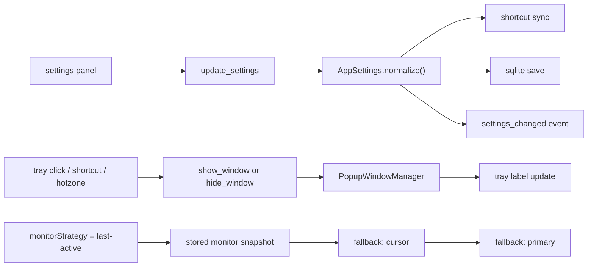

# runtime controls pass

## ziel

diese runde macht die systemsteuerung der bar dauerhaft konfigurierbar und robuster:

1. global shortcut in `AppSettings` persistieren
2. tray-toggle-text an den echten fensterzustand koppeln
3. monitor-strategie auf `primary | cursor | last-active` erweitern

## umgesetzt

1. `AppSettings` und das frontend-settings-modell enthalten jetzt `globalShortcut` und `monitorStrategy`
2. `multiMonitor` bleibt als kompatibilitaetsfeld erhalten und wird intern aus `monitorStrategy` abgeleitet
3. der globale shortcut kann im settings-panel geaendert oder ueber ein leeres feld deaktiviert werden
4. der tray-toggle-text springt jetzt zwischen `Show Popup Bar` und `Hide Popup Bar`
5. `last-active` merkt sich den zuletzt erfolgreich verwendeten monitor und faellt bei bedarf auf `cursor`, dann `primary` zurueck

## datenfluss

## kompatibilitaet

1. alte settings-jsons ohne `monitorStrategy` bleiben nutzbar
2. altes `multiMonitor: true` wird beim laden automatisch zu `monitorStrategy: cursor`
3. alte settings-jsons ohne `globalShortcut` bekommen den default `CommandOrControl+Shift+Space`

## produktentscheidungen

1. shortcut-aenderungen werden nicht bei jedem tastendruck gespeichert, sondern erst bei blur oder enter
2. ein leerer shortcut ist bewusst erlaubt und bedeutet `deaktiviert`
3. `last-active` merkt sich den zuletzt genutzten monitor der bar, nicht den fokus-monitor irgendeiner fremdapp

## naechste sinnvolle schritte

1. shortcut-konflikte im ui besser anzeigen statt nur den save zurueckzuweisen
2. tray-menue um einen kleinen statuspunkt oder einen checked-state erweitern
3. monitor-strategie spaeter optional um `focused-window` ergaenzen, falls der use-case staerker app-zentriert wird
