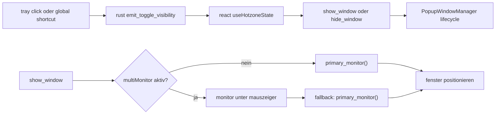

# tauri priority pass

## ziel

diese runde priorisiert die drei windows-relevanten systempfade, ohne die tauri-2-basis aufzubrechen:

1. tray fuer schnellen zugriff ohne sichtbare bar
2. global shortcut fuer keyboard-first toggling
3. echtes multi-monitor-handling statt immer nur primaermonitor

## umgesetzt

1. tray-icon mit menue fuer `show / hide`, `settings` und `quit`
2. global shortcut `CommandOrControl+Shift+Space`
3. monitor-auswahl ueber aktuelle mausposition, wenn `multiMonitor` aktiv ist
4. settings-panel erklaert jetzt den shortcut, tray-verhalten und den multi-monitor-modus
5. hotzone-hook lauscht auf ein gemeinsames system-toggle-event statt separater ui-sonderlogik

## laufzeitfluss

## architektur-notizen

1. tray und shortcut laufen bewusst im rust-core. das vermeidet frontend-bootstrapping im hot path.
2. das toggle-verhalten ist als event modelliert. dadurch bleiben tray, shortcut und hotzone auf derselben show/hide-lifecycle-logik.
3. multi-monitor ist jetzt brauchbar, aber noch nicht perfekt: die bar folgt dem monitor unter dem cursor, nicht zwingend dem monitor des fokussierten fensters.

## naechste sinnvolle schritte

1. shortcut konfigurierbar machen und in `AppSettings` persistieren
2. tray-menue-status dynamisch an sichtbarkeit koppeln
3. monitor-praferenz erweitern:
   `primary | cursor | last-active`
4. optional global shortcut in settings deaktivierbar machen, falls andere tools kollidieren

## rest-risiken

1. global shortcut kann mit powertoys, raycast-aehnlichen tools oder screen-capture-tools kollidieren.
2. multi-monitor nutzt cursor-position; bei automatisierten show-events ohne cursor-bewegung ist `last-active-monitor` spaeter robuster.
3. macos/linux sind technisch weiter bundle-faehig, aber dieser pass wurde lokal auf windows verifiziert.
