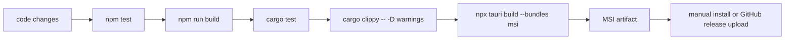

# installer guide

stand: 2026-03-18

## ziel

dieses repo erzeugt jetzt einen verifizierten windows-installer als `.msi`. der buildpfad ist lokal automatisiert, die github action baut denselben artefaktpfad auf `windows-latest`.

## flow

## lokal bauen

1. im repo-root powershell öffnen.
2. `.\scripts\build-installer.ps1` ausführen.
3. den erzeugten installer unter `src-tauri\target\release\bundle\msi\` nehmen.
4. optional die checksumme aus dem script-output mit dem release-post vergleichen.

## quick commands

1. voller build mit checks:
   `.\scripts\build-installer.ps1`
2. nur msi bundlen, wenn checks schon gelaufen sind:
   `.\scripts\build-installer.ps1 -SkipChecks`
3. direkter tauri-call:
   `npx tauri build --bundles msi`

## github action

1. `Windows Installer` läuft bei `workflow_dispatch`.
2. derselbe workflow läuft auch bei tags wie `v0.1.0`.
3. das artifact heißt `popup-bar-msi`.
4. bei tag-builds wird die `.msi` zusätzlich an den github release gehängt.

## output

1. installer-name aktuell:
   `Popup Bar_0.1.0_x64_en-US.msi`
2. standard-ordner:
   `src-tauri\target\release\bundle\msi\`
3. produkt-id-stabilität:
   die wix `upgradeCode` ist fest in `tauri.conf.json` hinterlegt, damit spätere updates nicht als zweite app enden.

## bekannte grenzen

1. der windows-installer ist am 2026-03-18 lokal verifiziert.
2. macOS `.dmg` und linux `.appimage/.deb` sind in der bundle-config vorbereitet, aber nicht auf dieser windows-maschine validiert.
3. code-signing ist noch nicht eingerichtet. für echte öffentliche distribution fehlt also noch signer/notarisierung.
